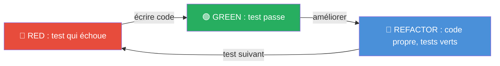

<!-- _class: lead -->
<!-- _paginate: false -->

# Artisanat logiciel, qualité et Git avancé

**R2.03 - Qualité de développement**

IUT d'Aix-Marseille - BUT Informatique, première année

🔀

Git

✅

TDD

🥋

Kata

🧹

Refactoring

---

## Le module R2.03 en un coup d'oeil

> Apprendre à produire du code **propre**, **testé**, **relu** et **maintenable**. Passer de "ça marche sur ma machine" à un vrai réflexe professionnel.

🔀

Git professionnel

Rebase, cherry-pick, PR, review

✅

TDD baby-steps

RED → GREEN → REFACTOR

🥋

Kata &amp; pair programming

Driver, navigator, ping-pong

🧹

Refactoring

Code smells et transformations de Fowler

---

## Organisation du module

CM1

Artisanat + Git + TDD intro

→ TP1 Git + TP2 TDD

CM2

TDD avancé + refactoring

→ TP3 Kata + TP4 Refactoring

Chaque CM prépare les <b>gestes concrets</b> mis en pratique dans les TP qui suivent.

Sem. 1 · 27 avril

CM1

Sem. 2 · 4 mai

CM2 + TP1 + TP2

Sem. 3 · 11 mai

TP3

Sem. 4 · 18 mai

TP4

18 juin

CC3

---

## Évaluation

Trois notes, un objectif : vérifier que vous <b>maîtrisez des gestes de métier</b>, pas juste que votre code tourne.

📝

CC1

Autograding de TP2, TP3, TP4

coeff. 10

🤝

CC2

Participation et qualité des reviews

coeff. 10

💻

CC3

Mini-kata TDD sur feuille (2 h, sans outils)

coeff. 40

17%

17%

66%

TP1 Git : mise à niveau, non noté. Le plus gros coefficient porte sur le <b>raisonnement TDD</b>, pas sur la vitesse de frappe.

---

## Environnement de travail

Tout le module se fait sur <b>GitHub Codespaces</b> dans votre navigateur sans installation :

☕

Java 25

🧪

JUnit 6 + AssertJ

📦

Maven (via mvnw)

🔀

Git + gh CLI

🤖

Copilot Chat

📊

ApprovalTests

🌐 Dépôt étudiant : <a href="https://github.com/IUTInfoAix-R203/tp" style="color: #a0d8f8;">github.com/IUTInfoAix-R203/tp</a>

---

<!-- _class: lead -->
<!-- _header: "" -->
<!-- _footer: "" -->

# Partie 1 - Artisanat logiciel

Pourquoi on parle de "qualité" ?

---

## 🔨 Qu'est-ce que l'artisanat logiciel ?

Un <b>artisan meunuisier</b> livre une table <b>bien finie</b>, robuste, belle, facile à réparer. Un <b>artisan logiciel</b> livre du code qui doit être :

📖

Lisible

par un autre humain

✅

Testé

pour éviter les régressions

🔧

Simple

à modifier quand les besoins évoluent

👥

Relu

par des pairs avant fusion

Le <b>"Software Craftsmanship"</b> est mouvement né dans les années 2000, en réaction à l'industrialisation du monde du logiciel qui pressait les développeurs à livrer vite au détriment de la qualité.

---

## 🔨 Le manifeste de l'artisanat logiciel (2009)

✊ Snowbird, Utah, décembre 2008 — en écho au Manifeste Agile de 2001, 4 principes, toujours sur le même modèle : <b>non seulement X, mais aussi Y</b>.

Non seulement du logiciel qui marche,

⚒️ mais aussi du logiciel bien conçu.

Non seulement répondre au changement,

📈 mais aussi ajouter de la valeur régulièrement.

Non seulement des individus et des interactions,

🤝 mais aussi une communauté de professionnels.

Non seulement collaborer avec le client,

🏛️ mais aussi des partenariats productifs.

💡 <b>L'idée à retenir</b> : le manifeste ne <b>rejette pas</b> l'agilité, il la <b>complète</b>. Les processus agiles ne suffisent pas : il faut aussi une exigence sur la <b>qualité du code</b> lui-même.

---

## 📉 Pourquoi c'est important : le coût des bugs

Plus un bug est détecté <b>tard</b>, plus il coûte cher à corriger. Ordre de grandeur (<a href="https://staff.emu.edu.tr/alexanderchefranov/Documents/CMPE412/Boehm1981%20COCOMO.pdf" style="color: inherit;">Boehm, 1981</a>) :

Développement

1x

Tests

6x

Pré-production

15x

<b>Chez le client</b>

100x

💥 Knight Capital (2012)

Un bug de déploiement sur un système de trading a fait perdre <b>440 M$ en 45 minutes</b>.  
Conséquence : <b>Faillite !</b>   Cause : un drapeau mal réinitialisé dans un module obsolète.

➡️ La qualité du code n'est pas un luxe d'esthète : c'est une question de <b>survie économique</b>.

---

## 💳 La dette technique

Métaphore de <b>Ward Cunningham</b> (1992) : écrire du code sale pour livrer vite, c'est comme <b>emprunter</b> de l'argent. Ça aide à court terme — mais il faut <b>rembourser</b>, <b>avec intérêts</b>.

⚡

Livrer vite

gain court terme

→

💳

Dette accumulée

coût caché

→

🐌

Ralentissement

perte long terme

Quand la dette augmente :

⏳

Les features sont plus lentes à livrer

🐛

Les bugs se multiplient en production

😩

L'équipe se sent démotivée

💀

Le projet finit par mourir

---

## 🛠️ Les 4 gestes de l'artisan du logiciel

Derrière chaque pilier du module, un <b>geste métier</b> que pratique l'artisan, pas juste un outil technique.

🔀 Laisser une trace

Comme le menuisier qui date et signe ses ouvrages : on doit pouvoir revenir, comprendre, reprendre.

Git avancé, branches, PR, review → TP1

✅ Essayer avant de livrer

Comme la table qu'on essaie sur l'établi avant de la remettre au client : l'outil doit fonctionner avant de quitter l'atelier.

TDD, RED-GREEN-REFACTOR → TP2

🥋 Répéter pour apprendre

Comme l'apprenti qui refait cent fois le même geste : la main retient ce que la tête oublie.

Kata, pair programming, ping-pong → TP3

🧹 Entretenir ses outils

Comme le chef qui aiguise ses couteaux en fin de service : demain on s'en resservira, autant qu'ils coupent.

Refactoring, code smells, Fowler → TP4

---

## 🧭 Pourquoi ce module compte tout de suite

<b style="color: #2c3e50;">SAÉ 2.01 - Développement d'une application :</b>
Vous allez coder <b>en équipe</b>, <b>sur plusieurs semaines</b>, un projet réel. Les gestes de R2.03 - historique propre, tests, refactoring, review - y deviennent immédiatement utiles.

🔀

Git

pour collaborer sans se marcher dessus

✅

Tests

pour modifier sans paniquer

🧹

Refactoring

pour garder le projet vivable

🎯 Ce qu'on voit ici n'est pas "pour plus tard" : c'est ce qui rend un projet d'équipe tenable.

---

## 🎯 Compétences BUT visées

Trois apprentissages critiques du <a href="https://cache.media.education.gouv.fr/file/SP4-MESRI-26-5-2022/14/6/spe617_annexe15_1426146.pdf" style="color: inherit;"><b>PN BUT Informatique 2022</b> (annexe 15)</a> sont couverts ici.

📐

AC11.02

Élaborer des conceptions simples

Compétence 1 <em>Développer des applications informatiques simples</em>

🧪

AC11.03

Faire des essais et évaluer leurs résultats

Compétence 1 <em>Développer des applications informatiques simples</em>

🔀

AC15.02

Mettre en place les outils de gestion de projet

Compétence 5 <em>Identifier les besoins métiers et techniques des clients</em>

Mots-clés officiels du PN : <b>Qualité</b>, <b>Test</b>, <b>Gestion de version</b>. C'est exactement le coeur de ce module.

---

<!-- _class: lead -->
<!-- _header: "" -->
<!-- _footer: "" -->

# Partie 2 - Git professionnel

Retour aux bases, puis les concepts avancés qui changent la vie.

---

## 🔀 Ce que vous savez déjà (plus ou moins bien)

Au S1, vous avez utilisé Git. Vérifiez avec moi :

✅ Je sais

<ul style="margin: 0.4rem 0 0 0; padding-left: 1.2rem; line-height: 1.6;">
<li><code style="font-size: 0.95em;">git clone</code>, <code style="font-size: 0.95em;">add</code>, <code style="font-size: 0.95em;">commit</code>, <code style="font-size: 0.95em;">push</code></li>
<li>Créer une branche</li>
<li>Ouvrir un fork sur GitHub</li>
<li>😭 Pleurer quand un collègue écrase mes modifications</li>
<li>😭😭 Pleurer encore plus quand j'ai un conflit de fusion</li>
</ul>

🤔 Je ne sais pas (encore)

<ul style="margin: 0.4rem 0 0 0; padding-left: 1.2rem; line-height: 1.6;">
<li>Écrire un message de commit lisible 6 mois plus tard</li>
<li>Intégrer une branche proprement (rebase vs merge)</li>
<li>Rattraper un commit perdu sans paniquer</li>
<li>Relire sérieusement la PR d'un pair</li>
</ul>

La moitié de ce TP1 corrige les mauvaises habitudes du S1. L'autre moitié, ce qui fait la différence en équipe.

---

## 🔀 Rappel express : le modèle Git

Il vous suffit de retenir <b>3 concepts</b> pour suivre le reste du cours :

📸

Commit

une photo du projet à un instant donné

🌱

Branche

une étiquette mobile qui avance avec vos commits

📍

HEAD

l'endroit où vous êtes en train de travailler

---

## 📝 Pourquoi un bon message de commit ?

Le message que vous écrivez <b>aujourd'hui</b> sera relu par <b>quelqu'un d'autre</b> (ou vous-même) dans 6 mois, pour comprendre pourquoi telle ligne a été écrite.

🙅 Mauvais messages

<pre style="background: transparent; padding: 0.5rem 0; font-size: 1.2rem; margin-top: 0.5rem; line-height: 1.6; color: white; border: none; box-shadow: none;">
wip
fix
trucs
ca marche enfin putain
update file</pre>

✅ Bons messages

<pre style="background: transparent; padding: 0.5rem 0; font-size: 1.2rem; margin-top: 0.5rem; line-height: 1.6; color: white; border: none; box-shadow: none;">feat(auth): ajoute login via OAuth Google
fix(cart): corrige le total quand la remise est 0
docs(readme): detaille l'installation locale
refactor(facture): extrait appliquerTVA</pre>

🎯 Un message clair aujourd'hui = l'origine d'un bug est retrouvé en 30 secondes dans 6 mois.

---

## 📝 Le format Conventional Commits

Un standard universel pour structurer vos messages et rendre votre historique lisible par tous.

<b>&lt;type&gt;</b>(<b>&lt;scope&gt;</b>) : <b>&lt;description&gt;</b>

✨

feat

nouvelle fonctionnalité

🐛

fix

correction de bug

📝

docs

documentation

♻️

refactor

réorganisation sans changer le comportement

✅

test

ajout ou fix de tests

🔧

chore

maintenance, config, outils

---

## 🔄 GitHub Flow : le workflow en 4 étapes

Le workflow standard en équipe, proposé par <b>Scott Chacon</b> (GitHub, 2011). Simple : une seule branche de référence (<code>main</code>) et des branches éphémères par fonctionnalité.

🌱

1. Branche

une par fonctionnalité

📸

2. Commits

atomiques + Conventional

🔍

3. Pull Request

dès qu'on est prêt à montrer

✅

4. Merge

après review

🎯 Règle d'or : <b>jamais de commit direct sur <code>main</code></b>. Tout passe par une PR.

---

## 🔍 Pull Request : une conversation

Une PR n'est pas un formulaire administratif. C'est une <b>invitation à discuter</b> du code que vous proposez d'intégrer à la branche <code>main</code>.

Ce qu'elle permet :

🗣️

Comprendre

votre intention

❓

Questionner

vos choix de conception

🤖

Vérifier

tests, qualité, conventions

📝

Documenter

l'historique des décisions

💡 Une PR qui vaut le coup : <b>un diff ciblé qui se lit, un contexte qui se comprend</b>.

---

## 🔍 Comment faire une bonne review ?

Reviewer, ce n'est pas dire "oui". C'est <b>lire le code avec les yeux d'un collègue dans 6 mois</b>, et mettre son nom en face de ce qui partira en prod.

✅ Checklist d'une bonne review

<ul style="margin-top: 0.5rem; padding-left: 1.3rem; font-size: 1.3rem; line-height: 1.7;">
<li>Le code est-il <b>lisible</b> ?</li>
<li>Les <b>noms de variable</b> sont-ils parlants ?</li>
<li>Y a-t-il des <b>tests</b> ? Passent-ils ?</li>
<li>Pas de <code>TODO</code> / <code>FIXME</code> orphelins ?</li>
<li>La PR ne fait-elle qu'<em>une seule</em> chose ?</li>
</ul>

🙅 Ce qui n'est PAS une review

<ul style="margin-top: 0.5rem; padding-left: 1.3rem; font-size: 1.3rem; line-height: 1.7;">
<li><b>"LGTM"</b> sans lire le diff</li>
<li>Approuver <b>sans tester</b> la branche en local</li>
<li>Commenter les <b>fautes de frappe</b>, jamais le fond</li>
<li>Valider sans attendre <b>la validation du CI</b></li>
<li>Bloquer la PR sur un <b>détail subjectif</b> (style personnel)</li>
</ul>

🎯 Une bonne review prend <b>15 minutes</b>. Un bug en prod prend <b>15 heures</b>.

---

## 🤖 Review automatique par Copilot

Dans vos Codespaces, <b>Copilot Code Review</b> peut commenter automatiquement une PR ouverte. Utile, mais ne remplace pas une vraie revue.

 👁️ Ce qu'il fait bien

<ul style="margin-top: 0.5rem; padding-left: 1.3rem; font-size: 1.4rem; line-height: 1.7;">
<li>Détecter les fautes de frappe</li>
<li>Signaler les noms confus</li>
<li>Proposer des simplifications</li>
<li>Trouver des bugs</li>
</ul>

⚠️ Ses limites

<ul style="margin-top: 0.5rem; padding-left: 1.3rem; font-size: 1.4rem; line-height: 1.7;">
<li>Ne comprend pas toujours l'intention métier</li>
<li>Peut suggérer des choses hors sujet</li>
<li>Peut <b>halluciner</b> un code faux qui semble bon</li>
<li>Ne peut pas trouver tous les bugs</li>
</ul>

💡 <b>Copilot suggère</b> mais c'est <b>un humain qui décide.</b> Une vraie review commence par comprendre l'intention du contributeur et de vérifier qu'elle est correctement mise en oeuvre dans le code.

---

<!-- _transition: fade -->

## 🔀 `git merge` — avant la fusion

Vos commits sur la branche <code>ma-feature</code> sont prêts à être partagés. Voici la première façons de les intégrer à la branche <code>main</code> : <code>git merge</code>.

🕐 <b>Situation initiale</b> : la branche <code>main</code> continue d'avancer (commit C) pendant que la branche <code>ma-feature</code> travaille sur D puis sur E.

---

## 🔀 `git merge` — après la fusion

Vos commits sur la branche <code>ma-feature</code> sont prêts à être partagés. Voici la première façons de les intégrer à la branche <code>main</code> : <code>git merge</code>. Après cette opération un nouveau commit de merge fait la jointure entre les deux branches.

✅ Avantages

<ul style="margin-top: 0.4rem; padding-left: 1.2rem; font-size: 1.4rem; line-height: 1.6;">
<li>Préserve l'<b>historique réel</b> du travail</li>
<li>Les SHA des commits restent <b>stables</b> (partageables sans risque)</li>
</ul>

⚠️ Inconvénients

<ul style="margin-top: 0.4rem; padding-left: 1.2rem; font-size: 1.4rem; line-height: 1.6;">
<li>Crée un <b>commit de merge</b> en plus</li>
<li>Historique "<b>en arête de poisson</b>", plus difficile à relire</li>
</ul>

---

<!-- _transition: fade -->

## 🔀 `git rebase` — avant le rebase

Vos commits sur la branche <code>ma-feature</code> sont prêts à être partagés. Voici la seconde façons de les intégrer à la branche <code>main</code> : <code>git rebase</code>.

🕐 <b>Même situation initiale</b> : on part de <code>main</code> = A-B-C et <code>ma-feature</code> = D-E.

---

## 🔀 `git rebase` — après le rebase

Vos commits sur la branche <code>ma-feature</code> sont prêts à être partagés. Voici la seconde façons de les intégrer à la branche <code>main</code> : <code>git rebase</code>. Le rebase <b>rejoue</b> les commits D et E sur la pointe de <code>main</code>. D et E devienent D' et E' : même contenu, mais nouveau commit avec un nouveau SHA.

✅ Avantages

<ul style="margin-top: 0.4rem; padding-left: 1.2rem; font-size: 1.4rem; line-height: 1.6;">
<li>Historique totalement <b>linéaire</b>, lisible comme une histoire</li>
<li>Pas de commit de merge parasite</li>
</ul>

⚠️ Inconvénients

<ul style="margin-top: 0.4rem; padding-left: 1.2rem; font-size: 1.4rem; line-height: 1.6;">
<li><b>Réécrit les commits</b> : nouveaux SHA</li>
<li>Dangereux sur une branche <b>déjà partagée</b> avec d'autres</li>
</ul>

---

## ⚖️ La règle d'or pour choisir entre merge et rebase

<b>Rebase</b> tes commits <b>tant que la branche n'est pas partagée </b>. 
<b>Merge</b> dès qu'elle est <b>partagée</b> avec d'autres personnes.

<b>Pourquoi ?</b> Le rebase <b>change les SHAs</b>. Si ton coéquipier a déjà basé du travail sur ta branche publique, ton rebase lui fait <b>perdre ses commits</b>.

✅ OK

Je rebase ma branche personnelle <code>feat-login</code> avant de créer une PR.

💀 Danger

Je rebase <code>main</code> (partagée par toute l'équipe).

---

## ✏️ Rebase interactif : nettoyer l'historique

<code>git rebase -i HEAD~3</code> ouvre un éditeur qui liste les 3 derniers commits, un par ligne, avec une action modifiable devant chacun.

📝 Éditeur ouvert par <code style="background:transparent;color:#fff;">rebase -i</code>

<pre style="background: #1e1e1e; color: #e8e8e8; margin: 0; padding: 0.8rem 1rem; font-size: 1.4rem; line-height: 1.35; border: none; box-shadow: none; font-family: 'Courier New', Consolas, monospace; white-space: pre; border-radius: 0 0 10px 10px;">pick a1b2c3 wip
pick d4e5f6 maj
pick g7h8i9 fix typo
&#35; Rebase ...
&#35; p, pick   = use commit
&#35; r, reword = edit message
&#35; s, squash = meld into previous
&#35; f, fixup  = like squash, no msg
&#35; d, drop   = remove commit</pre>

🎯 3 actions utiles au quotidien

- **`reword`** — corriger un message de commit
- **`squash`** / **`fixup`** — fusionner les petits commits de travail
- **`drop`** — retirer un commit indésirable

<b>reword</b> + <b>squash</b> + <b>drop</b> : 95% des cas d'usage.

---

## ✏️ Rebase interactif : exemple concret

Cinq commits de travail accumulés au fil de la journée, à fusionner en un seul commit propre prêt pour la PR.

🤦 Avant

<pre style="background: #1e1e1e; color: #e8e8e8; margin: 0; padding: 0.8rem 1rem; font-size: 1.4rem; line-height: 1.4; border: none !important; box-shadow: none !important; border-radius: 0 !important; font-family: 'Courier New', Consolas, monospace; white-space: pre; flex: 1;">a1b2c3 wip
d4e5f6 maj
g7h8i9 fix typo
h1j2k3 oh j'avais oublié un test
m4n5o6 deuxième essai</pre>

L'historique est illisible. Que s'est-il vraiment passé ?

🎯 Après rebase interactif

<pre style="background: #1e1e1e; color: #e8e8e8; margin: 0; padding: 0.8rem 1rem; font-size: 1.4rem; line-height: 1.4; border: none !important; box-shadow: none !important; border-radius: 0 !important; font-family: 'Courier New', Consolas, monospace; white-space: pre-wrap; word-break: break-all; flex: 1;">x7y8z9 feat(auth): ajoute login OAuth Google</pre>

Le message est clair. On sait ce qui a été ajouté et <b>pourquoi</b>.

Refaire son historique avant la PR, c'est un acte de <b>respect</b> envers le relecteur.

---

<!-- _transition: fade -->

## 🍒 `cherry-pick` — avant

Sur une branche expérimentale <code>exp</code>, le commit <code>D</code> contient un correctif utile. Vous voulez <b>juste ce commit-là</b> sur <code>main</code>, sans embarquer <code>C</code> ni <code>E</code>.

**Le besoin :**

- Récupérer **uniquement D** sur `main`
- Laisser `C` et `E` sur `exp` (encore en cours)
- Sans `merge` (qui rapatrierait tout)
- Sans `rebase` (qui réécrirait `exp`)

🕐 <b>Situation initiale</b> : <code>main</code> = A-B, <code>exp</code> = C-D-E.

---

## 🍒 `cherry-pick` — après

<code>cherry-pick</code> <b>copie</b> le commit <code>D</code> sur la pointe de <code>main</code>. Il devient <code>D'</code> : même contenu, mais nouveau commit avec un <b>nouveau SHA</b>.

<pre style="margin: 0; padding: 0.9rem 1.1rem; font-size: 1.5rem; line-height: 1.4; border: none !important; box-shadow: none !important; border-radius: 8px !important; font-family: 'Courier New', Consolas, monospace; white-space: pre;">git checkout main
git cherry-pick D</pre>

`exp` reste **intacte** : C, D et E sont toujours là pour continuer la branche expérimentale plus tard.

⚠️ Cherry-pick <b>copie</b> le commit : vous récupérez l'idée, pas le même SHA.

---

## 🆘 Outil de secours : reflog

Vous tapez <code>git reset --hard HEAD~5</code> et réalisez que vous venez d'effacer 5 commits. <b>Pas de panique</b> : Git garde une mémoire locale de tous vos déplacements.

1️⃣ Lister les déplacements

<pre style="background: #1e1e1e; color: #e8e8e8; margin: 0; padding: 0.8rem 1rem; font-size: 1.3rem; line-height: 1.4; border: none !important; box-shadow: none !important; border-radius: 0 !important; font-family: 'Courier New', Consolas, monospace; white-space: pre; flex: 1;">$ git reflog
a1b2c3 HEAD@{0}: reset: moving to HEAD~5
g7h8i9 HEAD@{1}: commit: feat: ajoute X  ← ici !
d4e5f6 HEAD@{2}: commit: wip
...</pre>

2️⃣ Revenir au commit perdu

<pre style="background: #1e1e1e; color: #e8e8e8; margin: 0; padding: 0.8rem 1rem; font-size: 1.3rem; line-height: 1.4; border: none !important; box-shadow: none !important; border-radius: 0 !important; font-family: 'Courier New', Consolas, monospace; white-space: pre; flex: 1;">$ git reset --hard g7h8i9
HEAD is now at g7h8i9 feat: ajoute X
✅ Vos commits sont récupérés.</pre>

<code>reflog</code> est votre <b>filet de sécurité</b> : tant qu'un commit a existé localement, il reste récupérable pendant ~30 jours.

---

## ⚠️ Commandes destructrices et leurs alternatives

Certaines commandes Git détruisent du travail <b>sans demander confirmation</b>. Pour chacune, il existe une variante équivalente qui refuse d'écraser silencieusement.

💀 Dangereux

<code style="font-size: 1.3rem; color: #c0392b; font-weight: bold;">git reset --hard</code> 
Perd toutes les modifications non commitées.

🛡️ Plus sûr

<code style="font-size: 1.3rem; color: #1e8449; font-weight: bold;">git reset</code> 
Déstage sans toucher au contenu (mode <code>--mixed</code> par défaut).

💀 Dangereux

<code style="font-size: 1.3rem; color: #c0392b; font-weight: bold;">git push --force</code> 
Écrase la branche distante, même si un collègue a poussé entre-temps.

🛡️ Plus sûr

<code style="font-size: 1.3rem; color: #1e8449; font-weight: bold;">git push --force-with-lease</code> 
Refuse le push si quelqu'un a poussé entre-temps pour ne pas perdre son travail.

Règle de survie : <b>privilégiez toujours la variante qui refuse d'écraser silencieusement</b>.

---

## 🎬 Démo live : rebase d'une branche sur main

Cycle complet en direct : <b>brancher, commiter, rebaser, pousser sans casser le travail des autres</b>. Posez vos questions pendant la démo.

1
Clone <code>IUTInfoAix-R203/tp1</code> dans un Codespace

2
Création de la branche <code>feat-exemple</code> + deux commits

3
Deux commits sur <code>main</code> pour simuler le travail d'un collègue

4
Rebase sur <code>main</code> : <code>git rebase origin/main</code>

5
Visualisation : <code>git log --oneline --graph --all</code>

6
Push sécurisé : <code>git push --force-with-lease</code>

<b style="color: #c0392b;">⚠️ Mise en scène pédagogique</b> — je vais volontairement simuler un commit mal formé pour montrer comment le rebase interactif le corrige. <b>Ne reproduisez pas ce style en vrai.</b>

👁️ Observez : l'historique de <code>main</code> reste <b>linéaire</b> et <b>lisible</b> avant et après le push.

---

## 🔗 De l'historique propre au code qui tient

Git assure la <b>trace</b> propre de votre travail. Mais une belle histoire ne garantit pas que <b>le code actuel marche</b>. Il vous faut l'autre moitié du métier.

🔀

Git

la trace propre du travail

+

✅

Tests

l'ouvrage qui tient

=

🔨

Artisan

le geste complet

Vérifier son ouvrage <b>à chaque geste</b>, pas à la livraison. C'est là qu'intervient le <b>TDD</b>.

---

<!-- _class: lead -->
<!-- _header: "" -->
<!-- _footer: "" -->

# Partie 3 - Introduction au TDD

Quand tester un logiciel vous aidera à mieux le concevoir !

---

## 🐛 Le problème du code "ça marche sur ma machine"

Trois situations qu'on a toutes et tous vécues, et qui ont <b>une seule cause profonde</b>.

📦 Vous livrez un projet qui marchait chez vous, et il <b>plante</b> chez le prof.

🔄 Vous corrigez un bug et un <b>autre</b> que vous aviez résolu il y a 3 jours <b>réapparaît</b>.

😰 Vous modifiez une fonction en ayant <b>peur</b> que ça casse ailleurs.

La cause profonde : <b>aucun filet de sécurité</b> qui vous prévient quand vous cassez quelque chose, vous n'avez aucune assurance que votre logiciel continue à fonctionner comme attendu.

---

## ✅ TDD : l'idée contre-intuitive

<b>Écrire le test <em>avant</em> le code</b> qu'il vérifie.

**Pourquoi c'est puissant ?**

1. Le test **précise** le comportement attendu (comme un cahier des charges)
2. Il **garantit** que vous n'écrivez que le code nécessaire
3. Il **sert** de filet quand vous refactorez ensuite
4. Il **guide** la conception de l'API (si le test est pénible à écrire, c'est que l'API est mal pensée)

**Pourquoi c'est contre-intuitif ?**

Notre réflexe naturel est : "j'écris le code, puis je testerai si j'ai le temps".

Résultat : on teste peu, on teste mal, et on teste **ce qu'on a codé** au lieu de **ce qu'il faudrait faire**.

TDD inverse la logique : on teste d'abord **le besoin**, puis on code le minimum pour y répondre.

---

## 🔁 Le cycle RED - GREEN - REFACTOR

<b>🔴 RED</b> Écrire un test qui échoue. Preuve qu'il teste vraiment quelque chose. <b>Ne pas coder</b> avant d'avoir vu le rouge.

<b>🟢 GREEN</b> Écrire le <b>minimum</b> de code pour que le test passe. Oui, même si c'est moche. <b>Fake it</b> si besoin.

<b>🧹 REFACTOR</b> Nettoyer le code <b>sans casser les tests</b>. C'est le moment d'extraire, renommer, simplifier.

---

## 🎣 Les 3 stratégies de Kent Beck

Pour passer du **RED** au **GREEN**, trois approches :

🟢 <b>Fake it</b>

Retourner une <b>valeur en dur</b> qui fait passer le test.

<pre style="background: rgba(0,0,0,0.2); padding: 0.6rem; border-radius: 4px; margin-top: 0.5rem; font-size: 0.85rem;">// Test : saluer("Alice") == "Hello, Alice!"
return "Hello, Alice!";</pre>

Premier réflexe. Toujours.

🔺 <b>Triangulation</b>

Un <b>2e test</b> avec une autre valeur t'oblige à généraliser.

<pre style="background: rgba(0,0,0,0.2); padding: 0.6rem; border-radius: 4px; margin-top: 0.5rem; font-size: 0.85rem;">// Test 1 : saluer("Alice")
// Test 2 : saluer("Bob")
return "Hello, " + nom + "!";</pre>

Quand fake it ne suffit plus.

✅ <b>Obvious</b>

L'implémentation tient en <b>une ligne évidente</b>.

<pre style="background: rgba(0,0,0,0.2); padding: 0.6rem; border-radius: 4px; margin-top: 0.5rem; font-size: 0.85rem;">// Test : additionner(2, 3) == 5
return a + b;</pre>

Rare. Mais OK si la solution est triviale.

---

## 👣 Baby steps : petits pas, toujours

**Règle absolue du TDD** : un test = une modification de code = un commit (ou au moins un point de contrôle mental).

Si vous ouvrez un fichier et vous modifiez 30 lignes entre deux exécutions de tests, **vous n'êtes plus en TDD** : vous êtes en train de coder "à l'ancienne" en priant pour que ça marche.

<b>✅ Bon rythme</b>
<ul style="margin-top: 0.3rem;">
<li>Activer 1 test</li>
<li>Le voir rouge (15s)</li>
<li>Écrire 3 lignes</li>
<li>Le voir vert (15s)</li>
<li>Cycle suivant</li>
</ul>

<b>❌ Mauvais rythme</b>
<ul style="margin-top: 0.3rem;">
<li>Activer 5 tests d'un coup</li>
<li>Écrire 40 lignes sans tester</li>
<li>Lancer les tests : 3 verts, 2 rouges</li>
<li>Débugger sans savoir qui a cassé quoi</li>
</ul>

---

## 🎬 Kata live : HelloWorld en TDD

On va écrire ensemble une méthode `saluer(String nom)` qui retourne :

- `"Hello, World!"` si `nom` est `null` ou vide
- `"Hello, <nom>!"` sinon

**Tests** (fournis, je vais les activer un par un) :
1. `saluerSansNomRetourneHelloWorld()`
2. `saluerChaineVideRetourneHelloWorld()`
3. `saluerAliceRetourneHelloAlice()`
4. `saluerBobRetourneHelloBob()`

Observez le rythme : <b>activer → rouge → écrire → vert → commit</b>. Ne pas coder en avance.

---

## 🤖 Copilot Chat : votre tuteur, pas votre code-monkey

Au TP2, Copilot est configuré comme **tuteur TDD** : il peut aider à raisonner, mais pas court-circuiter la démarche.

<b>✅ Ce que Copilot fera</b>
<ul style="margin-top: 0.3rem;">
<li>Expliquer un concept TDD</li>
<li>Vous orienter vers la Javadoc</li>
<li>Vous aider à débloquer une impasse</li>
<li>Refuser de coder à votre place si un test n'est pas encore activé</li>
</ul>

<b>❌ Ce qu'il refusera</b>
<ul style="margin-top: 0.3rem;">
<li>"Écris tout le TP à ma place"</li>
<li>Donner une solution dès le premier prompt</li>
<li>Coder avant que vous ayez vu le rouge</li>
</ul>

Copilot est un <b>tuteur</b> pendant les TP ; au contrôle, vos réflexes doivent être les vôtres.

---

<!-- _class: lead -->

# Ce qu'on fait maintenant

Le prochain cap est simple : mettre en pratique les deux moitiés du cours d'aujourd'hui.

**🔀 TP1 - Git avancé** (~2h, non noté)
Historique lisible, PR, review, intégration propre.

**✅ TP2 - TDD** (~4h, noté)
Cycle RED-GREEN-REFACTOR, fake-it, triangulation, ApprovalTests.

🎯 <b>Dès le prochain TP</b> : écrivez des commits relisibles, ouvrez une PR comme une vraie conversation, et laissez toujours un test vous dire quand vous avez cassé quelque chose.

👉 Lien Classroom : [github.com/IUTInfoAix-R203/tp](https://github.com/IUTInfoAix-R203/tp)

---

<!-- _class: lead -->

# À suivre : CM2 - TDD avancé et refactoring

On y approfondira le TDD, on découvrira les kata en pair programming, et on préparera le refactoring du TP4.
