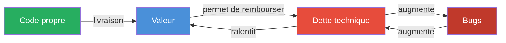
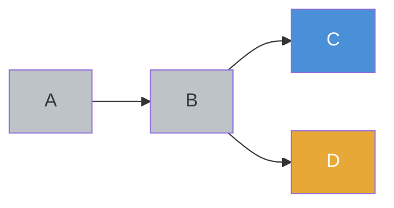
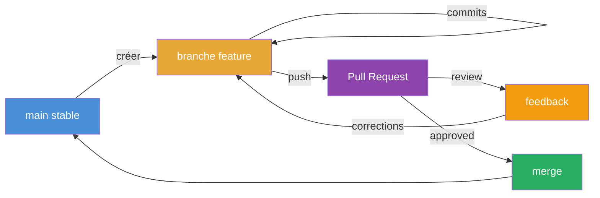
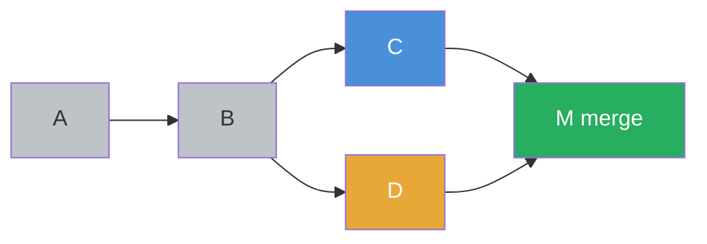
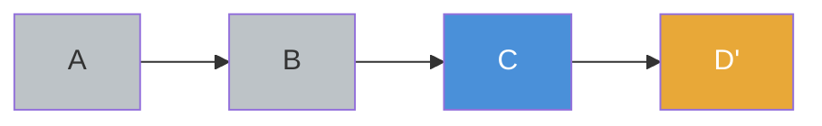
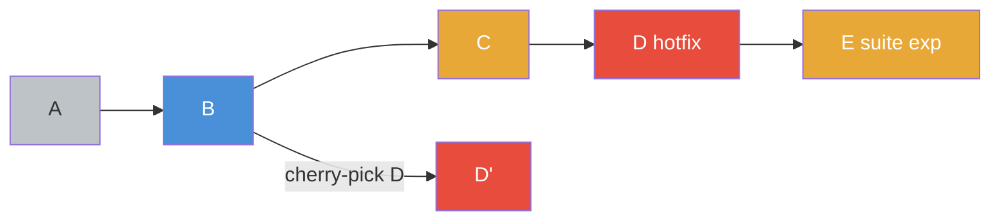
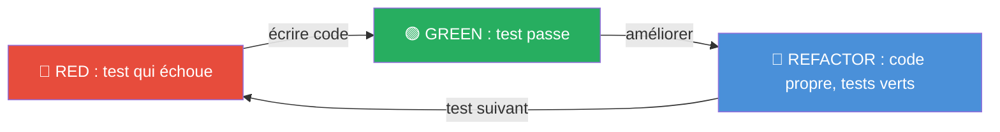

<!-- _class: lead -->
<!-- _paginate: false -->

# Artisanat logiciel, qualité et Git avancé

**R2.03 - Qualité de développement**

IUT d'Aix-Marseille - BUT Informatique, première année

<div style="display: flex; justify-content: center; gap: 9rem; margin-top: 6rem; color: #555;">
<div style="text-align: center;"><div style="font-size: 6.5rem; opacity: 0.8;">🔀</div><div style="font-size: 1.3rem; font-weight: 400; letter-spacing: 0.03em; color: #888;">Git</div></div>
<div style="text-align: center;"><div style="font-size: 6.5rem; opacity: 0.8;">✅</div><div style="font-size: 1.3rem; font-weight: 400; letter-spacing: 0.03em; color: #888;">TDD</div></div>
<div style="text-align: center;"><div style="font-size: 6.5rem; opacity: 0.8;">🥋</div><div style="font-size: 1.3rem; font-weight: 400; letter-spacing: 0.03em; color: #888;">Kata</div></div>
<div style="text-align: center;"><div style="font-size: 6.5rem; opacity: 0.8;">🧹</div><div style="font-size: 1.3rem; font-weight: 400; letter-spacing: 0.03em; color: #888;">Refactoring</div></div>
</div>

---

## Le module R2.03 en un coup d'oeil

<style scoped>
blockquote { font-size: 1rem; margin-bottom: 0; }
</style>

> Apprendre à produire du code **propre**, **testé**, **relu** et **maintenable**. Passer de "ça marche sur ma machine" à un vrai réflexe professionnel.

<div style="display: grid; grid-template-columns: 1fr 1fr; gap: 1.5rem; margin-top: 2rem;">
<div style="background: #4a90d9; color: white; padding: 1.8rem 1.2rem; border-radius: 12px; text-align: center;">
<div style="font-size: 2rem;">🔀</div>
<div style="font-size: 1.6rem; font-weight: bold; margin-top: 0.4rem;">Git professionnel</div>
<div style="font-size: 1.05rem; margin-top: 0.4rem; opacity: 0.95;">Rebase, cherry-pick, PR, review</div>
</div>

<div style="background: #27ae60; color: white; padding: 1.8rem 1.2rem; border-radius: 12px; text-align: center;">
<div style="font-size: 2rem;">✅</div>
<div style="font-size: 1.6rem; font-weight: bold; margin-top: 0.4rem;">TDD baby-steps</div>
<div style="font-size: 1.05rem; margin-top: 0.4rem; opacity: 0.95;">RED → GREEN → REFACTOR</div>
</div>

<div style="background: #e8a838; color: white; padding: 1.8rem 1.2rem; border-radius: 12px; text-align: center;">
<div style="font-size: 2rem;">🥋</div>
<div style="font-size: 1.6rem; font-weight: bold; margin-top: 0.4rem;">Kata &amp; pair programming</div>
<div style="font-size: 1.05rem; margin-top: 0.4rem; opacity: 0.95;">Driver, navigator, ping-pong</div>
</div>

<div style="background: #e74c3c; color: white; padding: 1.8rem 1.2rem; border-radius: 12px; text-align: center;">
<div style="font-size: 2rem;">🧹</div>
<div style="font-size: 1.6rem; font-weight: bold; margin-top: 0.4rem;">Refactoring</div>
<div style="font-size: 1.05rem; margin-top: 0.4rem; opacity: 0.95;">Code smells et transformations de Fowler</div>
</div>

</div>

---

## Organisation du module

<div style="display: grid; grid-template-columns: 1fr 1fr; gap: 1rem; margin-top: 1rem;">
<div style="background: #4a90d9; color: white; padding: 1.4rem; border-radius: 12px; text-align: center;">
<div style="font-size: 1.8rem; font-weight: bold;">CM1</div>
<div style="margin-top: 0.3rem;">Artisanat + Git + TDD intro</div>
<div style="margin-top: 0.8rem; background: rgba(255,255,255,0.18); border-radius: 8px; padding: 0.6rem; font-weight: bold;">→ TP1 Git + TP2 TDD</div>
</div>
<div style="background: #e8a838; color: white; padding: 1.4rem; border-radius: 12px; text-align: center;">
<div style="font-size: 1.8rem; font-weight: bold;">CM2</div>
<div style="margin-top: 0.3rem;">TDD avancé + refactoring</div>
<div style="margin-top: 0.8rem; background: rgba(255,255,255,0.18); border-radius: 8px; padding: 0.6rem; font-weight: bold;">→ TP3 Kata + TP4 Refactoring</div>
</div>
</div>

<div style="margin-top: 1.2rem; background: #2c3e50; color: white; padding: 1rem; border-radius: 10px; text-align: center; font-size: 1.1rem;">
Chaque CM prépare les <b>gestes concrets</b> mis en pratique dans les TP qui suivent.
</div>

<div style="margin-top: 1.5rem; display: flex; justify-content: space-between; align-items: flex-start; padding: 0 0.5rem; position: relative;">

<div style="position: absolute; top: 0.6rem; left: 3%; right: 3%; height: 3px; background: #bdc3c7; border-radius: 2px; z-index: 0;"></div>

<div style="flex: 1; text-align: center; position: relative; z-index: 1;">
<div style="width: 14px; height: 14px; background: #4a90d9; border: 3px solid white; border-radius: 50%; margin: 0 auto; box-shadow: 0 0 0 2px #4a90d9;"></div>
<div style="margin-top: 0.4rem; font-size: 0.8rem; color: #888;">Sem. 1 · 27 avril</div>
<div style="font-weight: bold; color: #4a90d9; margin-top: 0.1rem;">CM1</div>
</div>

<div style="flex: 1.2; text-align: center; position: relative; z-index: 1;">
<div style="width: 14px; height: 14px; background: #e8a838; border: 3px solid white; border-radius: 50%; margin: 0 auto; box-shadow: 0 0 0 2px #e8a838;"></div>
<div style="margin-top: 0.4rem; font-size: 0.8rem; color: #888;">Sem. 2 · 4 mai</div>
<div style="font-weight: bold; color: #e8a838; margin-top: 0.1rem;">CM2 + TP1 + TP2</div>
</div>

<div style="flex: 1; text-align: center; position: relative; z-index: 1;">
<div style="width: 14px; height: 14px; background: #27ae60; border: 3px solid white; border-radius: 50%; margin: 0 auto; box-shadow: 0 0 0 2px #27ae60;"></div>
<div style="margin-top: 0.4rem; font-size: 0.8rem; color: #888;">Sem. 3 · 11 mai</div>
<div style="font-weight: bold; color: #27ae60; margin-top: 0.1rem;">TP3</div>
</div>

<div style="flex: 1; text-align: center; position: relative; z-index: 1;">
<div style="width: 14px; height: 14px; background: #e74c3c; border: 3px solid white; border-radius: 50%; margin: 0 auto; box-shadow: 0 0 0 2px #e74c3c;"></div>
<div style="margin-top: 0.4rem; font-size: 0.8rem; color: #888;">Sem. 4 · 18 mai</div>
<div style="font-weight: bold; color: #e74c3c; margin-top: 0.1rem;">TP4</div>
</div>

<div style="flex: 1; text-align: center; position: relative; z-index: 1;">
<div style="width: 14px; height: 14px; background: #2c3e50; border: 3px solid white; border-radius: 50%; margin: 0 auto; box-shadow: 0 0 0 2px #2c3e50;"></div>
<div style="margin-top: 0.4rem; font-size: 0.8rem; color: #888;">18 juin</div>
<div style="font-weight: bold; color: #2c3e50; margin-top: 0.1rem;">CC3</div>
</div>

</div>

---

## Évaluation

<p style="font-size : 1.5rem;">
Trois notes, un objectif : vérifier que vous <b>maîtrisez des gestes de métier</b>, pas juste que votre code tourne.
</p>

<div style="display: flex; gap: 1.5rem; margin-top: 1rem;">
<div style="background: #4a90d9; color: white; padding: 1.8rem 1.2rem; border-radius: 12px; flex: 1; text-align: center;">
<div style="font-size: 3.5rem; margin-bottom: 0.5rem;">📝</div>
<div style="font-weight: bold; font-size: 1.5rem;">CC1</div>
<div style="margin-top: 0.5rem; opacity: 0.9;">Autograding de TP2, TP3, TP4</div>
<div style="margin-top: 0.5rem; font-weight: bold; font-size: 1.2rem; background: rgba(255,255,255,0.2); border-radius: 6px; padding: 0.2rem;">coeff. 10</div>
</div>
<div style="background: #e8a838; color: white; padding: 1.8rem 1.2rem; border-radius: 12px; flex: 1; text-align: center;">
<div style="font-size: 3.5rem; margin-bottom: 0.5rem;">🤝</div>
<div style="font-weight: bold; font-size: 1.5rem;">CC2</div>
<div style="margin-top: 0.5rem; opacity: 0.9;">Participation et qualité des reviews</div>
<div style="margin-top: 0.5rem; font-weight: bold; font-size: 1.2rem; background: rgba(255,255,255,0.2); border-radius: 6px; padding: 0.2rem;">coeff. 10</div>
</div>
<div style="background: #e74c3c; color: white; padding: 1.8rem 1.2rem; border-radius: 12px; flex: 1; text-align: center;">
<div style="font-size: 3.5rem; margin-bottom: 0.5rem;">💻</div>
<div style="font-weight: bold; font-size: 1.5rem;">CC3</div>
<div style="margin-top: 0.5rem; opacity: 0.9;">Mini-kata TDD sur feuille (2 h, sans outils)</div>
<div style="margin-top: 0.5rem; font-weight: bold; font-size: 1.2rem; background: rgba(255,255,255,0.2); border-radius: 6px; padding: 0.2rem;">coeff. 40</div>
</div>
</div>

<div style="display: flex; height: 2rem; border-radius: 8px; overflow: hidden; margin-top: 1.2rem;">
<div style="background: #4a90d9; flex: 10; display: flex; align-items: center; justify-content: center; color: white; font-size: 0.7rem; font-weight: bold;">17%</div>
<div style="background: #e8a838; flex: 10; display: flex; align-items: center; justify-content: center; color: white; font-size: 0.7rem; font-weight: bold;">17%</div>
<div style="background: #e74c3c; flex: 40; display: flex; align-items: center; justify-content: center; color: white; font-size: 0.7rem; font-weight: bold;">66%</div>
</div>

<div style="margin-top: 0.8rem; font-size: 1.2rem; color: #666; text-align: center;">
TP1 Git : mise à niveau, non noté. Le plus gros coefficient porte sur le <b>raisonnement TDD</b>, pas sur la vitesse de frappe.
</div>

---

## Environnement de travail

Tout le module se fait sur **GitHub Codespaces** : aucune installation locale nécessaire.

<div style="display: grid; grid-template-columns: 1fr 1fr 1fr; gap: 1rem; margin-top: 1.5rem;">
<div style="background: #2c3e50; color: white; padding: 1.2rem; border-radius: 10px; text-align: center;">
<div style="font-size: 2.5rem;">☕</div>
<div style="font-weight: bold; margin-top: 0.3rem;">Java 25</div>
</div>
<div style="background: #2c3e50; color: white; padding: 1.2rem; border-radius: 10px; text-align: center;">
<div style="font-size: 2.5rem;">🧪</div>
<div style="font-weight: bold; margin-top: 0.3rem;">JUnit 6 + AssertJ</div>
</div>
<div style="background: #2c3e50; color: white; padding: 1.2rem; border-radius: 10px; text-align: center;">
<div style="font-size: 2.5rem;">📦</div>
<div style="font-weight: bold; margin-top: 0.3rem;">Maven (via mvnw)</div>
</div>
<div style="background: #2c3e50; color: white; padding: 1.2rem; border-radius: 10px; text-align: center;">
<div style="font-size: 2.5rem;">🔀</div>
<div style="font-weight: bold; margin-top: 0.3rem;">Git + gh CLI</div>
</div>
<div style="background: #2c3e50; color: white; padding: 1.2rem; border-radius: 10px; text-align: center;">
<div style="font-size: 2.5rem;">🤖</div>
<div style="font-weight: bold; margin-top: 0.3rem;">Copilot Chat</div>
</div>
<div style="background: #2c3e50; color: white; padding: 1.2rem; border-radius: 10px; text-align: center;">
<div style="font-size: 2.5rem;">📊</div>
<div style="font-weight: bold; margin-top: 0.3rem;">ApprovalTests</div>
</div>
</div>

<div style="background: #2c3e50; color: white; padding: 1rem 2rem; border-radius: 10px; text-align: center; margin-top: 1rem; font-size: 1.2rem;">
🌐 Dépôt étudiant : <a href="https://github.com/IUTInfoAix-R203/tp" style="color: #a0d8f8;">github.com/IUTInfoAix-R203/tp</a>
</div>

---

<!-- _class: lead -->
<!-- _header: "" -->
<!-- _footer: "" -->

# Partie 1 - Artisanat logiciel

Pourquoi on parle de "qualité" ?

---

## 🔨 Qu'est-ce que l'artisanat logiciel ?

<div style="display: flex; gap: 2rem; margin-top: 1rem; align-items: center;">
<div style="flex: 1;">

Un **artisan** ne se contente pas de livrer une table qui tient debout. Il la livre **bien finie**, **robuste**, **belle**, facile à réparer et qui résistera aux années.

Un **artisan du logiciel** ne se contente pas de livrer du code qui compile. Il livre du code qui est :

- **Lisible** par un autre humain
- **Testé** pour éviter les régressions
- **Simple** à modifier quand les besoins évoluent
- **Relu** par des pairs avant fusion

</div>
<div style="flex: 1; text-align: center;">

<div style="background: #2c3e50; color: white; padding: 2rem; border-radius: 12px; font-size: 1.2rem;">
"<b>Software Craftsmanship</b>" est un mouvement né dans les années 2000, en réaction à l'industrialisation du logiciel qui pressait les développeurs à livrer vite au détriment de la qualité.
</div>

</div>
</div>

---

## 🔨 Le manifeste de l'artisanat logiciel (2009)

<div style="background: #2c3e50; color: white; padding: 2rem; border-radius: 12px; font-size: 1.25rem; line-height: 1.6;">

> En tant qu'aspirants <b>Software Craftsmen</b>, nous visons non seulement du logiciel qui marche, mais du logiciel <b>bien conçu</b>, porté par une <b>communauté de professionnels</b> qui ajoute de la valeur durablement.

</div>

<div style="margin-top: 1rem; background: #fff8e1; border-left: 4px solid #e8a838; padding: 0.8rem 1rem; border-radius: 6px; font-size: 1rem;">
💡 <b>L'idée à retenir</b> : l'agilité parle beaucoup de <b>processus</b> ; l'artisanat rappelle qu'il faut aussi une exigence sur la <b>qualité du code</b> lui-même.
</div>

---

## 📉 Pourquoi c'est important : le coût des bugs

<div style="display: flex; gap: 2rem;">
<div style="flex: 1;">

Plus un bug est détecté **tard**, plus il coûte cher à corriger. Ordre de grandeur connu :

| Détecté pendant... | Coût relatif |
|---|---|
| Le développement | 1x |
| Les tests | 6x |
| La pré-production | 15x |
| **Chez le client** | **100x** |

</div>
<div style="flex: 1;">

<div style="background: #e74c3c; color: white; padding: 1.5rem; border-radius: 12px;">
<b>Cas célèbre : Knight Capital (2012)</b><br/>
Un bug dans un déploiement de trading automatique a fait perdre <b>440 millions de dollars en 45 minutes</b>. Rang de bourse : faillite. Cause : un drapeau mal réinitialisé dans un module obsolète.
</div>

<div style="margin-top: 1rem; background: #2c3e50; color: white; padding: 1rem; border-radius: 8px; font-size: 1.1rem;">
➡️ La qualité du code n'est pas un luxe d'esthète : c'est une question de <b>survie économique</b>.
</div>

</div>
</div>

---

## 💳 La dette technique

<div style="display: flex; gap: 2rem; margin-top: 1rem; align-items: center;">
<div style="flex: 1;">

Métaphore de **Ward Cunningham** (1992) : écrire du code sale pour livrer vite, c'est comme emprunter de l'argent.

Ça aide à court terme. Mais il faut **rembourser**, **avec intérêts**.

Quand la dette technique est élevée :

- Chaque nouvelle fonctionnalité prend plus de temps
- Les bugs se multiplient
- L'équipe **ralentit**, démotivée
- Le projet peut **mourir**

</div>
<div style="flex: 1;">



</div>
</div>

---

## 🧱 Les 4 piliers du module R2.03

Ce module vous équipe des **4 outils fondamentaux** de l'artisan logiciel :

<div style="display: grid; grid-template-columns: 1fr 1fr; gap: 1rem; margin-top: 1rem;">
<div style="background: #4a90d9; color: white; padding: 1.5rem; border-radius: 12px;">
<div style="font-size: 2rem;">🔀 <b>Git avancé</b></div>
<div style="margin-top: 0.3rem;">Votre historique est une documentation exécutable. Branches, PR, reviews, rebase.</div>
<div style="margin-top: 0.5rem; font-size: 0.9rem; opacity: 0.9;">→ TP1</div>
</div>
<div style="background: #27ae60; color: white; padding: 1.5rem; border-radius: 12px;">
<div style="font-size: 2rem;">✅ <b>TDD</b></div>
<div style="margin-top: 0.3rem;">Écrire les tests <em>avant</em> le code. Spécification exécutable, filet de sécurité.</div>
<div style="margin-top: 0.5rem; font-size: 0.9rem; opacity: 0.9;">→ TP2</div>
</div>
<div style="background: #e8a838; color: white; padding: 1.5rem; border-radius: 12px;">
<div style="font-size: 2rem;">🥋 <b>Kata & pair programming</b></div>
<div style="margin-top: 0.3rem;">Entraîner son geste technique à deux. Driver / navigator, ping-pong.</div>
<div style="margin-top: 0.5rem; font-size: 0.9rem; opacity: 0.9;">→ TP3</div>
</div>
<div style="background: #e74c3c; color: white; padding: 1.5rem; border-radius: 12px;">
<div style="font-size: 2rem;">🧹 <b>Refactoring</b></div>
<div style="margin-top: 0.3rem;">Transformer du code existant sans changer son comportement. Protégé par les tests.</div>
<div style="margin-top: 0.5rem; font-size: 0.9rem; opacity: 0.9;">→ TP4</div>
</div>
</div>

---

## 🧭 Pourquoi ce module compte tout de suite

<div style="background: #e74c3c; color: white; padding: 1.5rem; border-radius: 12px; margin-top: 1rem;">
<b>SAÉ 2.01 - Développement d'une application</b><br/>
Vous allez coder <b>en équipe</b>, <b>sur plusieurs semaines</b>, un projet réel. Les gestes de R2.03 - historique propre, tests, refactoring, review - y deviennent immédiatement utiles.
</div>

<div style="display: grid; grid-template-columns: 1fr 1fr 1fr; gap: 1rem; margin-top: 1rem;">
<div style="background: #e6f0f9; padding: 1rem; border-radius: 10px; text-align: center;">
<b>Git</b><br/>pour collaborer sans se marcher dessus
</div>
<div style="background: #e6f5ec; padding: 1rem; border-radius: 10px; text-align: center;">
<b>Tests</b><br/>pour modifier sans paniquer
</div>
<div style="background: #fff3cd; padding: 1rem; border-radius: 10px; text-align: center;">
<b>Refactoring</b><br/>pour garder le projet vivable
</div>
</div>

<div style="margin-top: 1rem; background: #2c3e50; color: white; padding: 1rem; border-radius: 8px; font-size: 1.1rem; text-align: center;">
Ce qu'on voit ici n'est pas "pour plus tard" : c'est ce qui rend un projet d'équipe tenable.
</div>

---

## 🎯 Compétences BUT visées

Le référentiel BUT cible ici trois idées simples :

<div style="display: grid; grid-template-columns: 1fr 1fr 1fr; gap: 1rem; margin-top: 1rem;">
<div style="background: #4a90d9; color: white; padding: 1.2rem; border-radius: 10px;">
<div style="font-weight: bold; font-size: 1.2rem;">C1</div>
<div style="font-size: 0.95rem; margin-top: 0.3rem;">Développer des applications informatiques simples</div>
<div style="margin-top: 0.5rem; font-size: 0.85rem; opacity: 0.9;">
<b>AC2</b> : Élaborer des conceptions simples<br/>
<b>AC3</b> : Faire des essais et évaluer leurs résultats en regard des spécifications
</div>
</div>
<div style="background: #27ae60; color: white; padding: 1.2rem; border-radius: 10px;">
<div style="font-weight: bold; font-size: 1.2rem;">C4</div>
<div style="font-size: 0.95rem; margin-top: 0.3rem;">Concevoir et mettre en place une base de données</div>
<div style="margin-top: 0.5rem; font-size: 0.85rem; opacity: 0.9;">
<b>AC2</b> : Visualiser des données<br/>
<i>(traces et outils de débogage)</i>
</div>
</div>
<div style="background: #e74c3c; color: white; padding: 1.2rem; border-radius: 10px;">
<div style="font-weight: bold; font-size: 1.2rem;">C5</div>
<div style="font-size: 0.95rem; margin-top: 0.3rem;">Identifier les besoins métiers des clients</div>
<div style="margin-top: 0.5rem; font-size: 0.85rem; opacity: 0.9;">
<b>AC2</b> : Mettre en place les outils de gestion de projet<br/>
<i>(Git / GitHub)</i>
</div>
</div>
</div>

<div style="margin-top: 1.2rem; background: #2c3e50; color: white; padding: 1rem; border-radius: 8px; text-align: center;">
Mots-clés officiels du PN : <b>Qualité</b>, <b>Test</b>, <b>Gestion de version</b>. C'est exactement le coeur de ce module.
</div>

---

<!-- _class: lead -->
<!-- _header: "" -->
<!-- _footer: "" -->

# Partie 2 - Git professionnel

Retour aux bases, puis les concepts avancés qui changent la vie.

---

## 🔀 Ce que vous savez déjà (plus ou moins bien)

Au S1, vous avez utilisé Git. Vérifiez avec moi :

<div style="display: grid; grid-template-columns: 1fr 1fr; gap: 1rem; margin-top: 1rem;">
<div style="background: #27ae60; color: white; padding: 1rem; border-radius: 10px;">
✅ <b>Je sais</b> :
<ul style="margin: 0.3rem 0; padding-left: 1.2rem;">
<li><code>git clone</code>, <code>git add</code>, <code>git commit</code>, <code>git push</code></li>
<li>Créer une branche</li>
<li>Ouvrir un fork sur GitHub</li>
</ul>
</div>
<div style="background: #e74c3c; color: white; padding: 1rem; border-radius: 10px;">
❌ <b>Je ne sais pas (encore)</b> :
<ul style="margin: 0.3rem 0; padding-left: 1.2rem;">
<li>Écrire un message de commit lisible 6 mois plus tard</li>
<li>Intégrer une branche proprement (rebase vs merge)</li>
<li>Rattraper un commit perdu sans paniquer</li>
<li>Relire sérieusement la PR d'un pair</li>
</ul>
</div>
</div>

<div style="margin-top: 1.2rem; background: #2c3e50; color: white; padding: 1rem; border-radius: 8px; text-align: center;">
La moitié de ce TP1 consiste à corriger les mauvaises habitudes prises au S1. L'autre moitié, à découvrir ce qui fait la différence en équipe.
</div>

---

## 🔀 Rappel express : le modèle Git

Il vous suffit de bien tenir **3 idées** pour suivre le reste du cours :

<div style="text-align: center; margin-top: 1rem;">



</div>

<div style="display: flex; gap: 1rem; margin-top: 1rem;">
<div style="background: #2c3e50; color: white; padding: 1rem; border-radius: 8px; flex: 1;">
<b>Commit</b> : une photo de votre projet à un instant donné
</div>
<div style="background: #2c3e50; color: white; padding: 1rem; border-radius: 8px; flex: 1;">
<b>Branche</b> : une étiquette mobile qui avance avec vos commits
</div>
<div style="background: #2c3e50; color: white; padding: 1rem; border-radius: 8px; flex: 1;">
<b>HEAD</b> : l'endroit où vous êtes en train de travailler
</div>
</div>

<div style="margin-top: 1rem; background: #fff8e1; border-left: 4px solid #e8a838; padding: 0.8rem 1rem; border-radius: 6px; font-size: 1rem;">
🛠️ Pour `TP1`, ça suffit : <b>des commits sur une branche</b>, puis une <b>PR</b> pour les intégrer proprement.
</div>

---

## 📝 Conventional Commits : le message qui documente

<div style="display: flex; gap: 2rem; margin-top: 1rem;">
<div style="flex: 1;">

Le message de commit que vous écrivez **aujourd'hui** sera relu par **quelqu'un d'autre** (ou vous-même) dans 6 mois, pour comprendre pourquoi telle ligne a été écrite.

Format **Conventional Commits** :

```
<type>(<scope>): <description>
```

**Types classiques** :
- `feat` : nouvelle fonctionnalité
- `fix` : correction de bug
- `docs` : documentation
- `refactor` : réorganisation
- `test` : ajout ou fix de tests
- `chore` : maintenance

</div>
<div style="flex: 1;">

<div style="background: #27ae60; color: white; padding: 1rem; border-radius: 10px;">
<b>✅ Bons messages</b>
<pre style="background: rgba(0,0,0,0.2); padding: 0.6rem; border-radius: 4px; font-size: 0.85rem; margin-top: 0.5rem;">feat(auth): ajoute login via OAuth Google
fix(cart): corrige le total quand la remise est 0
docs(readme): detaille l'installation locale
refactor(facture): extrait appliquerTVA</pre>
</div>

<div style="background: #e74c3c; color: white; padding: 1rem; border-radius: 10px; margin-top: 1rem;">
<b>❌ Mauvais messages</b>
<pre style="background: rgba(0,0,0,0.2); padding: 0.6rem; border-radius: 4px; font-size: 0.85rem; margin-top: 0.5rem;">wip
fix
maj
trucs
ca marche enfin putain
update file</pre>
</div>

</div>
</div>

---

## 🔄 GitHub Flow : le workflow en 4 étapes

Le workflow standard en équipe (simplifié de Vincent Driessen) :

<div style="margin-top: 1rem;">



</div>

<div style="display: flex; gap: 1rem; margin-top: 1rem;">
<div style="background: #2c3e50; color: white; padding: 1rem; border-radius: 8px; flex: 1; text-align: center;">
<b>1.</b> Une branche par fonctionnalité
</div>
<div style="background: #2c3e50; color: white; padding: 1rem; border-radius: 8px; flex: 1; text-align: center;">
<b>2.</b> Commits atomiques + Conventional
</div>
<div style="background: #2c3e50; color: white; padding: 1rem; border-radius: 8px; flex: 1; text-align: center;">
<b>3.</b> Pull Request dès qu'on est prêt à montrer
</div>
<div style="background: #2c3e50; color: white; padding: 1rem; border-radius: 8px; flex: 1; text-align: center;">
<b>4.</b> Merge après review
</div>
</div>

---

## 🔍 Pull Request : une conversation, pas un dépôt de code

<div style="display: flex; gap: 2rem; margin-top: 1rem;">
<div style="flex: 1;">

Une PR n'est pas un formulaire administratif. C'est une **invitation à discuter** du code que vous proposez d'intégrer.

Ce qu'elle permet :

- **Comprendre** votre intention (le message de PR est comme un mini-post-it)
- **Questionner** vos choix (un pair peut avoir une meilleure idée)
- **Vérifier automatiquement** les tests, la qualité, les conventions
- **Documenter** l'historique des décisions

</div>
<div style="flex: 1;">

<div style="background: #8e44ad; color: white; padding: 1.2rem; border-radius: 10px;">
<b>Checklist d'une bonne review</b>
<ul style="margin-top: 0.5rem;">
<li>Le code est-il lisible sans commentaire ?</li>
<li>Les noms sont-ils parlants ?</li>
<li>Y a-t-il des tests ? Passent-ils ?</li>
<li>Pas de code commenté qui traîne ?</li>
<li>Pas de <code>TODO</code> ou <code>FIXME</code> orphelins ?</li>
<li>La PR ne fait-elle qu'<em>une</em> chose ?</li>
</ul>
</div>

<div style="background: #e74c3c; color: white; padding: 0.8rem 1rem; border-radius: 8px; margin-top: 0.8rem; font-size: 0.95rem;">
❌ "LGTM" (Looks Good To Me) sans lire <b>n'est pas</b> une review. C'est un tampon, qui en plus engage votre nom.
</div>

</div>
</div>

---

## 🤖 Review automatique par Copilot

Dans vos Codespaces, **Copilot Code Review** peut commenter automatiquement une PR ouverte.

<div style="display: grid; grid-template-columns: 1fr 1fr; gap: 1rem; margin-top: 1rem;">
<div style="background: #4a90d9; color: white; padding: 1rem; border-radius: 10px;">
<b>✅ Ce qu'il fait bien</b>
<ul style="margin-top: 0.3rem;">
<li>Détecter les fautes de frappe</li>
<li>Signaler les noms confus</li>
<li>Proposer des simplifications</li>
<li>Trouver des bugs évidents</li>
</ul>
</div>
<div style="background: #e8a838; color: white; padding: 1rem; border-radius: 10px;">
<b>⚠️ Ses limites</b>
<ul style="margin-top: 0.3rem;">
<li>Ne comprend pas toujours l'intention métier</li>
<li>Peut suggérer des choses hors sujet</li>
<li>Ne remplace <b>pas</b> la review humaine</li>
</ul>
</div>
</div>

<div style="margin-top: 1.2rem; background: #2c3e50; color: white; padding: 1rem; border-radius: 8px; font-size: 1.1rem; text-align: center;">
💡 Gardez la bonne hiérarchie : <b>Copilot suggère</b>, un <b>humain décide</b>. Une vraie review commence par comprendre l'intention du code.
</div>

---

## 🔀 Merge vs rebase : deux façons d'intégrer une branche

<div style="display: flex; gap: 1rem; margin-top: 1rem;">
<div style="flex: 1;">

<div style="background: #4a90d9; color: white; padding: 1rem; border-radius: 10px; text-align: center;">
<b>git merge</b>
</div>



<ul style="margin-top: 0.5rem; font-size: 0.9rem;">
<li>✅ Préserve l'historique réel</li>
<li>❌ Crée un commit de merge, historique "en arête de poisson"</li>
</ul>

</div>
<div style="flex: 1;">

<div style="background: #e8a838; color: white; padding: 1rem; border-radius: 10px; text-align: center;">
<b>git rebase</b>
</div>



<ul style="margin-top: 0.5rem; font-size: 0.9rem;">
<li>✅ Historique linéaire, lisible</li>
<li>⚠️ Réécrit les commits (nouveaux SHA)</li>
</ul>

</div>
</div>

---

## ⚖️ La règle d'or

<div style="background: #2c3e50; color: white; padding: 2rem; border-radius: 12px; text-align: center; font-size: 1.8rem; margin-top: 2rem;">
<b>Rebase</b> tes commits <b>tant que la branche est locale</b>.<br/>
<b>Merge</b> dès qu'elle est <b>partagée</b> avec d'autres.
</div>

<div style="margin-top: 1.5rem; font-size: 1.1rem; text-align: center; color: #666;">
Pourquoi ? Le rebase <b>change les SHAs</b>. Si ton coéquipier a déjà basé du travail sur ta branche publique, ton rebase lui fait perdre ses commits.
</div>

<div style="display: flex; gap: 1rem; margin-top: 1.5rem;">
<div style="background: #27ae60; color: white; padding: 1rem; border-radius: 8px; flex: 1;">
<b>✅ OK</b> : je rebase ma branche locale <code>feat-login</code> avant de la pousser
</div>
<div style="background: #e74c3c; color: white; padding: 1rem; border-radius: 8px; flex: 1;">
<b>❌ Danger</b> : je rebase <code>main</code> (partagée par toute l'équipe)
</div>
</div>

---

## 🍒 Outil de secours : cherry-pick

<div style="display: flex; gap: 2rem; margin-top: 1rem;">
<div style="flex: 1;">

**Usage** : récupérer **un seul commit utile** sans reprendre toute la branche.

Exemple : un petit correctif est sur une branche expérimentale, et vous le voulez aussi sur `main`.

```bash
git checkout main
git cherry-pick ABCD
```

<div style="margin-top: 0.8rem; background: #fff8e1; border-left: 4px solid #e8a838; padding: 0.7rem 1rem; border-radius: 6px; font-size: 0.95rem;">
À connaître, mais ce n'est pas le coeur de `TP1`. Le geste central reste : <b>branche courte → PR → review → intégration</b>.
</div>

</div>
<div style="flex: 1;">



<div style="background: #2c3e50; color: white; padding: 0.8rem; border-radius: 8px; margin-top: 0.5rem; font-size: 0.9rem;">
⚠️ Cherry-pick copie le commit : vous récupérez l'idée, pas le même SHA.
</div>

</div>
</div>

---

## ✏️ Rebase interactif : nettoyer l'historique

`git rebase -i HEAD~3` ouvre un éditeur qui liste les 3 derniers commits :

<div style="background: #2c3e50; color: #eee; padding: 1rem; border-radius: 8px; font-family: monospace; margin-top: 1rem; font-size: 1rem;">

```
pick a1b2c3 wip
pick d4e5f6 maj
pick g7h8i9 fix typo

# Rebase ...
# p, pick = use commit
# r, reword = use commit, but edit commit message
# s, squash = use commit, meld into previous
# f, fixup = like squash, but discard this commit's message
# d, drop = remove commit
```

</div>

<div style="margin-top: 1rem;">

Les 3 actions vraiment utiles au quotidien :

- **`reword`** : corriger un message de commit
- **`squash`** / **`fixup`** : fusionner les petits commits de travail
- **`drop`** : retirer un commit vraiment indésirable

</div>

---

## ✏️ Rebase interactif : exemple concret

<div style="display: grid; grid-template-columns: 1fr 1fr; gap: 1rem;">
<div style="background: #e74c3c; color: white; padding: 1rem; border-radius: 10px;">
<b>❌ Avant</b>

```
a1b2c3 wip
d4e5f6 maj
g7h8i9 fix typo
h1j2k3 oh j'avais oublié un test
m4n5o6 deuxième essai
```

Historique illisible. Que s'est-il réellement passé ?

</div>
<div style="background: #27ae60; color: white; padding: 1rem; border-radius: 10px;">
<b>✅ Après rebase interactif</b>

```
x7y8z9 feat(auth): ajoute login OAuth Google
```

Un seul commit, message clair. L'histoire racontée au futur lecteur est : "à cette date, on a ajouté OAuth Google".

</div>
</div>

<div style="margin-top: 1.5rem; background: #2c3e50; color: white; padding: 1rem; border-radius: 8px; text-align: center; font-size: 1.1rem;">
Refaire son historique avant la PR, c'est un acte de <b>courtoisie</b> envers le relecteur.
</div>

---

## 🆘 Outil de secours : reflog

**Situation cauchemar** : vous tapez `git reset --hard HEAD~5` et réalisez que vous venez d'effacer 5 commits. **Pas de panique.**

<div style="margin-top: 1rem;">

```bash
git reflog
```

Affiche TOUTES tes actions récentes, même celles que tu crois avoir "annulées" :

</div>

```
a1b2c3 HEAD@{0}: reset: moving to HEAD~5
g7h8i9 HEAD@{1}: commit: feat: ajoute fonctionnalité X  ← ici !
d4e5f6 HEAD@{2}: commit: wip
...
```

<div style="display: flex; gap: 1rem; margin-top: 1rem;">
<div style="background: #4a90d9; color: white; padding: 1rem; border-radius: 8px; flex: 1;">
Pour revenir à l'état d'avant :
<pre style="background: rgba(0,0,0,0.2); padding: 0.4rem; border-radius: 4px; margin-top: 0.5rem;">git reset --hard g7h8i9</pre>
</div>
<div style="background: #27ae60; color: white; padding: 1rem; border-radius: 8px; flex: 1;">
Le message important : <b>Git garde une mémoire locale de vos déplacements</b>. Reflog sert surtout à récupérer après une mauvaise manoeuvre.
</div>
</div>

---

## ⚠️ Commandes destructrices et leurs alternatives

<div style="display: grid; grid-template-columns: 1fr 1fr; gap: 1rem; margin-top: 0.5rem;">
<div style="background: #e74c3c; color: white; padding: 1rem; border-radius: 10px;">
<b>❌ git reset --hard</b><br/>Perd toutes les modifications non commitées.
</div>
<div style="background: #27ae60; color: white; padding: 1rem; border-radius: 10px;">
<b>✅ git reset (mixed par défaut)</b><br/>Déstage sans perdre le contenu.
</div>

<div style="background: #e74c3c; color: white; padding: 1rem; border-radius: 10px;">
<b>❌ git push --force</b><br/>Écrase la branche distante, même si d'autres ont poussé après toi.
</div>
<div style="background: #27ae60; color: white; padding: 1rem; border-radius: 10px;">
<b>✅ git push --force-with-lease</b><br/>Refuse le push si quelqu'un a poussé entre-temps.
</div>

</div>

<div style="margin-top: 1.2rem; background: #2c3e50; color: white; padding: 1rem; border-radius: 8px; text-align: center; font-size: 1.1rem;">
Règle de survie : <b>privilégiez toujours la variante qui refuse d'écraser silencieusement le travail</b>.
</div>

---

## 🎬 Démo live : rebase d'une branche sur main

Je vais faire la démo suivante, posez des questions pendant :

<div style="background: #2c3e50; color: white; padding: 1.5rem; border-radius: 12px; margin-top: 1rem;">

1. Je clone `github.com/IUTInfoAix-R203/tp1` dans un Codespace
2. Je fais deux commits sur `main` pour simuler le travail d'un collègue
3. Je crée une branche `feat-exemple` et j'y fais deux commits
4. Je rebase ma branche sur `main` : `git rebase origin/main`
5. J'affiche l'historique avec `git log --oneline --graph --all`
6. Je pousse avec `git push --force-with-lease`

</div>

<div style="margin-top: 1rem; background: #e74c3c; color: white; padding: 1rem; border-radius: 8px;">
⚠️ Ce que vous allez voir que je <b>ne conseille pas en vrai</b> : je vais volontairement simuler un commit mal formé, pour vous montrer le rebase interactif pour le corriger.
</div>

---

## 🔗 De l'historique propre au code qui tient

<div style="display: flex; gap: 1.5rem; align-items: center; margin-top: 1rem;">

<div style="flex: 1;">

Avec Git, on a pris soin de la **trace** de notre travail : chaque commit raconte un pas, chaque PR invite le regard d'un autre, chaque rebase redresse l'histoire qu'on laissera derrière nous.

Mais une belle histoire ne garantit pas que **le code actuel marche**. Vous pouvez avoir le plus propre des historiques et une base de code qu'on n'ose plus modifier.

L'autre moitié du métier de l'artisan, c'est de **vérifier** son ouvrage. Pas à la livraison - **à chaque geste**. C'est là qu'intervient le TDD.

</div>

<div style="flex: 0.9;">

<div style="background: #4a90d9; color: white; padding: 1rem 1.2rem; border-radius: 10px; text-align: center;">
<b>Git</b><br/>
<span style="font-size: 0.95rem;">la trace propre du travail</span>
</div>

<div style="text-align: center; font-size: 1.8rem; margin: 0.3rem 0;">+</div>

<div style="background: #27ae60; color: white; padding: 1rem 1.2rem; border-radius: 10px; text-align: center;">
<b>Tests</b><br/>
<span style="font-size: 0.95rem;">l'ouvrage qui tient</span>
</div>

<div style="text-align: center; font-size: 1.8rem; margin: 0.3rem 0;">=</div>

<div style="background: #e8a838; color: white; padding: 1rem 1.2rem; border-radius: 10px; text-align: center;">
<b>Le geste complet<br/>de l'artisan</b>
</div>

</div>

</div>

---

<!-- _class: lead -->
<!-- _header: "" -->
<!-- _footer: "" -->

# Partie 3 - Introduction au TDD

Écrire les tests avant le code. Oui, vraiment.

---

## 🐛 Le problème du code "ça marche sur ma machine"

<div style="display: flex; gap: 2rem; margin-top: 1rem;">
<div style="flex: 1;">

Combien de fois avez-vous :

- Livré un TP qui marchait chez vous mais pas chez le prof ?
- Corrigé un bug et fait réapparaître un autre que vous aviez résolu il y a 3 jours ?
- Modifié une fonction en ayant peur que ça casse ailleurs ?

Toutes ces situations ont la **même cause profonde** : vous n'avez pas de filet de tests qui vous dit quand vous avez cassé quelque chose.

</div>
<div style="flex: 1;">

<div style="background: #e74c3c; color: white; padding: 1.2rem; border-radius: 10px;">
<b>Sans tests</b>
<ul style="margin-top: 0.3rem;">
<li>Vous avez <b>peur</b> de modifier le code</li>
<li>Vous <b>perdez du temps</b> à tester manuellement</li>
<li>Les bugs se <b>multiplient silencieusement</b></li>
</ul>
</div>

<div style="background: #27ae60; color: white; padding: 1.2rem; border-radius: 10px; margin-top: 1rem;">
<b>Avec tests</b>
<ul style="margin-top: 0.3rem;">
<li>Vous modifiez <b>sereinement</b></li>
<li>Le feedback est <b>instantané</b> (secondes)</li>
<li>Vous <b>documentez</b> le comportement attendu</li>
</ul>
</div>

</div>
</div>

---

## ✅ TDD : l'idée contre-intuitive

<div style="background: #2c3e50; color: white; padding: 1.5rem; border-radius: 12px; margin-top: 1rem; font-size: 1.3rem; text-align: center;">
<b>Écrire le test <em>avant</em> le code</b> qu'il vérifie.
</div>

<div style="display: flex; gap: 2rem; margin-top: 1.5rem;">
<div style="flex: 1;">

**Pourquoi c'est puissant ?**

1. Le test **précise** le comportement attendu (comme un cahier des charges)
2. Il **garantit** que vous n'écrivez que le code nécessaire
3. Il **sert** de filet quand vous refactorez ensuite
4. Il **guide** la conception de l'API (si le test est pénible à écrire, c'est que l'API est mal pensée)

</div>
<div style="flex: 1;">

**Pourquoi c'est contre-intuitif ?**

Notre réflexe naturel est : "j'écris le code, puis je testerai si j'ai le temps".

Résultat : on teste peu, on teste mal, et on teste **ce qu'on a codé** au lieu de **ce qu'il faudrait faire**.

TDD inverse la logique : on teste d'abord **le besoin**, puis on code le minimum pour y répondre.

</div>
</div>

---

## 🔁 Le cycle RED - GREEN - REFACTOR

<div style="text-align: center; margin-top: 1rem;">



</div>

<div style="display: grid; grid-template-columns: 1fr 1fr 1fr; gap: 1rem; margin-top: 1rem;">
<div style="background: #e74c3c; color: white; padding: 1rem; border-radius: 10px;">
<b>🔴 RED</b><br/>Écrire un test qui échoue. Preuve qu'il teste vraiment quelque chose. <b>Ne pas coder</b> avant d'avoir vu le rouge.
</div>
<div style="background: #27ae60; color: white; padding: 1rem; border-radius: 10px;">
<b>🟢 GREEN</b><br/>Écrire le <b>minimum</b> de code pour que le test passe. Oui, même si c'est moche. <b>Fake it</b> si besoin.
</div>
<div style="background: #4a90d9; color: white; padding: 1rem; border-radius: 10px;">
<b>🧹 REFACTOR</b><br/>Nettoyer le code <b>sans casser les tests</b>. C'est le moment d'extraire, renommer, simplifier.
</div>
</div>

---

## 🎣 Les 3 stratégies de Kent Beck

Pour passer du **RED** au **GREEN**, trois approches :

<div style="display: grid; grid-template-columns: 1fr 1fr 1fr; gap: 1rem; margin-top: 1rem;">
<div style="background: #27ae60; color: white; padding: 1.2rem; border-radius: 10px;">
<div style="font-size: 2rem;">🟢 <b>Fake it</b></div>
<div style="margin-top: 0.5rem;">Retourner une <b>valeur en dur</b> qui fait passer le test.</div>
<pre style="background: rgba(0,0,0,0.2); padding: 0.6rem; border-radius: 4px; margin-top: 0.5rem; font-size: 0.85rem;">// Test : saluer("Alice") == "Hello, Alice!"
return "Hello, Alice!";</pre>
<div style="margin-top: 0.5rem; font-size: 0.85rem; opacity: 0.9;">Premier réflexe. Toujours.</div>
</div>

<div style="background: #e8a838; color: white; padding: 1.2rem; border-radius: 10px;">
<div style="font-size: 2rem;">🔺 <b>Triangulation</b></div>
<div style="margin-top: 0.5rem;">Un <b>2e test</b> avec une autre valeur t'oblige à généraliser.</div>
<pre style="background: rgba(0,0,0,0.2); padding: 0.6rem; border-radius: 4px; margin-top: 0.5rem; font-size: 0.85rem;">// Test 1 : saluer("Alice")
// Test 2 : saluer("Bob")
return "Hello, " + nom + "!";</pre>
<div style="margin-top: 0.5rem; font-size: 0.85rem; opacity: 0.9;">Quand fake it ne suffit plus.</div>
</div>

<div style="background: #4a90d9; color: white; padding: 1.2rem; border-radius: 10px;">
<div style="font-size: 2rem;">✅ <b>Obvious</b></div>
<div style="margin-top: 0.5rem;">L'implémentation tient en <b>une ligne évidente</b>.</div>
<pre style="background: rgba(0,0,0,0.2); padding: 0.6rem; border-radius: 4px; margin-top: 0.5rem; font-size: 0.85rem;">// Test : additionner(2, 3) == 5
return a + b;</pre>
<div style="margin-top: 0.5rem; font-size: 0.85rem; opacity: 0.9;">Rare. Mais OK si la solution est triviale.</div>
</div>
</div>

---

## 👣 Baby steps : petits pas, toujours

<div style="background: #2c3e50; color: white; padding: 1.5rem; border-radius: 12px; margin-top: 1rem; font-size: 1.2rem;">

**Règle absolue du TDD** : un test = une modification de code = un commit (ou au moins un point de contrôle mental).

Si vous ouvrez un fichier et vous modifiez 30 lignes entre deux exécutions de tests, **vous n'êtes plus en TDD** : vous êtes en train de coder "à l'ancienne" en priant pour que ça marche.

</div>

<div style="display: grid; grid-template-columns: 1fr 1fr; gap: 1rem; margin-top: 1rem;">
<div style="background: #27ae60; color: white; padding: 1rem; border-radius: 10px;">
<b>✅ Bon rythme</b>
<ul style="margin-top: 0.3rem;">
<li>Activer 1 test</li>
<li>Le voir rouge (15s)</li>
<li>Écrire 3 lignes</li>
<li>Le voir vert (15s)</li>
<li>Cycle suivant</li>
</ul>
</div>
<div style="background: #e74c3c; color: white; padding: 1rem; border-radius: 10px;">
<b>❌ Mauvais rythme</b>
<ul style="margin-top: 0.3rem;">
<li>Activer 5 tests d'un coup</li>
<li>Écrire 40 lignes sans tester</li>
<li>Lancer les tests : 3 verts, 2 rouges</li>
<li>Débugger sans savoir qui a cassé quoi</li>
</ul>
</div>
</div>

---

## 🎬 Kata live : HelloWorld en TDD

<div style="background: #2c3e50; color: white; padding: 1.5rem; border-radius: 12px; margin-top: 1rem;">

On va écrire ensemble une méthode `saluer(String nom)` qui retourne :

- `"Hello, World!"` si `nom` est `null` ou vide
- `"Hello, <nom>!"` sinon

**Tests** (fournis, je vais les activer un par un) :
1. `saluerSansNomRetourneHelloWorld()`
2. `saluerChaineVideRetourneHelloWorld()`
3. `saluerAliceRetourneHelloAlice()`
4. `saluerBobRetourneHelloBob()`

</div>

<div style="margin-top: 1.2rem; font-size: 1.1rem; text-align: center; color: #666;">
Observez le rythme : <b>activer → rouge → écrire → vert → commit</b>. Ne pas coder en avance.
</div>

---

## 🤖 Copilot Chat : votre tuteur, pas votre code-monkey

Au TP2, Copilot est configuré comme **tuteur TDD** : il peut aider à raisonner, mais pas court-circuiter la démarche.

<div style="display: grid; grid-template-columns: 1fr 1fr; gap: 1rem; margin-top: 1rem;">
<div style="background: #27ae60; color: white; padding: 1rem; border-radius: 10px;">
<b>✅ Ce que Copilot fera</b>
<ul style="margin-top: 0.3rem;">
<li>Expliquer un concept TDD</li>
<li>Vous orienter vers la Javadoc</li>
<li>Vous aider à débloquer une impasse</li>
<li>Refuser de coder à votre place si un test n'est pas encore activé</li>
</ul>
</div>
<div style="background: #e74c3c; color: white; padding: 1rem; border-radius: 10px;">
<b>❌ Ce qu'il refusera</b>
<ul style="margin-top: 0.3rem;">
<li>"Écris tout le TP à ma place"</li>
<li>Donner une solution dès le premier prompt</li>
<li>Coder avant que vous ayez vu le rouge</li>
</ul>
</div>
</div>

<div style="margin-top: 1.2rem; background: #2c3e50; color: white; padding: 1rem; border-radius: 8px; text-align: center; font-size: 1.1rem;">
Copilot est un <b>tuteur</b> pendant les TP ; au contrôle, vos réflexes doivent être les vôtres.
</div>

---

<!-- _class: lead -->

# Ce qu'on fait maintenant

Le prochain cap est simple : mettre en pratique les deux moitiés du cours d'aujourd'hui.

**🔀 TP1 - Git avancé** (~2h, non noté)
Historique lisible, PR, review, intégration propre.

**✅ TP2 - TDD** (~4h, noté)
Cycle RED-GREEN-REFACTOR, fake-it, triangulation, ApprovalTests.

<div style="margin-top: 1rem; background: #fff8e1; border-left: 4px solid #e8a838; padding: 0.8rem 1rem; border-radius: 6px; font-size: 1rem;">
🎯 <b>Dès le prochain TP</b> : écrivez des commits relisibles, ouvrez une PR comme une vraie conversation, et laissez toujours un test vous dire quand vous avez cassé quelque chose.
</div>

<div style="margin-top: 1rem; text-align: center;">
👉 Lien Classroom : [github.com/IUTInfoAix-R203/tp](https://github.com/IUTInfoAix-R203/tp)
</div>

---

<!-- _class: lead -->

# À suivre : CM2 - TDD avancé et refactoring

On y approfondira le TDD, on découvrira les kata en pair programming, et on préparera le refactoring du TP4.
