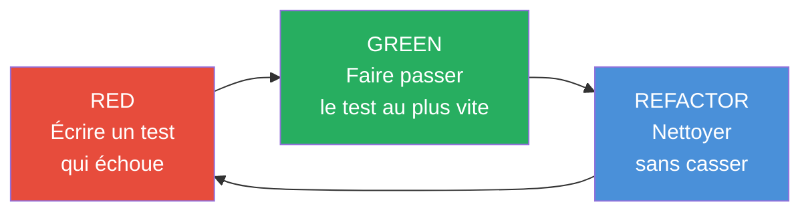
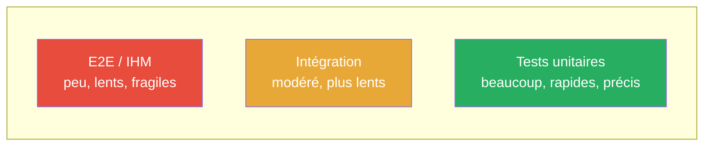
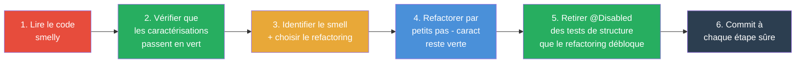

<!-- _class: lead -->
<!-- _paginate: false -->

# TDD, refactoring et code propre

**R2.03 - Qualité de développement**

IUT d'Aix-Marseille - BUT Informatique, 1re année

---

## Au programme de ce CM

<div style="display: grid; grid-template-columns: 1fr 1fr 1fr; gap: 1rem; margin-top: 1rem; font-size: 1.3rem;">
<div style="background: #27ae60; color: white; padding: 1.2rem; border-radius: 10px; text-align: center;">
<div style="font-size: 2.5rem;">✅</div>
<b>TDD approfondi</b><br/>
<span style="font-size: 0.9rem; opacity: 0.9;">F.I.R.S.T., stratégies de Beck, test doubles</span>
</div>
<div style="background: #e8a838; color: white; padding: 1.2rem; border-radius: 10px; text-align: center;">
<div style="font-size: 2.5rem;">🥋</div>
<b>Kata et pair programming</b><br/>
<span style="font-size: 0.9rem; opacity: 0.9;">Driver, navigator, ping-pong</span>
</div>
<div style="background: #e74c3c; color: white; padding: 1.2rem; border-radius: 10px; text-align: center;">
<div style="font-size: 2.5rem;">🧹</div>
<b>Code smells et refactoring</b><br/>
<span style="font-size: 0.9rem; opacity: 0.9;">Fowler, characterization tests</span>
</div>
</div>

<div style="margin-top: 1.5rem; background: #2c3e50; color: white; padding: 1rem; border-radius: 10px; text-align: center; font-size: 1.1rem;">
Ce CM prépare <b>TP3 - Kata</b> (séance 3) et <b>TP4 - Refactoring</b> (séance 4).
</div>

---

## Où on en est

<div style="display: flex; gap: 0.8rem; margin-top: 1rem;">
<div style="background: #4a90d9; color: white; padding: 1rem; border-radius: 10px; flex: 1; text-align: center; opacity: 0.55;">
<b>✓ CM1</b><br/><span style="font-size: 0.9rem;">Artisanat + Git + TDD intro</span>
</div>
<div style="background: #e8a838; color: white; padding: 1rem; border-radius: 10px; flex: 1.3; text-align: center; border: 3px solid #c87d00;">
<b>📍 CM2 (vous êtes ici)</b><br/><span style="font-size: 0.9rem;">TDD + Refactoring</span>
</div>
<div style="background: #e74c3c; color: white; padding: 1rem; border-radius: 10px; flex: 1; text-align: center;">
<b>TP1</b><br/><span style="font-size: 0.9rem;">Git avancé</span>
</div>
<div style="background: #e74c3c; color: white; padding: 1rem; border-radius: 10px; flex: 1; text-align: center;">
<b>TP2</b><br/><span style="font-size: 0.9rem;">TDD baby-steps</span>
</div>
<div style="background: #e74c3c; color: white; padding: 1rem; border-radius: 10px; flex: 1; text-align: center;">
<b>TP3</b><br/><span style="font-size: 0.9rem;">Kata + pair prog</span>
</div>
<div style="background: #e74c3c; color: white; padding: 1rem; border-radius: 10px; flex: 1; text-align: center;">
<b>TP4</b><br/><span style="font-size: 0.9rem;">Refactoring</span>
</div>
<div style="background: #2c3e50; color: white; padding: 1rem; border-radius: 10px; flex: 1; text-align: center;">
<b>CC3</b><br/><span style="font-size: 0.9rem;">Kata sur feuille</span>
</div>
</div>

<div style="margin-top: 1.5rem; font-size: 1.1rem; text-align: center;">
Le CM1 a ouvert le TDD ; on l'<b>approfondit</b> aujourd'hui. Puis on attaque le <b>refactoring</b> : transformer du code existant sans le casser. L'après-midi, on met tout ça en pratique sur TP1 (Git) et TP2 (TDD).
</div>

<div style="margin-top: 1rem; background: #fff8e1; border-left: 4px solid #e8a838; padding: 0.8rem 1rem; border-radius: 6px; font-size: 1rem;">
🛠️ <b>En CM1 on a vu <em>pourquoi</em> l'artisan prend soin de son code.</b> Aujourd'hui, on voit <b>comment il s'y prend au quotidien</b> : tester avant, refactorer souvent, nommer juste. Les gestes qui transforment l'intention en habitude.
</div>

---

<!-- _class: lead -->
<!-- _header: "" -->
<!-- _footer: "" -->

# Partie 1 - TDD approfondi

On a vu le cycle RED-GREEN-REFACTOR. Maintenant, comment en tirer le maximum ?

<div style="margin-top: 1.5rem; background: #fff8e1; border-left: 4px solid #e8a838; padding: 0.9rem 1rem; border-radius: 6px; font-size: 1rem;">
🛠️ <b>Un artisan n'expose jamais un outil qu'il n'a pas essayé lui-même.</b><br/>
Le TDD, c'est exactement ce geste : <b>écrire le test d'abord</b>, c'est s'obliger à savoir ce que l'outil doit faire <em>avant</em> de le forger. La table ne part chez le client qu'une fois essayée sur l'établi.
</div>

---

## 🔁 Rappel : le cycle RED-GREEN-REFACTOR



<div style="display: flex; gap: 1.5rem; margin-top: 1rem;">
<div style="flex: 1; background: #fde8e6; padding: 1rem; border-radius: 10px; border-left: 5px solid #e74c3c;">
<b>RED</b> : j'écris <b>un seul</b> test. Il doit échouer pour la <b>bonne raison</b> (le comportement manque, pas une coquille de syntaxe).
</div>
<div style="flex: 1; background: #e6f5ec; padding: 1rem; border-radius: 10px; border-left: 5px solid #27ae60;">
<b>GREEN</b> : je code le <b>minimum</b> pour passer. Je n'ai <b>pas</b> le droit d'anticiper.
</div>
<div style="flex: 1; background: #e6f0f9; padding: 1rem; border-radius: 10px; border-left: 5px solid #4a90d9;">
<b>REFACTOR</b> : je nettoie (noms, duplication, lisibilité). La suite de tests reste <b>verte</b>.
</div>
</div>

---

## 💰 Pourquoi ce cycle, économiquement

<div style="display: flex; gap: 2rem; margin-top: 0.5rem;">
<div style="flex: 1.1;">

Le CM1 a montré la **courbe du coût d'un bug** : 1x en dev, 6x aux tests, 15x en pré-prod, **100x chez le client**.

Le TDD attaque la courbe **au point le moins cher**. Chaque cycle RED-GREEN-REFACTOR est un bug potentiel **détecté avant qu'il existe** : vous écrivez d'abord la condition qui devra être vraie, puis le code qui la rend vraie.

Un test qui passe en 200 ms sur votre machine évite :
- quelques heures de debug quand le bug remonterait d'un user
- parfois plusieurs jours si le bug dort plusieurs releases
- parfois une perte cliente si le comportement est visible côté produit

</div>
<div style="flex: 1;">

<div style="background: #e6f5ec; padding: 1rem 1.2rem; border-radius: 10px; border-left: 5px solid #27ae60;">
<b>1 test écrit = 1 bug potentiel neutralisé<br/>au moment le moins cher</b>
</div>

<div style="margin-top: 1rem; background: #2c3e50; color: white; padding: 1rem; border-radius: 8px; font-size: 1rem;">
Le TDD ne ralentit pas le développement. Il le <b>déplace</b> : on passe du temps à tester <em>avant</em> au lieu de débugger <em>après</em>. La vitesse apparente baisse le premier jour, la vitesse réelle monte dès la deuxième semaine.
</div>

<div style="margin-top: 1rem; font-size: 0.95rem; color: #555; text-align: center;">
<em>Étude Capers Jones : les projets avec tests systématiques livrent en moyenne <b>30 % plus vite</b> sur les équipes matures.</em>
</div>

</div>
</div>

---

## 🚦 Les 3 lois du TDD (Uncle Bob)

<div style="background: #2c3e50; color: white; padding: 2rem; border-radius: 12px; font-size: 1.25rem; line-height: 1.7;">

1. Tu n'écriras **pas de code de production** tant qu'un test **échoue** ne l'exige.
2. Tu n'écriras **pas plus de test** qu'il n'en faut pour **échouer** (une erreur de compilation compte comme un échec).
3. Tu n'écriras **pas plus de code de production** qu'il n'en faut pour faire **passer** le test qui échoue.

</div>

<div style="margin-top: 1rem; text-align: center; font-size: 1.1rem; color: #555;">
Ces lois semblent extrêmes. Elles sont là pour <b>forcer les baby-steps</b>.<br/>
À chaque cycle, vous alternez entre production et test toutes les <b>30 secondes à 2 minutes</b>.
</div>

---

## 🎯 Fake it / Triangulation / Obvious : laquelle choisir ?

On les a vues au CM1. Au TP2, vous vous êtes probablement demandé : *laquelle appliquer à ce test-là ?* Voici la **décision rapide** :

<div style="display: flex; gap: 1rem; margin-top: 0.5rem;">

<div style="flex: 1; background: #2c3e50; color: white; padding: 1rem 1.2rem; border-radius: 10px;">
<b>🎭 Fake it d'abord, toujours</b>
<div style="font-size: 0.95rem; margin-top: 0.3rem;">
Même quand la solution semble évidente. <b>Pourquoi</b> : fake it vérifie que le <em>test</em> est juste, avant de se soucier du code.
</div>
<div style="font-size: 0.85rem; margin-top: 0.4rem; background: rgba(255,255,255,0.1); padding: 0.4rem 0.6rem; border-radius: 4px;">
<em>Le test passe avec une constante en dur ? OK, le test est bien formulé.</em>
</div>
</div>

<div style="flex: 1; background: #2c3e50; color: white; padding: 1rem 1.2rem; border-radius: 10px;">
<b>📐 Triangulation quand...</b>
<div style="font-size: 0.95rem; margin-top: 0.3rem;">
... le 2e ou 3e test vous <b>force</b> à généraliser. Ajoutez un cas différent, et le comportement commun émerge <em>tout seul</em>.
</div>
<div style="font-size: 0.85rem; margin-top: 0.4rem; background: rgba(255,255,255,0.1); padding: 0.4rem 0.6rem; border-radius: 4px;">
<em>FizzBuzz : après 3 tests (1, 3, 5), la logique if/else se dessine.</em>
</div>
</div>

<div style="flex: 1; background: #2c3e50; color: white; padding: 1rem 1.2rem; border-radius: 10px;">
<b>💡 Obvious seulement si...</b>
<div style="font-size: 0.95rem; margin-top: 0.3rem;">
... la solution <b>tient en une ligne</b> et vous ne pouvez <em>pas</em> vous tromper. <b>Doute</b> = pas obvious.
</div>
<div style="font-size: 0.85rem; margin-top: 0.4rem; background: rgba(255,255,255,0.1); padding: 0.4rem 0.6rem; border-radius: 4px;">
<em>return a + b; dans un addArithmetique(int, int).</em>
</div>
</div>

</div>

<div style="margin-top: 0.8rem; background: #fde8e6; border-left: 5px solid #e74c3c; padding: 0.7rem 1rem; border-radius: 6px; font-size: 0.95rem;">
⚠️ <b>Anti-pattern fréquent en BUT1</b> : "je sais déjà comment coder, je vais directement en obvious." Résultat : le test n'est jamais rouge, vous ne savez pas s'il vérifie vraiment quelque chose. <b>Fake it d'abord</b>, toujours - même 10 secondes, pour voir le test passer du rouge au vert.
</div>

---

## ✅ Qu'est-ce qu'un bon test ? Le principe F.I.R.S.T.

<div style="background: #2c3e50; color: white; padding: 1.5rem; border-radius: 12px; margin-top: 0.3rem;">

| Lettre | Signifie | Pourquoi |
|---|---|---|
| **F**ast | Rapide (quelques ms) | On les lance des dizaines de fois par heure |
| **I**ndependent | Indépendants entre eux | Changer l'ordre ne doit rien casser |
| **R**epeatable | Reproductible | Pas de dépendance au réseau, à l'heure, à un fichier temporaire |
| **S**elf-validating | Auto-vérifiant | Rouge ou vert, pas de "regardez le log" |
| **T**imely | Écrit au bon moment | **Avant** le code, pas après |

</div>

<div style="margin-top: 1rem; text-align: center; font-size: 1.1rem;">
Robert C. Martin (<em>Clean Code</em>, 2008)
</div>

<div style="margin-top: 0.8rem; background: #fff8e1; border-left: 4px solid #e8a838; padding: 0.7rem 1rem; border-radius: 6px; font-size: 0.95rem;">
🛠️ F.I.R.S.T., c'est la <b>check-list de l'artisan</b> qui vérifie que son banc de tests reste un banc, pas un gouffre. Un test lent, fragile, dépendant des voisins, c'est un outil émoussé qu'il faut <b>affûter ou jeter</b>.
</div>

---

## 🧪 La structure AAA d'un test

<div style="display: flex; gap: 1rem; margin-top: 0.5rem;">
<div style="flex: 1; background: #e6f0f9; padding: 1rem; border-radius: 10px;">

**Arrange**
Préparer l'environnement, les données, les dépendances.

**Act**
Déclencher le comportement testé (UNE seule action).

**Assert**
Vérifier le résultat (idéalement UNE assertion principale).

</div>
<div style="flex: 1.3;">

```java
@Test
void additionne_deux_entiers_positifs() {
  // Arrange
  Calculatrice c = new Calculatrice();

  // Act
  int resultat = c.additionner(2, 3);

  // Assert
  assertThat(resultat).isEqualTo(5);
}
```

</div>
</div>

<div style="margin-top: 0.8rem; background: #2c3e50; color: white; padding: 0.8rem 1rem; border-radius: 8px;">
💡 <b>Astuce nommage</b> : <code>nom_scenario_comportement_attendu</code> ou <code>should_X_when_Y</code>. Un bon nom de test se lit comme une phrase.
</div>

---

## 📝 Exemple : noms de tests parlants

<div style="display: flex; gap: 1.5rem; margin-top: 0.5rem;">
<div style="flex: 1; background: #fde8e6; padding: 1.2rem; border-radius: 10px;">

**❌ Pas clair**

```java
@Test void test1() { ... }
@Test void testAdd() { ... }
@Test void testCalc() { ... }
@Test void bugFix12345() { ... }
```

On ne sait **pas ce qui est testé**, ni **quel comportement** est attendu.

</div>
<div style="flex: 1; background: #e6f5ec; padding: 1.2rem; border-radius: 10px;">

**✅ Clair**

```java
@Test void additionne_deux_positifs()
@Test void additionne_avec_zero_retourne_lautre_nombre()
@Test void solde_negatif_leve_exception()
@Test void panier_vide_a_un_total_zero()
```

On lit le test comme une **spécification**.

</div>
</div>

<div style="margin-top: 0.8rem; background: #fff8e1; border-left: 4px solid #e8a838; padding: 0.7rem 1rem; border-radius: 6px; font-size: 0.95rem;">
<b>🥋 Ce qu'on vise au TP3</b> (kata Tennis) : des tests qui racontent une partie, pas des numéros.
<pre style="background: rgba(0,0,0,0.04); padding: 0.5rem 0.7rem; border-radius: 4px; margin-top: 0.4rem; font-size: 0.9rem;">@Test void partie_tombe_a_egalite_apres_deux_points_partout()
@Test void le_serveur_gagne_la_partie_apres_quatre_points()
@Test void avantage_au_receveur_apres_egalite_puis_point_receveur()</pre>
</div>

---

## 🥋 Grounding : ces principes sur un vrai kata

Le kata **Tennis** du TP3 illustre tout ce qu'on vient de voir. Voici 3 tests pris dans leur ordre d'écriture :

<div style="display: flex; gap: 1rem; margin-top: 0.4rem;">

<div style="flex: 1; background: #e6f5ec; padding: 0.9rem; border-radius: 8px; border-left: 4px solid #27ae60;">
<b>Test 1 - Fake it</b>
<pre style="font-size: 0.82rem; margin-top: 0.3rem;">@Test
void debut_de_partie_est_0_0() {
  assertThat(new Tennis().score())
    .isEqualTo("0-0");
}

// Impl: return "0-0";</pre>
<div style="font-size: 0.85rem; margin-top: 0.3rem;">Le test passe avec une constante. On sait que le test est juste.</div>
</div>

<div style="flex: 1; background: #fff3cd; padding: 0.9rem; border-radius: 8px; border-left: 4px solid #e8a838;">
<b>Test 2 - Triangulation</b>
<pre style="font-size: 0.82rem; margin-top: 0.3rem;">@Test
void apres_point_serveur_15_0() {
  Tennis t = new Tennis();
  t.pointPourServeur();
  assertThat(t.score())
    .isEqualTo("15-0");
}</pre>
<div style="font-size: 0.85rem; margin-top: 0.3rem;">Force à stocker un état. La constante ne suffit plus.</div>
</div>

<div style="flex: 1; background: #e6f0f9; padding: 0.9rem; border-radius: 8px; border-left: 4px solid #4a90d9;">
<b>Test 3 - Triangulation</b>
<pre style="font-size: 0.82rem; margin-top: 0.3rem;">@Test
void apres_deux_points_serveur_30_0() {
  Tennis t = new Tennis();
  t.pointPourServeur();
  t.pointPourServeur();
  assertThat(t.score())
    .isEqualTo("30-0");
}</pre>
<div style="font-size: 0.85rem; margin-top: 0.3rem;">Force une vraie table (0, 15, 30, 40). La logique émerge.</div>
</div>

</div>

<div style="margin-top: 0.6rem; text-align: center; font-size: 0.95rem; color: #555;">
<em>Chaque test est <b>un pas</b>. La conception s'invente au fur et à mesure - pas avant.</em>
</div>

---

## 🎭 Les test doubles (bref aperçu)

Quand le code testé dépend d'autre chose (base de données, service externe, horloge), on utilise un **double** - un objet qui remplace la vraie dépendance dans le test.

<div style="display: grid; grid-template-columns: 1fr 1fr; gap: 1rem; margin-top: 0.5rem;">

<div style="background: #e6f0f9; padding: 1rem; border-radius: 10px;">
<b>🪨 Stub</b> : renvoie une réponse prédéfinie.<br/>
<em>Exemple</em> : un repo qui renvoie toujours la même liste d'utilisateurs.
</div>

<div style="background: #fff3cd; padding: 1rem; border-radius: 10px;">
<b>🎯 Mock</b> : vérifie <b>comment</b> il est appelé.<br/>
<em>Exemple</em> : vérifier que <code>envoyerEmail</code> a bien été appelé 1 fois.
</div>

<div style="background: #d1ecf1; padding: 1rem; border-radius: 10px;">
<b>🕵️ Spy</b> : double qui enregistre les appels tout en utilisant la vraie implémentation.
</div>

<div style="background: #d4edda; padding: 1rem; border-radius: 10px;">
<b>🎪 Fake</b> : implémentation alternative simplifiée (ex : repo en mémoire au lieu d'une vraie BDD).
</div>

</div>

<div style="margin-top: 0.8rem; background: #2c3e50; color: white; padding: 0.8rem; border-radius: 8px; text-align: center; font-size: 0.95rem;">
Dans ce module, l'outillage tests mis en pratique est surtout <b>ApprovalTests</b> (kata à sortie textuelle, cf. TP2 Minesweeper) et le <b>pair programming ping-pong</b> (TP3). <b>Mockito</b> est disponible en dépendance si vous en avez besoin, mais n'est pas exercé ici. Pas obligatoire au CC3.
</div>

---

## 🎯 Exemple Mockito

```java
@Test
void envoie_un_email_quand_la_commande_est_validee() {
  // Arrange : on crée un mock
  EmailService email = mock(EmailService.class);
  GestionCommande g = new GestionCommande(email);

  // Act
  g.valider(new Commande("alice@iut.fr", 42));

  // Assert : on vérifie l'appel
  verify(email).envoyer("alice@iut.fr", "Commande 42 confirmée");
}
```

<div style="margin-top: 0.8rem; background: #fff3cd; padding: 1rem; border-radius: 8px;">
⚠️ <b>Ne pas abuser des mocks</b>. Un mock remplace une vraie dépendance : s'il est mal configuré, le test peut passer alors que le code est cassé.<br/>
Règle pragmatique : <b>mocker seulement ce qu'on ne contrôle pas</b> (I/O, réseau, horloge).
</div>

---

## 📸 ApprovalTests : quand la sortie est textuelle

Pour du code qui produit une sortie complexe (grille, JSON, rapport), écrire l'attendu à la main est pénible.

<div style="display: flex; gap: 1rem; margin-top: 0.5rem;">
<div style="flex: 1.2;">

```java
@Test
void grille_demineur_5x5() {
  List<String> entree = List.of(
    " *   ",
    "     ",
    "  *  ",
    "     ",
    "   * "
  );
  List<String> sortie =
    new GrilleDemineur(entree).annotee();
  Approvals.verifyAll("", sortie);
}
```

</div>
<div style="flex: 1;">

<div style="background: #e6f5ec; padding: 1rem; border-radius: 10px;">

**Principe**
1. Je lance le test
2. La sortie va dans `...received.txt`
3. Je <b>vérifie visuellement</b>
4. Je renomme `received` → `approved`
5. Le test compare ensuite `received` à `approved`

</div>

</div>
</div>

<div style="margin-top: 0.5rem; background: #2c3e50; color: white; padding: 0.8rem; border-radius: 8px; text-align: center;">
Utilisé au TP2 exercice 5 (Démineur) - gain énorme sur les grandes grilles.
</div>

---

## 💡 Règles pour ne pas se planter en TDD

<div style="display: grid; grid-template-columns: 1fr 1fr; gap: 1rem; margin-top: 0.5rem;">

<div style="background: #fde8e6; padding: 1rem; border-radius: 10px; border-left: 5px solid #e74c3c;">
<b>❌ Ne pas écrire plusieurs tests à la suite sans coder.</b><br/>
<span style="font-size: 0.9rem;">Un test écrit, un test codé. Sinon vous perdez le filet de sécurité.</span>
</div>

<div style="background: #fde8e6; padding: 1rem; border-radius: 10px; border-left: 5px solid #e74c3c;">
<b>❌ Ne pas écrire du code qui n'est pas couvert par un test.</b><br/>
<span style="font-size: 0.9rem;">Si vous écrivez une branche <code>if</code> en plus, un test doit l'exiger.</span>
</div>

<div style="background: #fde8e6; padding: 1rem; border-radius: 10px; border-left: 5px solid #e74c3c;">
<b>❌ Ne pas sauter le REFACTOR.</b><br/>
<span style="font-size: 0.9rem;">Le cycle est à 3 étapes, pas à 2. Sinon la dette technique explose.</span>
</div>

<div style="background: #e6f5ec; padding: 1rem; border-radius: 10px; border-left: 5px solid #27ae60;">
<b>✅ Vérifier que le test <u>échoue</u> avant de coder.</b><br/>
<span style="font-size: 0.9rem;">Sinon vous risquez un faux positif : un test qui passait déjà.</span>
</div>

<div style="background: #e6f5ec; padding: 1rem; border-radius: 10px; border-left: 5px solid #27ae60;">
<b>✅ Commit à chaque GREEN ou REFACTOR.</b><br/>
<span style="font-size: 0.9rem;">Chaque état vert est un point de sauvegarde exploitable.</span>
</div>

<div style="background: #e6f5ec; padding: 1rem; border-radius: 10px; border-left: 5px solid #27ae60;">
<b>✅ Un seul test qui échoue à la fois.</b><br/>
<span style="font-size: 0.9rem;">Focaliser l'attention. Pas 5 rouges en parallèle.</span>
</div>

</div>

---

## 📊 Pyramide des tests



<div style="margin-top: 0.5rem; display: flex; gap: 1rem;">
<div style="flex: 1; background: #e6f5ec; padding: 1rem; border-radius: 8px;">
<b>Beaucoup</b> de tests unitaires (vite, ciblés) : la base de la pyramide.
</div>
<div style="flex: 1; background: #fff3cd; padding: 1rem; border-radius: 8px;">
<b>Moins</b> de tests d'intégration (plusieurs classes ensemble).
</div>
<div style="flex: 1; background: #fde8e6; padding: 1rem; border-radius: 8px;">
<b>Encore moins</b> de tests bout-en-bout (lents, cassants).
</div>
</div>

<div style="margin-top: 0.5rem; text-align: center; font-size: 1rem; color: #555;">
Dans ce module, on se concentre sur la <b>base</b> : les tests unitaires.
</div>

---

## 🧬 Bonus : la couverture ne suffit pas

<div style="display: flex; gap: 1.5rem; margin-top: 0.4rem;">
<div style="flex: 1.1;">

**La couverture de code** (JaCoCo, IntelliJ Coverage) dit : *"quelles lignes ont été exécutées par les tests ?"*

C'est utile... mais ça ne dit **pas** si vos tests détectent de vrais bugs. Exemple piège :

```java
int diviser(int a, int b) {
  return a / b;  // ligne 100% couverte
}

@Test void test() { diviser(10, 2); }  // aucun assert !
```

La ligne est couverte à 100 %. Aucun bug ne sera détecté.

</div>
<div style="flex: 1;">

<div style="background: #e6f0f9; padding: 1rem 1.2rem; border-radius: 10px; border-left: 5px solid #4a90d9;">
<b>Mutation testing</b> (outil <b>PIT</b> en Java) répond à une question plus dure : <em>"si je modifie subtilement le code de production, est-ce que mes tests le détectent ?"</em>
</div>

<div style="margin-top: 0.8rem; background: #fff3cd; padding: 0.8rem 1rem; border-radius: 8px; font-size: 0.95rem;">
<b>Exemple de mutation</b> : PIT remplace <code>a + b</code> par <code>a - b</code>. Si votre test passe toujours, votre test était <b>tautologique</b>. Si le test casse : bien, il avait du sens.
</div>

<div style="margin-top: 0.8rem; text-align: center; font-size: 0.95rem;">
<b>Score PIT</b> = % de mutations détectées par la suite de tests.<br/>
Un score 80 % raconte <em>vraiment</em> la qualité des tests.
</div>

</div>
</div>

<div style="margin-top: 0.8rem; background: #2c3e50; color: white; padding: 0.7rem 1rem; border-radius: 8px; font-size: 0.95rem; text-align: center;">
<b>Hors scope R2.03</b>, mais à connaître : quand une entreprise est sérieuse sur la qualité des tests, elle regarde <b>le score mutation</b>, pas seulement la couverture. Outil gratuit : <a href="https://pitest.org" style="color: #e8a838;">pitest.org</a>.
</div>

---

## 🌄 Où s'arrête le TDD ?

<div style="display: flex; gap: 1.2rem; margin-top: 0.8rem;">

<div style="flex: 1; background: #e6f5ec; padding: 1rem 1.2rem; border-radius: 10px; border-left: 5px solid #27ae60;">
<b>Ce que le TDD fait bien</b>
<ul style="font-size: 0.95rem; margin-top: 0.3rem;">
<li>Cadrer une <b>intention</b> avant de coder</li>
<li>Donner un <b>filet</b> pour refactorer sereinement</li>
<li>Produire une <b>documentation vivante</b> du comportement</li>
<li>Forcer un <b>découplage</b> (sinon le test devient injouable)</li>
</ul>
</div>

<div style="flex: 1; background: #fde8e6; padding: 1rem 1.2rem; border-radius: 10px; border-left: 5px solid #e74c3c;">
<b>Ce que le TDD ne fait PAS</b>
<ul style="font-size: 0.95rem; margin-top: 0.3rem;">
<li><b>Garantir</b> que le produit est utile pour le client</li>
<li>Remplacer la <b>revue de code</b> et le <b>pair programming</b></li>
<li>Couvrir les bugs d'<b>intégration</b>, de <b>perf</b>, d'<b>ergonomie</b></li>
<li>Dispenser de <b>penser</b> - un test tautologique passera toujours</li>
</ul>
</div>

</div>

<div style="margin-top: 0.8rem; background: #fff8e1; border-left: 4px solid #e8a838; padding: 0.8rem 1rem; border-radius: 6px; font-size: 1rem;">
🛠️ L'artisan connaît ses outils - et leurs <b>limites</b>. Un marteau ne visse pas une vis, même très bien utilisé. Le TDD est un outil puissant pour <b>le code qui prend en charge une logique claire</b> ; il ne remplace ni les tests d'intégration, ni la relecture humaine, ni l'entretien avec le client qui dira si l'ouvrage correspond à son besoin.
</div>

---

<!-- _class: lead -->
<!-- _header: "" -->
<!-- _footer: "" -->

# Partie 2 - Le kata et le pair programming

Comment on devient meilleur ? En répétant des gestes simples.

---

## 🥋 Qu'est-ce qu'un kata ?

<div style="display: flex; gap: 2rem; margin-top: 1rem;">
<div style="flex: 1;">

Dans les arts martiaux, un **kata** est une séquence de mouvements qu'on répète jusqu'à ce que le corps l'exécute sans y penser.

En programmation, un **coding kata** est un petit exercice qu'on refait **plusieurs fois** pour :

- **automatiser** des gestes (raccourcis IDE, TDD, refactoring)
- **essayer** des approches différentes
- **comparer** avec d'autres développeurs

Concept popularisé par **Dave Thomas** (*The Pragmatic Programmer*, 2003).

</div>
<div style="flex: 1;">

<div style="background: #e8a838; color: white; padding: 1.5rem; border-radius: 12px; font-size: 1.1rem;">

🎯 **Le but n'est pas de résoudre le problème.**
Le problème, vous le connaissez déjà.

Le but, c'est d'améliorer **votre façon** de le résoudre.

</div>

<div style="margin-top: 1rem; background: #2c3e50; color: white; padding: 1rem; border-radius: 10px; font-size: 0.95rem;">
Analogie : un pianiste ne joue pas ses gammes pour "réussir les gammes". Il les joue pour <b>garder la main</b>.
</div>

</div>
</div>

---

## 🥋 Quelques kata célèbres

<div style="display: grid; grid-template-columns: 1fr 1fr; gap: 0.8rem; margin-top: 0.5rem; font-size: 0.95rem;">

<div style="background: #e6f0f9; padding: 0.8rem 1rem; border-radius: 8px;">
<b>🎳 Bowling (Uncle Bob)</b><br/>
Calcul d'un score de bowling. Simple, mais plein de pièges sur les strikes et spares.
</div>

<div style="background: #e6f0f9; padding: 0.8rem 1rem; border-radius: 8px;">
<b>🎾 Tennis (various)</b><br/>
Afficher le score d'un jeu de tennis. Idéal pour les state machines.
</div>

<div style="background: #e6f0f9; padding: 0.8rem 1rem; border-radius: 8px;">
<b>🎲 Yahtzee</b><br/>
Scorer les combinaisons d'un jet de 5 dés. Bon terrain pour la stratégie.
</div>

<div style="background: #e6f0f9; padding: 0.8rem 1rem; border-radius: 8px;">
<b>🔢 String Calculator (Osherove)</b><br/>
Parser une chaîne et additionner les nombres. Progression en 9 étapes.
</div>

<div style="background: #e6f0f9; padding: 0.8rem 1rem; border-radius: 8px;">
<b>🗓️ Années bissextiles</b><br/>
Multi-règles booléennes. Premier kata idéal.
</div>

<div style="background: #e6f0f9; padding: 0.8rem 1rem; border-radius: 8px;">
<b>🏪 Gilded Rose (Emily Bache)</b><br/>
Kata de <b>refactoring</b> sur du legacy volontairement horrible.
</div>

</div>

<div style="margin-top: 0.8rem; text-align: center; background: #2c3e50; color: white; padding: 0.8rem; border-radius: 8px;">
Au TP3, on en fera <b>5</b> : Années bissextiles, Tennis, Gestion employés, Pagination, Yahtzee.
</div>

---

## 🤔 Pourquoi refaire un kata qu'on sait résoudre ?

<div style="display: grid; grid-template-columns: 1fr 1fr; gap: 1rem; margin-top: 0.5rem;">

<div style="background: #e6f5ec; padding: 1rem; border-radius: 10px;">
<b>🏃 1ère fois</b> : je galère, je découvre les règles. Je code "quelque chose qui marche".
</div>

<div style="background: #e6f5ec; padding: 1rem; border-radius: 10px;">
<b>2ème fois</b> : je vais plus vite, je vois les pièges. Je soigne le nommage.
</div>

<div style="background: #e6f5ec; padding: 1rem; border-radius: 10px;">
<b>3ème fois</b> : je teste une autre approche (fake-it seulement, triangulation seulement).
</div>

<div style="background: #e6f5ec; padding: 1rem; border-radius: 10px;">
<b>10ème fois</b> : je suis fluide. Je peux me concentrer sur le <b>style</b>, pas le problème.
</div>

</div>

<div style="margin-top: 0.8rem; background: #2c3e50; color: white; padding: 1rem; border-radius: 10px; text-align: center; font-size: 1.1rem;">
Un sportif ne s'entraîne pas le jour du match. Un développeur non plus.
</div>

---

## 👥 Le pair programming

<div style="display: flex; gap: 1.5rem; margin-top: 0.3rem;">
<div style="flex: 1;">

**Deux personnes, un clavier.**

<div style="background: #4a90d9; color: white; padding: 1rem; border-radius: 10px; margin-top: 0.8rem;">
<b>🎮 Driver</b><br/>Celui qui tape. Se concentre sur le <b>comment</b> (syntaxe, IDE, tests qui passent).
</div>

<div style="background: #27ae60; color: white; padding: 1rem; border-radius: 10px; margin-top: 0.5rem;">
<b>🧭 Navigator</b><br/>Celui qui pense. Se concentre sur le <b>quoi</b> (design, edge cases, lisibilité).
</div>

<div style="background: #2c3e50; color: white; padding: 0.8rem; border-radius: 8px; margin-top: 0.8rem; text-align: center;">
On <b>échange</b> les rôles toutes les 7 à 10 minutes.
</div>

</div>
<div style="flex: 1;">

<div style="background: #e8a838; color: white; padding: 1.5rem; border-radius: 12px;">

**Bénéfices**

- Moins de bugs (deux cerveaux sur chaque ligne)
- Montée en compétences croisée
- Moins de "bus factor" sur le code
- Revue de code permanente, en temps réel
- Effet antisomnolent 😴

</div>

<div style="margin-top: 1rem; background: #fde8e6; padding: 1rem; border-radius: 10px; border-left: 5px solid #e74c3c;">

**⚠ Attention**
- Pas le même que "un qui code, un qui regarde son téléphone"
- Fatigant - faire des pauses toutes les heures

</div>

</div>
</div>

---

## 🏓 Le ping-pong TDD

Un cas particulier très puissant de pair programming :

<div style="background: #2c3e50; color: white; padding: 1.5rem; border-radius: 12px; margin-top: 0.5rem;">

1. **A écrit un test** qui échoue (RED).
2. **B écrit le code** qui fait passer (GREEN).
3. **B écrit le test suivant** qui échoue (RED).
4. **A écrit le code** qui fait passer (GREEN).
5. À tour de rôle pour **REFACTOR**.

</div>

<div style="display: flex; gap: 1rem; margin-top: 0.8rem;">
<div style="flex: 1; background: #e6f5ec; padding: 1rem; border-radius: 10px;">
<b>✅ Avantage 1</b> : chacun des deux <b>devine l'intention</b> de l'autre. Excellent pour le design.
</div>
<div style="flex: 1; background: #e6f5ec; padding: 1rem; border-radius: 10px;">
<b>✅ Avantage 2</b> : impossible d'écrire du code "en douce" sans test. Le coéquipier impose la discipline.
</div>
<div style="flex: 1; background: #e6f5ec; padding: 1rem; border-radius: 10px;">
<b>✅ Avantage 3</b> : on voit <b>immédiatement</b> si un test est mal écrit - l'autre ne sait pas quoi coder.
</div>
</div>

---

## 🎯 Démo en ouverture du TP3

Au début du TP3, on fera **20 min de kata live** en pair programming.

<div style="display: grid; grid-template-columns: 1fr 1fr; gap: 1rem; margin-top: 0.8rem;">

<div style="background: #e6f0f9; padding: 1rem; border-radius: 10px;">
<b>Kata retenu</b> : <em>Tennis scoring</em><br/>
Un état (jeu en cours) + un comportement (marquer un point) → l'affichage du score.
</div>

<div style="background: #e6f0f9; padding: 1rem; border-radius: 10px;">
<b>Ce que vous verrez</b> :<br/>
- Alternance driver/navigator toutes les ~5 min<br/>
- Commit à chaque GREEN<br/>
- Pas de shortcut IDE (vous devez suivre)
</div>

</div>

<div style="margin-top: 0.8rem; background: #e8a838; color: white; padding: 1rem; border-radius: 10px; text-align: center; font-size: 1.1rem;">
🥋 Le but : que vous voyiez <b>à quoi ressemble</b> une séance TDD en binôme - pas juste lire le texte d'un kata.
</div>

---

<!-- _class: lead -->
<!-- _header: "" -->
<!-- _footer: "" -->

# Partie 3 - Code smells et refactoring

Du code qui marche, mais qui pue. On fait quoi ?

<div style="margin-top: 1.5rem; background: #fff8e1; border-left: 4px solid #e8a838; padding: 0.9rem 1rem; border-radius: 6px; font-size: 1rem;">
🛠️ <b>Un artisan entretient ses outils.</b><br/>
Le menuisier aiguise sa scie entre deux chantiers. Le chef récure ses couteaux en fin de service. Pas par perfectionnisme - parce que demain ils s'en servent <em>encore</em>. Refactorer, c'est exactement ce geste : on ne le fait pas pour faire joli, on le fait pour <b>rester rapide ensuite</b>. Le code qu'on lit cette semaine, c'est celui qu'on modifiera le mois prochain.
</div>

---

## 👃 Qu'est-ce qu'un code smell ?

<div style="display: flex; gap: 2rem; align-items: center; margin-top: 0.5rem;">
<div style="flex: 1.2;">

Terme inventé par **Kent Beck** et popularisé par **Martin Fowler** (*Refactoring*, 1999).

Un **code smell** est un **indice** que quelque chose ne va pas dans votre code. Pas un bug, pas une erreur de compilation - juste un signal qui dit :

> "Attention, cette zone devient difficile à maintenir."

Un peu comme un aliment qui sent bizarre : **pas forcément périmé, mais il faut regarder de près.**

</div>
<div style="flex: 1; text-align: center;">

<div style="background: #e74c3c; color: white; padding: 2rem; border-radius: 12px; font-size: 3rem;">
👃
</div>

<div style="margin-top: 1rem; background: #2c3e50; color: white; padding: 1rem; border-radius: 8px; font-size: 0.9rem;">
"If it stinks, change it." - Kent Beck
</div>

</div>
</div>

---

## 📚 Les code smells les plus courants (1/2)

<div style="display: grid; grid-template-columns: 1fr 1fr; gap: 0.8rem; margin-top: 0.3rem; font-size: 0.92rem;">

<div style="background: #fde8e6; padding: 0.8rem 1rem; border-radius: 8px; border-left: 4px solid #e74c3c;">
<b>📏 Long Method</b><br/>
Une méthode de 50 lignes qu'on scroll pour la lire.<br/>
<em>Solution</em> : Extract Method.
</div>

<div style="background: #fde8e6; padding: 0.8rem 1rem; border-radius: 8px; border-left: 4px solid #e74c3c;">
<b>🏢 Large Class</b><br/>
Une classe qui fait tout (God class).<br/>
<em>Solution</em> : Extract Class.
</div>

<div style="background: #fde8e6; padding: 0.8rem 1rem; border-radius: 8px; border-left: 4px solid #e74c3c;">
<b>📋 Long Parameter List</b><br/>
Une méthode à 7 paramètres, imbuvable à l'appel.<br/>
<em>Solution</em> : Introduce Parameter Object.
</div>

<div style="background: #fde8e6; padding: 0.8rem 1rem; border-radius: 8px; border-left: 4px solid #e74c3c;">
<b>👯 Duplicated Code</b><br/>
Le même bloc copié-collé en 3 endroits.<br/>
<em>Solution</em> : Extract Method / Move Method.
</div>

<div style="background: #fde8e6; padding: 0.8rem 1rem; border-radius: 8px; border-left: 4px solid #e74c3c;">
<b>🔢 Magic Numbers</b><br/>
<code>if (age > 65)</code>, <code>total *= 1.20</code>.<br/>
<em>Solution</em> : Replace Magic Number with Constant.
</div>

<div style="background: #fde8e6; padding: 0.8rem 1rem; border-radius: 8px; border-left: 4px solid #e74c3c;">
<b>🌳 Nested Conditionals</b><br/>
Des <code>if</code> imbriqués sur 5 niveaux.<br/>
<em>Solution</em> : Guard Clauses, Extract Method.
</div>

</div>

---

## 📚 Les code smells les plus courants (2/2)

<div style="display: grid; grid-template-columns: 1fr 1fr; gap: 0.8rem; margin-top: 0.3rem; font-size: 0.92rem;">

<div style="background: #fde8e6; padding: 0.8rem 1rem; border-radius: 8px; border-left: 4px solid #e74c3c;">
<b>🔌 Feature Envy</b><br/>
Une méthode de A qui manipule surtout des données de B.<br/>
<em>Solution</em> : Move Method.
</div>

<div style="background: #fde8e6; padding: 0.8rem 1rem; border-radius: 8px; border-left: 4px solid #e74c3c;">
<b>🧩 Data Clumps</b><br/>
Les mêmes 3 paramètres qui voyagent ensemble partout.<br/>
<em>Solution</em> : Extract Class.
</div>

<div style="background: #fde8e6; padding: 0.8rem 1rem; border-radius: 8px; border-left: 4px solid #e74c3c;">
<b>🔣 Primitive Obsession</b><br/>
<code>String email</code>, <code>int codePostal</code> partout au lieu de vrais types.<br/>
<em>Solution</em> : Replace Primitive with Object.
</div>

<div style="background: #fde8e6; padding: 0.8rem 1rem; border-radius: 8px; border-left: 4px solid #e74c3c;">
<b>🔀 Switch Statements</b><br/>
Un <code>switch</code> sur un type, dupliqué en 5 endroits.<br/>
<em>Solution</em> : Replace Conditional with Polymorphism.
</div>

<div style="background: #fde8e6; padding: 0.8rem 1rem; border-radius: 8px; border-left: 4px solid #e74c3c;">
<b>💬 Comments qui expliquent le code</b><br/>
Un commentaire qui traduit ce que fait un bloc.<br/>
<em>Solution</em> : Extract Method avec un bon nom.
</div>

<div style="background: #fde8e6; padding: 0.8rem 1rem; border-radius: 8px; border-left: 4px solid #e74c3c;">
<b>🏷️ Mauvais nommage</b><br/>
<code>int x, y, z</code>, <code>void doStuff()</code>.<br/>
<em>Solution</em> : Rename.
</div>

</div>

---

## 🔧 Qu'est-ce qu'un refactoring ?

<div style="background: #2c3e50; color: white; padding: 1.5rem; border-radius: 12px; font-size: 1.2rem; line-height: 1.6; margin-top: 0.5rem;">

> **Refactoring** : modifier la **structure interne** du code<br/>
> <b>sans changer son comportement observable</b>.

<div style="margin-top: 0.5rem; font-size: 0.9rem; opacity: 0.8;">
Martin Fowler, <em>Refactoring: Improving the Design of Existing Code</em> (1999, 2018)
</div>

</div>

<div style="display: flex; gap: 1.5rem; margin-top: 1rem;">
<div style="flex: 1; background: #e6f5ec; padding: 1rem; border-radius: 10px;">
<b>✅ Refactoring</b><br/>
Renommer une variable, extraire une méthode, bouger un champ dans une autre classe.<br/>
→ <b>Les tests existants continuent de passer.</b>
</div>

<div style="flex: 1; background: #fde8e6; padding: 1rem; border-radius: 10px;">
<b>❌ Pas un refactoring</b><br/>
Changer ce que fait une méthode, ajouter une fonctionnalité, corriger un bug.<br/>
→ Là, les tests changent (ou en deviennent rouges).
</div>
</div>

<div style="margin-top: 0.8rem; background: #e8a838; color: white; padding: 0.8rem; border-radius: 8px; text-align: center;">
🛡️ <b>Prérequis absolu</b> : une suite de tests qui couvre le comportement. Sinon vous faites du <em>rewriting</em>, pas du refactoring.
</div>

---

## 📖 Le catalogue de Fowler (70+ refactorings)

<div style="display: grid; grid-template-columns: 1fr 1fr; gap: 0.8rem; margin-top: 0.3rem; font-size: 0.95rem;">

<div style="background: #e6f0f9; padding: 0.8rem 1rem; border-radius: 8px;">
<b>🏷️ Rename</b><br/>
Renommer variable, méthode, classe. Le plus fréquent.
</div>

<div style="background: #e6f0f9; padding: 0.8rem 1rem; border-radius: 8px;">
<b>✂️ Extract Method</b><br/>
Sortir un bloc dans une méthode nommée.
</div>

<div style="background: #e6f0f9; padding: 0.8rem 1rem; border-radius: 8px;">
<b>📌 Inline</b><br/>
L'inverse : replacer le corps d'une méthode dans l'appelant.
</div>

<div style="background: #e6f0f9; padding: 0.8rem 1rem; border-radius: 8px;">
<b>📦 Extract Class</b><br/>
Sortir un groupe de champs + méthodes dans une nouvelle classe.
</div>

<div style="background: #e6f0f9; padding: 0.8rem 1rem; border-radius: 8px;">
<b>➡️ Move Method</b><br/>
Déplacer une méthode vers la classe qu'elle utilise le plus.
</div>

<div style="background: #e6f0f9; padding: 0.8rem 1rem; border-radius: 8px;">
<b>🎁 Introduce Parameter Object</b><br/>
Grouper des paramètres qui voyagent ensemble dans un objet.
</div>

<div style="background: #e6f0f9; padding: 0.8rem 1rem; border-radius: 8px;">
<b>🦎 Replace Conditional with Polymorphism</b><br/>
Un <code>switch</code> → une hiérarchie de classes.
</div>

<div style="background: #e6f0f9; padding: 0.8rem 1rem; border-radius: 8px;">
<b>🔢 Replace Magic Number with Constant</b><br/>
<code>0.2</code> → <code>TAUX_TVA</code>.
</div>

</div>

<div style="margin-top: 0.7rem; text-align: center; background: #2c3e50; color: white; padding: 0.7rem; border-radius: 8px; font-size: 0.95rem;">
Référence : <a href="https://refactoring.com/catalog/" style="color: #a0d8f8;">refactoring.com/catalog</a> - le catalogue complet en ligne.
</div>

---

## 🧪 Exemple : Extract Method

<div style="display: flex; gap: 1rem;">
<div style="flex: 1; background: #fde8e6; padding: 0.8rem; border-radius: 8px; font-size: 0.8rem;">

**Avant (smell : Long Method)**

```java
void imprimerFacture(Client c, List<Article> a) {
  // entête
  System.out.println("=== FACTURE ===");
  System.out.println("Client : " + c.nom());
  System.out.println("Date : " + LocalDate.now());

  // lignes
  for (Article art : a) {
    System.out.printf("  %s x%d : %.2f€%n",
      art.nom(), art.qte(), art.prix() * art.qte());
  }

  // total
  double t = 0;
  for (Article art : a) t += art.prix() * art.qte();
  System.out.printf("TOTAL : %.2f€%n", t * 1.20);
}
```

</div>
<div style="flex: 1; background: #e6f5ec; padding: 0.8rem; border-radius: 8px; font-size: 0.8rem;">

**Après**

```java
void imprimerFacture(Client c, List<Article> a) {
  imprimerEntete(c);
  imprimerLignes(a);
  imprimerTotal(a);
}

void imprimerEntete(Client c) {
  System.out.println("=== FACTURE ===");
  System.out.println("Client : " + c.nom());
  System.out.println("Date : " + LocalDate.now());
}

void imprimerLignes(List<Article> a) { /* ... */ }

double calculerTotalHT(List<Article> a) {
  return a.stream()
    .mapToDouble(x -> x.prix() * x.qte()).sum();
}
```

</div>
</div>

<div style="margin-top: 0.5rem; text-align: center; background: #2c3e50; color: white; padding: 0.5rem; border-radius: 6px; font-size: 0.95rem;">
Code de <b>gauche</b> : on doit tout lire pour comprendre. <b>Droite</b> : on lit <code>imprimerFacture</code> comme un sommaire.
</div>

---

## 🧪 Exemple : Replace Conditional with Polymorphism

<div style="display: flex; gap: 1rem;">
<div style="flex: 1; background: #fde8e6; padding: 0.8rem; border-radius: 8px; font-size: 0.8rem;">

**Avant (smell : Switch Statements)**

```java
class Animal {
  String type;

  String faireDuBruit() {
    switch (type) {
      case "chien":  return "Wouf !";
      case "chat":   return "Miaou !";
      case "vache":  return "Meuh !";
      case "canard": return "Coin coin !";
      default: throw new IllegalStateException();
    }
  }
}
```

Chaque nouveau type → modifier cette classe.<br/>
Un <code>switch</code> sur le type est souvent dupliqué.

</div>
<div style="flex: 1; background: #e6f5ec; padding: 0.8rem; border-radius: 8px; font-size: 0.8rem;">

**Après**

```java
abstract class Animal {
  abstract String faireDuBruit();
}

class Chien extends Animal {
  String faireDuBruit() { return "Wouf !"; }
}

class Chat extends Animal {
  String faireDuBruit() { return "Miaou !"; }
}

class Vache extends Animal {
  String faireDuBruit() { return "Meuh !"; }
}
```

Nouveau type → nouvelle classe. **Pas touche** au reste.

</div>
</div>

<div style="margin-top: 0.5rem; text-align: center; background: #2c3e50; color: white; padding: 0.5rem; border-radius: 6px; font-size: 0.95rem;">
Principe <b>Open/Closed</b> : ouvert à l'extension, fermé à la modification.
</div>

---

## 🛠️ Votre IDE fait le gros du travail

<div style="display: flex; gap: 1.5rem; margin-top: 0.5rem;">
<div style="flex: 1;">

Un refactoring **manuel** est risqué. Un oubli, un mauvais remplacement → comportement changé.

Les TP se font dans le **Codespace VS Code** avec l'extension Java officielle (Red Hat). Les gestes de refactoring passent par deux entrées :

- **`Ctrl+.`** (ou `Cmd+.` sur Mac) : menu **Quick Fix + Refactor** contextuel. Propose *Extract to method*, *Extract to constant*, *Extract to variable / field*, *Move...*, *Inline...*, *Add unimplemented methods* selon ce que le curseur touche.
- **`F2`** : **Rename** (propage partout, imports + Javadoc inclus).

</div>
<div style="flex: 1;">

<div style="background: #4a90d9; color: white; padding: 1.5rem; border-radius: 12px;">

**💡 Règle pragmatique**

> Si tu peux faire le refactoring **avec un raccourci IDE**, fais-le avec. Si tu dois le faire à la main, **ajoute d'abord des tests**.

</div>

<div style="margin-top: 1rem; background: #fff3cd; padding: 1rem; border-radius: 8px; font-size: 0.95rem;">

**Au TP4**, on abuse de <code>Ctrl+.</code> et <code>F2</code>. Le README liste la correspondance raccourci → refactoring pour chaque exercice.

</div>

<div style="margin-top: 0.5rem; font-size: 0.85rem; color: #666;">
<em>IntelliJ IDEA fait les mêmes refactorings avec <code>Ctrl+Alt+M</code>, <code>Ctrl+Alt+V</code>, <code>Shift+F6</code>... si vous préférez l'utiliser en dehors des TP.</em>
</div>

</div>
</div>

---

## 🛡️ Characterization tests : sécuriser du legacy

<div style="display: flex; gap: 1.5rem; margin-top: 0.3rem;">
<div style="flex: 1;">

Concept de **Michael Feathers** (*Working Effectively with Legacy Code*, 2004).

> **Legacy code** = du code **sans tests**, qu'on doit faire évoluer.

**Problème** : on veut refactorer, mais sans tests on n'a pas de filet.

**Solution** : des **characterization tests** - des tests qui **décrivent le comportement actuel** du code, qu'il soit "juste" ou non.

</div>
<div style="flex: 1;">

<div style="background: #2c3e50; color: white; padding: 1.2rem; border-radius: 12px;">

**Démarche**

1. Je prends le code en entrée.
2. Je lance le code, j'observe la sortie.
3. J'écris un test qui **attend cette sortie**.
4. Le test passe - je l'ai **figé**.
5. Maintenant je peux refactorer : si un test casse, j'ai changé le comportement (donc j'ai un bug, pas un refactoring).

</div>

<div style="margin-top: 0.8rem; background: #e8a838; color: white; padding: 0.8rem; border-radius: 8px; text-align: center; font-size: 0.95rem;">
Ces tests <b>ne valident pas</b> que le code est juste - ils le <b>pinnent</b>.
</div>

</div>
</div>

---

## 🎯 Le pattern du TP4

Chaque exercice du TP4 suit le même squelette, avec **deux familles de tests** :



<div style="margin-top: 0.5rem; background: #eef6fb; padding: 0.8rem 1rem; border-left: 4px solid #4a90d9; border-radius: 6px; font-size: 0.95rem;">
<b>Deux filets de tests, deux rôles</b> :<br/>
• <b>Caractérisation</b> (active, verte dès le départ) : pin le comportement. Elle doit <b>rester verte</b> après chaque transformation - c'est votre garde-fou anti-régression.<br/>
• <b>Structure</b> (<code>@Disabled</code> au départ) : vérifie que votre refactoring a produit la bonne extraction (méthode, constante, classe, record). Vous la débloquez <b>au fur et à mesure</b>. Elle prouve que le geste a été fait, pas juste que rien n'est cassé.
</div>

<div style="margin-top: 0.5rem; background: #fff3cd; padding: 0.8rem 1rem; border-radius: 8px; text-align: center;">
⚠️ <b>Si une caractérisation casse</b>, ne la modifiez pas pour la faire passer. Annulez votre dernière transformation (<code>git restore .</code>). Votre "refactoring" était un <b>bug</b>.
</div>

---

## 🌹 Le kata Gilded Rose

<div style="display: flex; gap: 1.5rem;">
<div style="flex: 1.2;">

**Créé par Terry Hughes, popularisé par Emily Bache.**

Un magasin vend des articles qui évoluent tous les jours :
- Articles normaux (perdent en qualité)
- Aged Brie (gagne en qualité)
- Sulfuras (immuable)
- Backstage passes (complexe)
- **Conjured** (à ajouter)

Le code source tient en **35 lignes** - mais quelles lignes. `if` imbriqués, noms cryptiques, duplication partout.

**Votre mission** :
1. Comprendre (*characterization tests*)
2. Refactorer (sans casser)
3. **Ajouter la fonctionnalité Conjured**

</div>
<div style="flex: 1;">

<div style="background: #8e44ad; color: white; padding: 1.2rem; border-radius: 12px;">

**Pourquoi ce kata est devenu un classique**

C'est exactement la situation d'un développeur qui arrive dans une entreprise :

- du code qu'il n'a pas écrit
- sans docs
- qu'il faut **modifier**
- sans **casser** l'existant

Ajouter Conjured **directement** dans le code spaghetti est très risqué. Le refactoring **d'abord** rend le changement trivial.

</div>

<div style="margin-top: 0.8rem; background: #2c3e50; color: white; padding: 0.8rem; border-radius: 8px; text-align: center;">
🎬 <b>Démo live en ouverture du TP4</b> (20 min).
</div>

</div>
</div>

---

## 🌄 Où s'arrête le refactoring ?

<div style="display: flex; gap: 1.2rem; margin-top: 0.8rem;">

<div style="flex: 1; background: #e6f5ec; padding: 1rem 1.2rem; border-radius: 10px; border-left: 5px solid #27ae60;">
<b>Refactorer vaut le coup quand...</b>
<ul style="font-size: 0.95rem; margin-top: 0.3rem;">
<li>vous <b>allez toucher</b> cette zone dans les prochains mois</li>
<li>le smell <b>ralentit</b> concrètement une feature ou un bug fix</li>
<li>vous avez des tests qui <b>prouvent</b> que rien ne casse</li>
<li>c'est <b>l'endroit précis</b> où vous intervenez (règle du scout)</li>
</ul>
</div>

<div style="flex: 1; background: #fde8e6; padding: 1rem 1.2rem; border-radius: 10px; border-left: 5px solid #e74c3c;">
<b>Refactorer est un piège quand...</b>
<ul style="font-size: 0.95rem; margin-top: 0.3rem;">
<li>le code <b>marche</b>, est <b>stable</b> et <b>personne ne le touche</b></li>
<li>vous le faites juste parce que "c'est pas joli"</li>
<li>il n'y a pas de <b>tests</b> pour sécuriser - vous allez casser</li>
<li>vous refactorez <b>et</b> ajoutez une feature en même temps</li>
</ul>
</div>

</div>

<div style="margin-top: 0.8rem; background: #fff8e1; border-left: 4px solid #e8a838; padding: 0.8rem 1rem; border-radius: 6px; font-size: 1rem;">
🛠️ L'artisan qui retourne son atelier <b>tous les jours</b> ne travaille plus - il range. Le refactoring a un <b>coût</b> : du temps, un risque résiduel, une PR à relire. On le justifie toujours par un bénéfice concret à venir, pas par un idéal d'esthétique.
</div>

---

<!-- _class: lead -->
<!-- _header: "" -->
<!-- _footer: "" -->

# Clean Code - touches finales

Quelques principes transverses à retenir pour la vie.

---

## 🏕️ La règle du scout

<div style="background: #2c3e50; color: white; padding: 2rem; border-radius: 12px; font-size: 1.3rem; line-height: 1.6; text-align: center;">

> "Leave the campground cleaner than you found it."
>
> **Laisse le campement plus propre que tu ne l'as trouvé.**

<div style="margin-top: 0.8rem; font-size: 0.95rem; opacity: 0.85;">
Adapté du scoutisme par Robert C. Martin (<em>Clean Code</em>, 2008)
</div>

</div>

<div style="margin-top: 1rem; text-align: center; font-size: 1.2rem;">
Chaque fois que vous <b>touchez</b> un fichier, vous le laissez <b>un peu mieux</b>.<br/>
Un nom plus clair, une méthode extraite, un test ajouté.
</div>

<div style="margin-top: 1rem; background: #fff8e1; border-left: 4px solid #e8a838; padding: 0.8rem 1rem; border-radius: 6px; font-size: 1rem;">
🛠️ C'est <b>le geste de l'artisan qui range son atelier</b> avant de partir. Pas pour la démonstration, pas pour la photo - parce que demain matin il veut retrouver un atelier où il peut travailler vite. La règle du scout appliquée au code, c'est la même économie : l'artisan soigne son environnement parce que <em>c'est là qu'il vit</em>.
</div>

<div style="margin-top: 0.8rem; background: #e6f5ec; padding: 1rem; border-radius: 10px;">
💡 <b>Effet cumulé</b> : 20 développeurs qui améliorent 2 lignes à chaque PR = la base de code s'<b>auto-nettoie</b>. Inverse du cercle vicieux de la dette technique.
</div>

---

## 🏷️ Le nommage : première victoire

<div style="background: #2c3e50; color: white; padding: 1rem; border-radius: 10px; font-size: 1.1rem; text-align: center; margin-bottom: 0.8rem;">
"There are only <b>two hard things</b> in Computer Science: cache invalidation and <b>naming things</b>." - Phil Karlton
</div>

<div style="display: grid; grid-template-columns: 1fr 1fr; gap: 0.8rem; font-size: 0.92rem;">

<div style="background: #fde8e6; padding: 0.8rem 1rem; border-radius: 8px;">

❌ `int d;`<br/>
❌ `List<Integer> list;`<br/>
❌ `void doStuff() { ... }`<br/>
❌ `boolean flag = true;`

</div>

<div style="background: #e6f5ec; padding: 0.8rem 1rem; border-radius: 8px;">

✅ `int joursRestants;`<br/>
✅ `List<Integer> ageEtudiants;`<br/>
✅ `void envoyerRappel() { ... }`<br/>
✅ `boolean estInscrit = true;`

</div>

</div>

<div style="margin-top: 0.8rem; display: grid; grid-template-columns: 1fr 1fr 1fr; gap: 0.5rem; font-size: 0.9rem;">
<div style="background: #e6f0f9; padding: 0.7rem; border-radius: 8px;"><b>Classe</b> : nom commun<br/><code>Commande</code>, <code>Facture</code></div>
<div style="background: #e6f0f9; padding: 0.7rem; border-radius: 8px;"><b>Méthode</b> : verbe<br/><code>calculer</code>, <code>envoyer</code></div>
<div style="background: #e6f0f9; padding: 0.7rem; border-radius: 8px;"><b>Booléen</b> : question<br/><code>estValide</code>, <code>aPaye</code></div>
</div>

---

## 🧱 SOLID : 5 principes de Robert C. Martin

<div style="display: grid; grid-template-columns: 1fr 1fr 1fr 1fr 1fr; gap: 0.6rem; margin-top: 0.5rem; font-size: 0.9rem;">

<div style="background: #e74c3c; color: white; padding: 0.9rem; border-radius: 8px; text-align: center;">
<div style="font-size: 2rem; font-weight: bold;">S</div>
<div>Single<br/>Responsibility</div>
</div>

<div style="background: #e8a838; color: white; padding: 0.9rem; border-radius: 8px; text-align: center;">
<div style="font-size: 2rem; font-weight: bold;">O</div>
<div>Open /<br/>Closed</div>
</div>

<div style="background: #27ae60; color: white; padding: 0.9rem; border-radius: 8px; text-align: center;">
<div style="font-size: 2rem; font-weight: bold;">L</div>
<div>Liskov<br/>Substitution</div>
</div>

<div style="background: #4a90d9; color: white; padding: 0.9rem; border-radius: 8px; text-align: center;">
<div style="font-size: 2rem; font-weight: bold;">I</div>
<div>Interface<br/>Segregation</div>
</div>

<div style="background: #8e44ad; color: white; padding: 0.9rem; border-radius: 8px; text-align: center;">
<div style="font-size: 2rem; font-weight: bold;">D</div>
<div>Dependency<br/>Inversion</div>
</div>

</div>

<div style="margin-top: 1rem; text-align: center; font-size: 1.05rem;">
5 principes de conception orientée objet. On les voit un par un, avec un exemple chacun. Objectif : <b>reconnaître le nom</b> et avoir <b>un exemple mental</b>.
</div>

<div style="margin-top: 0.8rem; background: #fff8e1; border-left: 4px solid #e8a838; padding: 0.7rem 1rem; border-radius: 6px; font-size: 0.95rem;">
🛠️ SOLID, c'est <b>l'équivalent des règles du métier</b> pour l'artisan du logiciel : on peut coder sans les connaître, mais on coderait mieux en les connaissant. Vous n'avez pas à tout maîtriser dès le BUT1 - vous devez pouvoir <b>reconnaître</b> chaque principe quand un·e collègue y fera référence.
</div>

---

## 🧱 S - Single Responsibility Principle

Une classe doit avoir **une seule raison de changer**.

<div style="display: flex; gap: 1rem; margin-top: 0.3rem;">
<div style="flex: 1; background: #fde8e6; padding: 0.8rem; border-radius: 8px; font-size: 0.85rem;">

**❌ Employe qui fait tout**

```java
class Employe {
  double calculerSalaire() { ... }
  void sauvegarderEnBDD() { ... }
  String genererRapportPDF() { ... }
  void envoyerEmailBulletin() { ... }
}
```

Raisons de changer : règles RH, schéma BDD, format PDF, SMTP... → **4 raisons** = trop.

</div>
<div style="flex: 1; background: #e6f5ec; padding: 0.8rem; border-radius: 8px; font-size: 0.85rem;">

**✅ Chacun son rôle**

```java
class Employe { /* données + comportement métier */ }

class CalculSalaire { ... }
class EmployeRepository { ... }
class RapportGenerator { ... }
class BulletinMailer { ... }
```

Chaque classe : **une** raison de changer.

</div>
</div>

<div style="margin-top: 0.5rem; background: #2c3e50; color: white; padding: 0.6rem; border-radius: 6px; font-size: 0.95rem; text-align: center;">
C'est le refactoring <b>Extract Class</b> appliqué systématiquement. Le <b>TP4 exercice 3</b> en fait une démo : <code>Menu</code> fait à la fois l'affichage ET la gestion de l'historique → on extrait <code>Historique</code>.
</div>

---

## 🧱 O - Open / Closed Principle

Une classe doit être **ouverte à l'extension**, **fermée à la modification**.

<div style="display: flex; gap: 1rem; margin-top: 0.3rem;">
<div style="flex: 1; background: #fde8e6; padding: 0.8rem; border-radius: 8px; font-size: 0.85rem;">

**❌ Chaque nouveau type modifie la méthode**

```java
String faireDuBruit(Animal a) {
  switch (a.type) {
    case "chien": return "Wouaf";
    case "chat":  return "Miaou";
    // ajouter un cas = modifier CETTE méthode
  }
}
```

</div>
<div style="flex: 1; background: #e6f5ec; padding: 0.8rem; border-radius: 8px; font-size: 0.85rem;">

**✅ Chaque nouveau type est une nouvelle classe**

```java
abstract class Animal {
  abstract String faireDuBruit();
}
class Chien extends Animal { String faireDuBruit() { return "Wouaf"; } }
class Chat  extends Animal { String faireDuBruit() { return "Miaou"; } }
// nouveau type = nouvelle classe, CODE EXISTANT non touché
```

</div>
</div>

<div style="margin-top: 0.5rem; background: #2c3e50; color: white; padding: 0.6rem; border-radius: 6px; font-size: 0.95rem; text-align: center;">
C'est exactement le refactoring <b>Replace Conditional with Polymorphism</b>. <b>TP4 exercice 4</b> (Animal) et <b>exercice 6</b> (Gilded Rose).
</div>

---

## 🧱 L - Liskov Substitution Principle

Une sous-classe doit pouvoir **remplacer** sa classe mère **sans casser** le code qui l'utilise.

<div style="display: flex; gap: 1rem; margin-top: 0.3rem;">
<div style="flex: 1; background: #fde8e6; padding: 0.8rem; border-radius: 8px; font-size: 0.85rem;">

**❌ Carre extends Rectangle qui casse la logique**

```java
class Rectangle {
  void setLargeur(int l) { ... }
  void setHauteur(int h) { ... }
}
class Carre extends Rectangle {
  // force largeur == hauteur !
  void setLargeur(int l) { this.largeur = l; this.hauteur = l; }
}
// Code appelant : r.setLargeur(5); r.setHauteur(3);
// -> surprise si r est un Carre : largeur devient 3
```

</div>
<div style="flex: 1; background: #e6f5ec; padding: 0.8rem; border-radius: 8px; font-size: 0.85rem;">

**✅ Hiérarchie qui respecte le contrat**

```java
interface Forme { int aire(); }
class Rectangle implements Forme { ... }
class Carre implements Forme { ... }
// Chacune implémente aire(), aucune ne "ment"
// sur le comportement attendu.
```

</div>
</div>

<div style="margin-top: 0.5rem; background: #2c3e50; color: white; padding: 0.6rem; border-radius: 6px; font-size: 0.95rem; text-align: center;">
Règle pratique : <b>si vous devez overrider pour désactiver ou contredire la classe mère, c'est une alerte LSP</b>. Préférez la composition ou une interface commune.
</div>

---

## 🧱 I - Interface Segregation Principle

**Mieux vaut plusieurs interfaces ciblées** qu'une grosse interface fourre-tout.

<div style="display: flex; gap: 1rem; margin-top: 0.3rem;">
<div style="flex: 1; background: #fde8e6; padding: 0.8rem; border-radius: 8px; font-size: 0.85rem;">

**❌ Machine à tout faire**

```java
interface Machine {
  void imprimer(Doc d);
  void scanner(Doc d);
  void envoyerFax(Doc d);
}
// Une Imprimante simple doit implémenter
// scanner() et envoyerFax() pour rien.
// -> UnsupportedOperationException partout.
```

</div>
<div style="flex: 1; background: #e6f5ec; padding: 0.8rem; border-radius: 8px; font-size: 0.85rem;">

**✅ Interfaces séparées, cumulables**

```java
interface Imprimante { void imprimer(Doc d); }
interface Scanner    { void scanner(Doc d); }
interface Fax        { void envoyerFax(Doc d); }

class ImprimanteSimple implements Imprimante { ... }
class MultiFonction implements Imprimante, Scanner, Fax { ... }
```

</div>
</div>

<div style="margin-top: 0.5rem; background: #2c3e50; color: white; padding: 0.6rem; border-radius: 6px; font-size: 0.95rem; text-align: center;">
Règle pratique : <b>une interface = un rôle</b>. Si une classe implémente l'interface mais jette <code>UnsupportedOperationException</code> sur la moitié des méthodes, elle a besoin d'une interface plus ciblée.
</div>

---

## 🧱 D - Dependency Inversion Principle

**Dépendez d'abstractions** (interfaces), **pas d'implémentations concrètes**.

<div style="display: flex; gap: 1rem; margin-top: 0.3rem;">
<div style="flex: 1; background: #fde8e6; padding: 0.8rem; border-radius: 8px; font-size: 0.85rem;">

**❌ Couplage dur à MySQL**

```java
class GestionUtilisateurs {
  private MySQLRepository db = new MySQLRepository();
  // Impossible de tester sans une vraie BDD MySQL.
  // Impossible de changer pour Postgres sans réécrire.
}
```

</div>
<div style="flex: 1; background: #e6f5ec; padding: 0.8rem; border-radius: 8px; font-size: 0.85rem;">

**✅ Dépendance via interface**

```java
interface UtilisateurRepository {
  Optional<Utilisateur> trouver(int id);
}

class GestionUtilisateurs {
  private final UtilisateurRepository repo;
  // injecté au constructeur : MySQL en prod,
  // repo en mémoire en test
}
```

</div>
</div>

<div style="margin-top: 0.5rem; background: #2c3e50; color: white; padding: 0.6rem; border-radius: 6px; font-size: 0.95rem; text-align: center;">
C'est ce qui rend les <b>test doubles</b> possibles (slide test doubles plus tôt). Sans DIP, pas de stub, pas de mock propre.
</div>

---

## 💬 Les commentaires : utiliser avec parcimonie

<div style="display: flex; gap: 1.5rem; margin-top: 0.5rem;">
<div style="flex: 1; background: #fde8e6; padding: 1rem; border-radius: 10px; font-size: 0.95rem;">

**❌ Commente pour compenser**

```java
// Vérifie si l'utilisateur a plus de 18 ans
if (u.getA() > 18) { ... }
```

→ Renomme plutôt : `if (utilisateur.estMajeur())`.

</div>
<div style="flex: 1; background: #e6f5ec; padding: 1rem; border-radius: 10px; font-size: 0.95rem;">

**✅ Commente le pourquoi**

```java
// Le SDK distant exige un id positif strict ;
// 0 provoque un NPE côté serveur.
if (id <= 0) throw ...;
```

→ Information qui ne peut **pas** être déduite du code.

</div>
</div>

<div style="margin-top: 0.8rem; background: #2c3e50; color: white; padding: 0.8rem; border-radius: 8px; text-align: center;">
<b>Règle</b> : avant d'écrire un commentaire, demandez-vous si un <b>meilleur nom</b> ou une <b>méthode extraite</b> rendrait le commentaire inutile.
</div>

---

## 📚 Les livres à lire (un jour)

<div style="display: grid; grid-template-columns: 1fr 1fr; gap: 0.8rem; margin-top: 0.3rem; font-size: 0.95rem;">

<div style="background: #e6f0f9; padding: 0.8rem; border-radius: 8px;">
<b>📖 Refactoring</b> (Fowler, 1999/2018)<br/>
<em>La bible. Catalogue de 70+ refactorings avec exemples.</em>
</div>

<div style="background: #e6f0f9; padding: 0.8rem; border-radius: 8px;">
<b>📖 Clean Code</b> (Martin, 2008)<br/>
<em>Règles de nommage, fonctions, commentaires, classes.</em>
</div>

<div style="background: #e6f0f9; padding: 0.8rem; border-radius: 8px;">
<b>📖 Test-Driven Development: By Example</b> (Beck, 2002)<br/>
<em>Le TDD expliqué par son inventeur, en 200 pages.</em>
</div>

<div style="background: #e6f0f9; padding: 0.8rem; border-radius: 8px;">
<b>📖 Working Effectively with Legacy Code</b> (Feathers, 2004)<br/>
<em>Comment sauver du code sans tests.</em>
</div>

<div style="background: #e6f0f9; padding: 0.8rem; border-radius: 8px;">
<b>📖 The Pragmatic Programmer</b> (Hunt & Thomas, 1999/2019)<br/>
<em>100 conseils transverses. Un classique.</em>
</div>

<div style="background: #e6f0f9; padding: 0.8rem; border-radius: 8px;">
<b>📖 The Mikado Method</b> (Ellnestam, 2014)<br/>
<em>Une méthode pour attaquer de gros refactorings.</em>
</div>

</div>

<div style="margin-top: 0.7rem; text-align: center; background: #2c3e50; color: white; padding: 0.6rem; border-radius: 8px; font-size: 0.95rem;">
💡 Commencez par <b>Clean Code</b> (chapitres 1 à 3) et <b>Refactoring</b> (chapitres 1 + 3).
</div>

---

<!-- _class: lead -->
<!-- _header: "" -->
<!-- _footer: "" -->

# Pour la suite

TP3 demain. TP4 la semaine d'après. CC3 à la fin.

---

## 📅 Ce qui vous attend

<div style="display: flex; gap: 0.8rem; margin-top: 0.5rem;">

<div style="background: #e8a838; color: white; padding: 1rem; border-radius: 10px; flex: 1;">
<div style="font-size: 1.4rem; font-weight: bold;">🥋 TP3</div>
<div style="font-size: 0.95rem; margin-top: 0.4rem;">
5 kata en <b>pair programming</b> :<br/>
années bissextiles, tennis, employés, pagination, yahtzee.<br/><br/>
Driver / navigator, ping-pong TDD.
</div>
</div>

<div style="background: #e74c3c; color: white; padding: 1rem; border-radius: 10px; flex: 1;">
<div style="font-size: 1.4rem; font-weight: bold;">🧹 TP4</div>
<div style="font-size: 0.95rem; margin-top: 0.4rem;">
6 exercices de refactoring : Facture (Extract Method), CalculPrix (Magic Number), Menu (Extract Class), Animal (Polymorphisme), ServiceNotification (Parameter Object), <b>Gilded Rose</b>.<br/><br/>
Caractérisation <b>active et verte</b> + tests de structure <code>@Disabled</code> à débloquer.
</div>
</div>

<div style="background: #2c3e50; color: white; padding: 1rem; border-radius: 10px; flex: 1;">
<div style="font-size: 1.4rem; font-weight: bold;">💻 CC3</div>
<div style="font-size: 0.95rem; margin-top: 0.4rem;">
Mini-kata TDD <b>sur feuille</b>, 2 h.<br/><br/>
Pas d'IDE, pas de compilateur - juste la démarche TDD appliquée à un problème simple.
</div>
</div>

</div>

---

<!-- _class: lead -->

# Des questions ?

**Sébastien Nedjar**
IUT d'Aix-Marseille - Département Informatique

<div style="margin-top: 2rem; font-size: 1.1rem;">

🌐 [github.com/IUTInfoAix-R203/tp](https://github.com/IUTInfoAix-R203/tp)

📧 sebastien.nedjar@univ-amu.fr

</div>

<div style="margin-top: 2rem; background: #2c3e50; color: white; padding: 1rem 2rem; border-radius: 12px; font-size: 1.1rem;">
<b>🎯 Dès maintenant</b> : dans votre Codespace, essayez <code>F2</code> pour renommer un identifiant, puis sélectionnez quelques lignes et lancez <code>Ctrl+.</code> → <em>Extract to method</em>. Le plus tôt vos doigts connaissent ces deux gestes, le mieux vous vivrez les TP3 et TP4.
</div>

<div style="margin-top: 1.2rem; background: #fff8e1; border-left: 4px solid #e8a838; padding: 0.9rem 1rem; border-radius: 6px; font-size: 1rem;">
🛠️ <b>L'artisan, au fond, c'est vous.</b> Le CM1 a posé le <em>pourquoi</em> - du code dont on peut être fier, qu'on n'a pas peur de relire dans six mois. Ce CM2 a posé les <em>gestes</em> - tester avant, refactorer souvent, nommer juste, ranger en partant. À partir du TP3, le seul objectif est que ces gestes deviennent des <b>réflexes</b>. On n'aiguise pas sa scie le jour où on doit couper la planche ; on l'aiguise la veille.
</div>
