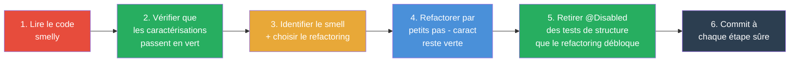

<!-- _class: lead -->
<!-- _paginate: false -->

# TDD, refactoring et code propre

**R2.03 - Qualité de développement**

IUT d'Aix-Marseille - BUT Informatique, première année

<div style="display: flex; justify-content: center; gap: 9rem; margin-top: 6rem; color: #555;">
<div style="text-align: center;"><div style="font-size: 6.5rem; opacity: 0.8;">✅</div><div style="font-size: 1.3rem; font-weight: 400; letter-spacing: 0.03em; color: #888;">TDD</div></div>
<div style="text-align: center;"><div style="font-size: 6.5rem; opacity: 0.8;">🥋</div><div style="font-size: 1.3rem; font-weight: 400; letter-spacing: 0.03em; color: #888;">Kata</div></div>
<div style="text-align: center;"><div style="font-size: 6.5rem; opacity: 0.8;">🧹</div><div style="font-size: 1.3rem; font-weight: 400; letter-spacing: 0.03em; color: #888;">Refactoring</div></div>
</div>

---

## Au programme de ce CM

<p style="font-size: 1.5rem; margin-top: -0.3rem;">
Trois axes pour transformer les bases du CM1 en <b>réflexes</b> : approfondir le TDD, pratiquer ensemble, sécuriser du legacy.
</p>

<div style="display: grid; grid-template-columns: 1fr 1fr 1fr; gap: 1rem; margin: 3rem 0; font-size: 1.5rem;">
<div style="background: #27ae60; color: white; padding: 1.2rem; border-radius: 10px; text-align: center;">
<div style="font-size: 2.5rem;">✅</div>
<b>TDD approfondi</b><br/>
<span style="font-size: 1.3rem; opacity: 0.9;">F.I.R.S.T., stratégies de Beck, ApprovalTests</span>
</div>
<div style="background: #e8a838; color: white; padding: 1.2rem; border-radius: 10px; text-align: center;">
<div style="font-size: 2.5rem;">🥋</div>
<b>Kata et pair programming</b><br/>
<span style="font-size: 1.3rem; opacity: 0.9;">Driver, navigator, ping-pong</span>
</div>
<div style="background: #e74c3c; color: white; padding: 1.2rem; border-radius: 10px; text-align: center;">
<div style="font-size: 2.5rem;">🧹</div>
<b>Code smells et refactoring</b><br/>
<span style="font-size: 1.3rem; opacity: 0.9;">Fowler, characterization tests</span>
</div>
</div>

<div style="margin-top: 1.5rem; background: #2c3e50; color: white; padding: 1rem; border-radius: 10px; text-align: center; font-size: 1.5rem;">
Ce CM prépare le <b>TP3 - Kata</b> et le <b>TP4 - Refactoring</b>.
</div>

---

## Où on en est

<p style="font-size: 1.5rem; margin-top: -0.3rem;">
Aujourd'hui, on <b>approfondit</b> le socle du CM1 et on prépare les <b>TP3</b>, <b>TP4</b> et la logique du <b>CC3</b>.
</p>

<!-- Ligne 1 : les 2 CMs -->
<div style="display: flex; gap: 0.5rem; margin-top: 1.5rem;">
  <div style="background: #4a90d9; color: white; padding: 1rem 1.2rem; border-radius: 10px 10px 0 0; flex: 1; text-align: center; opacity: 0.6;">
    <b>✓ CM1</b><br/><span style="font-size: 1.05rem;">Artisanat + Git + TDD intro</span>
  </div>
  <div style="background: #e8a838; color: white; padding: 1rem 1.2rem; border-radius: 10px 10px 0 0; flex: 1; text-align: center; border: 3px solid #c87d00; box-shadow: 0 4px 12px rgba(232,168,56,0.4);">
    <b>📍 CM2 (vous êtes ici)</b><br/><span style="font-size: 1.05rem;">TDD + Refactoring</span>
  </div>
</div>

<!-- Ligne 2 : les 4 TPs (légèrement espacés des CMs ci-dessus) -->
<div style="display: flex; gap: 0.5rem; margin-top: 0.4rem;">
  <div style="background: #d0e2f3; color: #2c5f8a; padding: 0.7rem; border-radius: 0 0 10px 10px; flex: 1; text-align: center; font-weight: bold; font-size: 1.05rem;">TP1</div>
  <div style="background: #d0e2f3; color: #2c5f8a; padding: 0.7rem; border-radius: 0 0 10px 10px; flex: 1; text-align: center; font-weight: bold; font-size: 1.05rem;">TP2</div>
  <div style="background: #fae5c0; color: #8a6a1f; padding: 0.7rem; border-radius: 0 0 10px 10px; flex: 1; text-align: center; font-weight: bold; font-size: 1.05rem;">TP3</div>
  <div style="background: #fae5c0; color: #8a6a1f; padding: 0.7rem; border-radius: 0 0 10px 10px; flex: 1; text-align: center; font-weight: bold; font-size: 1.05rem;">TP4</div>
</div>

<!-- Flèches convergentes TP2 + TP3 + TP4 -> CC3 -->
<div style="display: flex; gap: 0.5rem; text-align: center; font-size: 1.5rem; color: #999; margin: 0.2rem 0;">
  <div style="flex: 1;">&nbsp;</div>
  <div style="flex: 1;">↓</div>
  <div style="flex: 1;">↓</div>
  <div style="flex: 1;">↓</div>
</div>

<!-- Ligne 3 : CC3 (pleine largeur, violet plein, ligne unique) -->
<div style="background: #8e44ad; color: white; padding: 0.9rem 1rem; border-radius: 10px; text-align: center; font-weight: bold; font-size: 1.4rem;">
  🎯 CC3 — kata sur feuille (2 h) : <span style="font-weight: normal; opacity: 0.9;"> évalue les acquis de TP2 + TP3 + TP4</span>
</div>

<div style="margin-top: 1.5rem; background: #2c3e50; color: white; padding: 0.9rem 1.2rem; border-radius: 8px; font-size: 1.5rem;">
<b>En CM1 on a vu <em>pourquoi</em> l'artisan prend soin de son code.</b> Aujourd'hui, on voit <b>comment il s'y prend au quotidien</b> : tester avant, refactorer souvent, nommer juste. Les gestes qui transforment l'intention en habitude.
</div>

---

<!-- _class: lead -->
<!-- _header: "" -->
<!-- _footer: "" -->


# Partie 1 - TDD approfondi

Comment tirer le meilleur du cycle du TDD au quotidien ?

---

## 🔁 Rappel : le cycle RED-GREEN-REFACTOR

<p style="font-size: 1.5rem; margin-top: -0.3rem;">
Pour rappel : <b>3 étapes</b>, dans cet ordre, pour chaque petit comportement à ajouter.
</p>

<div style="display: grid; grid-template-columns: 1fr 0.2fr 1fr 0.2fr 1fr; gap: 0.6rem; margin-top: 1.5rem; align-items: stretch;">

<div style="display: flex; flex-direction: column; border-radius: 12px; overflow: hidden; box-shadow: 0 3px 8px rgba(0,0,0,0.15);">
<div style="background: #e74c3c; color: #fff; padding: 0.6rem 1rem; font-size: 1.5rem; font-weight: bold; text-align: center;">1. 🔴 RED</div>
<div style="background: #fdecea; padding: 1rem; flex: 1; font-size: 1.25rem;">
J'écris <b>un seul</b> test. Il doit échouer pour la <b>bonne raison</b> : un comportement qui manque, pas une coquille de syntaxe.
</div>
</div>

<div style="display: flex; align-items: center; justify-content: center; font-size: 3rem; color: #999;">▶</div>

<div style="display: flex; flex-direction: column; border-radius: 12px; overflow: hidden; box-shadow: 0 3px 8px rgba(0,0,0,0.15);">
<div style="background: #27ae60; color: #fff; padding: 0.6rem 1rem; font-size: 1.5rem; font-weight: bold; text-align: center;">2. 🟢 GREEN</div>
<div style="background: #e8f6ec; padding: 1rem; flex: 1; font-size: 1.25rem;">
Je code le <b>minimum</b> pour passer. Je n'ai <b>pas</b> le droit d'anticiper sur les tests à venir.
</div>
</div>

<div style="display: flex; align-items: center; justify-content: center; font-size: 3rem; color: #999;">▶</div>

<div style="display: flex; flex-direction: column; border-radius: 12px; overflow: hidden; box-shadow: 0 3px 8px rgba(0,0,0,0.15);">
<div style="background: #4a90d9; color: #fff; padding: 0.6rem 1rem; font-size: 1.5rem; font-weight: bold; text-align: center;">3. 🧹 REFACTOR</div>
<div style="background: #eaf2fb; padding: 1rem; flex: 1; font-size: 1.25rem;">
Je nettoie (noms, duplication, lisibilité). La suite de tests reste <b>verte</b> en permanence.
</div>
</div>

</div>

<div style="display: flex; align-items: center; justify-content: center; gap: 0.8rem; margin-top: 1.2rem; font-size: 1.4rem; color: #555;">
<span style="font-size: 2rem;">🔁</span><span>... puis on <b>reprend en 1.</b> avec le test suivant.</span>
</div>

<div style="margin-top: 1rem; background: #2c3e50; color: white; padding: 0.9rem 1.2rem; border-radius: 8px; text-align: center; font-size: 1.5rem;">
La force du cycle vient de sa <b>discipline</b> : 3 étapes, dans l'ordre, à chaque tour.
</div>

---

## 💰 Pourquoi ce cycle, économiquement

<p style="font-size: 1.5rem; margin-top: -0.3rem;">
Le CM1 a montré que les bugs coûtent jusqu'à <b>100×</b> plus cher quand ils sont détectés tard. Le TDD attaque la courbe <b>au moment le moins cher</b>.
</p>

<div style="display: grid; gap: 1.2rem; margin: 3.5rem 0;">

<div style="display: flex; align-items: center; gap: 0.8rem;">
<div style="width: 200px; font-size: 1.3rem; color: #555;">Développement</div>
<div style="flex: 1; background: #eee; border-radius: 6px; height: 2.4rem; overflow: hidden; position: relative;">
<div style="background: #27ae60; width: 1%; height: 100%;"></div>
<div style="position: absolute; left: 3%; top: 50%; transform: translateY(-50%); background: #27ae60; color: white; padding: 0.2rem 0.7rem; border-radius: 999px; font-size: 1rem; font-weight: bold; box-shadow: 0 2px 6px rgba(0,0,0,0.2);">👈 le TDD agit ici</div>
</div>
<div style="width: 80px; text-align: right; font-weight: bold; font-size: 1.3rem; color: #27ae60;">1×</div>
</div>

<div style="display: flex; align-items: center; gap: 0.8rem;">
<div style="width: 200px; font-size: 1.3rem; color: #555;">Tests</div>
<div style="flex: 1; background: #eee; border-radius: 6px; height: 2.4rem; overflow: hidden;">
<div style="background: #e8a838; width: 6%; height: 100%;"></div>
</div>
<div style="width: 80px; text-align: right; font-weight: bold; font-size: 1.3rem; color: #e8a838;">6×</div>
</div>

<div style="display: flex; align-items: center; gap: 0.8rem;">
<div style="width: 200px; font-size: 1.3rem; color: #555;">Pré-production</div>
<div style="flex: 1; background: #eee; border-radius: 6px; height: 2.4rem; overflow: hidden;">
<div style="background: #e67e22; width: 15%; height: 100%;"></div>
</div>
<div style="width: 80px; text-align: right; font-weight: bold; font-size: 1.3rem; color: #e67e22;">15×</div>
</div>

<div style="display: flex; align-items: center; gap: 0.8rem;">
<div style="width: 200px; font-size: 1.3rem; color: #555;"><b>Chez le client</b></div>
<div style="flex: 1; background: #eee; border-radius: 6px; height: 2.4rem; overflow: hidden;">
<div style="background: #e74c3c; width: 100%; height: 100%;"></div>
</div>
<div style="width: 80px; text-align: right; font-weight: bold; font-size: 1.5rem; color: #e74c3c;">100×</div>
</div>

</div>

<div style="margin-top: 1.2rem; background: #2c3e50; color: white; padding: 0.9rem 1.2rem; border-radius: 8px; text-align: center; font-size: 1.5rem;">
Le TDD ne supprime pas le travail ; il le <b>déplace là où il coûte le moins cher</b>.
</div>

---

## 🚦 Les 3 lois du TDD (Uncle Bob)

<p style="font-size: 1.5rem; margin-top: -0.3rem;">
Trois règles formelles, énoncées par <b>Robert C. Martin</b> (Uncle Bob), pour <b>forcer la discipline du baby-step</b>.
</p>

<div style="display: grid; grid-template-columns: 1fr 1fr 1fr; gap: 1.2rem; margin: 3.2rem 0; align-items: stretch;">

<div style="display: flex; flex-direction: column; border-radius: 10px; overflow: hidden; box-shadow: 0 2px 6px rgba(0,0,0,0.12);">
<div style="background: #e74c3c; color: #fff; padding: 0.5rem 1rem; font-size: 1.5rem; font-weight: bold; text-align: center;">🙅 Loi 1 — Interdit</div>
<div style="background: #fdecea; padding: 0.9rem 1.1rem; flex: 1; font-size: 1.5rem;">
Tu n'écriras <b>pas de code de production</b> tant qu'un test qui <b>échoue</b> ne l'exige.
</div>
</div>

<div style="display: flex; flex-direction: column; border-radius: 10px; overflow: hidden; box-shadow: 0 2px 6px rgba(0,0,0,0.12);">
<div style="background: #e8a838; color: #fff; padding: 0.5rem 1rem; font-size: 1.5rem; font-weight: bold; text-align: center;">⏸️ Loi 2 — Limite</div>
<div style="background: #f9f5e8; padding: 0.9rem 1.1rem; flex: 1; font-size: 1.5rem;">
Tu n'écriras <b>pas plus de test</b> qu'il n'en faut pour échouer. Une erreur de compilation compte comme un échec.
</div>
</div>

<div style="display: flex; flex-direction: column; border-radius: 10px; overflow: hidden; box-shadow: 0 2px 6px rgba(0,0,0,0.12);">
<div style="background: #27ae60; color: #fff; padding: 0.5rem 1rem; font-size: 1.5rem; font-weight: bold; text-align: center;">✋ Loi 3 — Juste assez</div>
<div style="background: #e8f6ec; padding: 0.9rem 1.1rem; flex: 1; font-size: 1.5rem;">
Tu n'écriras <b>pas plus de code de production</b> qu'il n'en faut pour faire passer le test qui échoue.
</div>
</div>

</div>

<div style="margin-top: 1.2rem; background: #2c3e50; color: white; padding: 0.9rem 1.2rem; border-radius: 8px; text-align: center; font-size: 1.5rem;">
À chaque cycle, vous alternez entre production et test toutes les <b>30 secondes à 2 minutes</b>.
</div>

---

<!-- _transition: fade -->

## 🎯 Fake it / Triangulation / Obvious : laquelle choisir ?

<style scoped>
.hidden { visibility: hidden; }
</style>

<p style="font-size: 1.5rem; margin-top: -0.3rem;">
On les a vues au CM1. Voici la <b>décision rapide</b> au moment d'écrire le code de production.
</p>

<div style="display: grid; grid-template-columns: 1fr 1fr 1fr; gap: 1rem; margin-top: 1rem; align-items: stretch;">

<div style="display: flex; flex-direction: column; border-radius: 10px; overflow: hidden; box-shadow: 0 2px 6px rgba(0,0,0,0.12);">
<div style="background: #27ae60; color: #fff; padding: 0.5rem 1rem; font-size: 1.4rem; font-weight: bold; text-align: center;">🎭 Fake it d'abord, toujours</div>
<div style="background: #e8f6ec; padding: 0.9rem 1.1rem; flex: 1; font-size: 1.2rem; display: flex; flex-direction: column; gap: 0.6rem;">
<div>Même si la solution semble évidente. Fake it vérifie que le <b>test</b> est juste, <b>avant</b> de se soucier du code.</div>
<div style="font-size: 1rem; opacity: 0.85; margin-top: auto;">💡 <em>Le test passe avec une constante en dur ? OK, il est bien formulé.</em></div>
</div>
</div>

<div style="display: flex; flex-direction: column; border-radius: 10px; overflow: hidden; box-shadow: 0 2px 6px rgba(0,0,0,0.12);">
<div style="background: #e8a838; color: #fff; padding: 0.5rem 1rem; font-size: 1.4rem; font-weight: bold; text-align: center;">📐 Triangulation quand...</div>
<div style="background: #f9f5e8; padding: 0.9rem 1.1rem; flex: 1; font-size: 1.2rem; display: flex; flex-direction: column; gap: 0.6rem;">
<div>... le 2<sup>e</sup> ou 3<sup>e</sup> test vous <b>force</b> à généraliser. Le comportement commun émerge <em>tout seul</em>.</div>
<div style="font-size: 1rem; opacity: 0.85; margin-top: auto;">💡 <em>FizzBuzz : après 3 tests (1, 3, 5), la logique if/else se dessine.</em></div>
</div>
</div>

<div style="display: flex; flex-direction: column; border-radius: 10px; overflow: hidden; box-shadow: 0 2px 6px rgba(0,0,0,0.12);">
<div style="background: #4a90d9; color: #fff; padding: 0.5rem 1rem; font-size: 1.4rem; font-weight: bold; text-align: center;">💡 Obvious seulement si...</div>
<div style="background: #eaf2fb; padding: 0.9rem 1.1rem; flex: 1; font-size: 1.2rem; display: flex; flex-direction: column; gap: 0.6rem;">
<div>... la solution <b>tient en une ligne</b> et vous ne pouvez <em>pas</em> vous tromper. <b>Le moindre doute</b> = pas obvious.</div>
<div style="font-size: 1rem; opacity: 0.85; margin-top: auto;">💡 <em><code>return a + b;</code> dans <code>addition(int, int)</code>.</em></div>
</div>
</div>

</div>

<div class="hidden" style="margin-top: 1rem; background: #fdecea; border-left: 5px solid #e74c3c; padding: 0.7rem 1rem; border-radius: 6px; font-size: 1.1rem;">
⚠️ <b>Anti-pattern fréquent</b> : « je sais coder ça, je passe direct en obvious ». Le test n'est jamais rouge, vous ne savez pas s'il vérifie vraiment quelque chose. <b>Fake it d'abord</b>, même 10 secondes, pour voir le test passer du rouge au vert.
</div>

<div style="margin-top: 1rem; background: #2c3e50; color: white; padding: 0.9rem 1.2rem; border-radius: 8px; text-align: center; font-size: 1.5rem;">
Règle simple : <b>Fake it</b> par défaut, <b>Triangulation</b> quand un seul cas ne suffit plus, <b>Obvious</b> seulement quand l'évidence est totale.
</div>

---

## 🎯 Fake it / Triangulation / Obvious : laquelle choisir ?

<p style="font-size: 1.5rem; margin-top: -0.3rem;">
On les a vues au CM1. Voici la <b>décision rapide</b> au moment d'écrire le code de production.
</p>

<div style="display: grid; grid-template-columns: 1fr 1fr 1fr; gap: 1rem; margin-top: 1rem; align-items: stretch;">

<div style="display: flex; flex-direction: column; border-radius: 10px; overflow: hidden; box-shadow: 0 2px 6px rgba(0,0,0,0.12);">
<div style="background: #27ae60; color: #fff; padding: 0.5rem 1rem; font-size: 1.4rem; font-weight: bold; text-align: center;">🎭 Fake it d'abord, toujours</div>
<div style="background: #e8f6ec; padding: 0.9rem 1.1rem; flex: 1; font-size: 1.2rem; display: flex; flex-direction: column; gap: 0.6rem;">
<div>Même si la solution semble évidente. Fake it vérifie que le <b>test</b> est juste, <b>avant</b> de se soucier du code.</div>
<div style="font-size: 1rem; opacity: 0.85; margin-top: auto;">💡 <em>Le test passe avec une constante en dur ? OK, il est bien formulé.</em></div>
</div>
</div>

<div style="display: flex; flex-direction: column; border-radius: 10px; overflow: hidden; box-shadow: 0 2px 6px rgba(0,0,0,0.12);">
<div style="background: #e8a838; color: #fff; padding: 0.5rem 1rem; font-size: 1.4rem; font-weight: bold; text-align: center;">📐 Triangulation quand...</div>
<div style="background: #f9f5e8; padding: 0.9rem 1.1rem; flex: 1; font-size: 1.2rem; display: flex; flex-direction: column; gap: 0.6rem;">
<div>... le 2<sup>e</sup> ou 3<sup>e</sup> test vous <b>force</b> à généraliser. Le comportement commun émerge <em>tout seul</em>.</div>
<div style="font-size: 1rem; opacity: 0.85; margin-top: auto;">💡 <em>FizzBuzz : après 3 tests (1, 3, 5), la logique if/else se dessine.</em></div>
</div>
</div>

<div style="display: flex; flex-direction: column; border-radius: 10px; overflow: hidden; box-shadow: 0 2px 6px rgba(0,0,0,0.12);">
<div style="background: #4a90d9; color: #fff; padding: 0.5rem 1rem; font-size: 1.4rem; font-weight: bold; text-align: center;">💡 Obvious seulement si...</div>
<div style="background: #eaf2fb; padding: 0.9rem 1.1rem; flex: 1; font-size: 1.2rem; display: flex; flex-direction: column; gap: 0.6rem;">
<div>... la solution <b>tient en une ligne</b> et vous ne pouvez <em>pas</em> vous tromper. <b>Le moindre doute</b> = pas obvious.</div>
<div style="font-size: 1rem; opacity: 0.85; margin-top: auto;">💡 <em><code>return a + b;</code> dans <code>addition(int, int)</code>.</em></div>
</div>
</div>

</div>

<div style="margin-top: 1rem; background: #fdecea; border-left: 5px solid #e74c3c; padding: 0.7rem 1rem; border-radius: 6px; font-size: 1.1rem;">
⚠️ <b>Anti-pattern fréquent</b> : « je sais coder ça, je passe direct en obvious ». Le test n'est jamais rouge, vous ne savez pas s'il vérifie vraiment quelque chose. <b>Fake it d'abord</b>, même 10 secondes, pour voir le test passer du rouge au vert.
</div>

<div style="margin-top: 1rem; background: #2c3e50; color: white; padding: 0.9rem 1.2rem; border-radius: 8px; text-align: center; font-size: 1.5rem;">
Règle simple : <b>Fake it</b> par défaut, <b>Triangulation</b> quand un seul cas ne suffit plus, <b>Obvious</b> seulement quand l'évidence est totale.
</div>

---

## ✅ Qu'est-ce qu'un bon test ? Le principe F.I.R.S.T.

<p style="font-size: 1.5rem; margin-top: -0.3rem;">
Robert C. Martin (<em>Clean Code</em>, 2008) a énoncé <b>5 critères</b> d'un bon test, l'acronyme <b>FIRST</b>.
</p>

<div style="display: grid; grid-template-columns: repeat(5, 1fr); gap: 0.8rem; margin: 3rem 0; align-items: stretch;">

<div style="display: flex; flex-direction: column; border-radius: 10px; overflow: hidden; box-shadow: 0 2px 6px rgba(0,0,0,0.12);">
<div style="background: #4a90d9; color: #fff; padding: 0.7rem 0.5rem; text-align: center; line-height: 1;">
<span style="font-size: 2.4rem; font-weight: bold;">F</span><span style="font-size: 1rem;">ast</span>
</div>
<div style="background: #eaf2fb; padding: 0.7rem 0.8rem; flex: 1; font-size: 1.3rem;">
<b>Rapide</b> (quelques ms). On les lance des dizaines de fois par heure.
</div>
</div>

<div style="display: flex; flex-direction: column; border-radius: 10px; overflow: hidden; box-shadow: 0 2px 6px rgba(0,0,0,0.12);">
<div style="background: #27ae60; color: #fff; padding: 0.7rem 0.5rem; text-align: center; line-height: 1;">
<span style="font-size: 2.4rem; font-weight: bold;">I</span><span style="font-size: 1rem;">ndependent</span>
</div>
<div style="background: #e8f6ec; padding: 0.7rem 0.8rem; flex: 1; font-size: 1.3rem;">
<b>Indépendants</b> entre eux. Changer l'ordre ne doit rien casser.
</div>
</div>

<div style="display: flex; flex-direction: column; border-radius: 10px; overflow: hidden; box-shadow: 0 2px 6px rgba(0,0,0,0.12);">
<div style="background: #e8a838; color: #fff; padding: 0.7rem 0.5rem; text-align: center; line-height: 1;">
<span style="font-size: 2.4rem; font-weight: bold;">R</span><span style="font-size: 1rem;">epeatable</span>
</div>
<div style="background: #f9f5e8; padding: 0.7rem 0.8rem; flex: 1; font-size: 1.3rem;">
<b>Reproductible</b>. Pas de dépendance au réseau, à l'heure, à un fichier temporaire.
</div>
</div>

<div style="display: flex; flex-direction: column; border-radius: 10px; overflow: hidden; box-shadow: 0 2px 6px rgba(0,0,0,0.12);">
<div style="background: #e74c3c; color: #fff; padding: 0.7rem 0.5rem; text-align: center; line-height: 1;">
<span style="font-size: 2.4rem; font-weight: bold;">S</span><span style="font-size: 1rem;">elf-validating</span>
</div>
<div style="background: #fdecea; padding: 0.7rem 0.8rem; flex: 1; font-size: 1.3rem;">
<b>Auto-vérifiant</b>. Rouge ou vert, pas de « regardez le log ».
</div>
</div>

<div style="display: flex; flex-direction: column; border-radius: 10px; overflow: hidden; box-shadow: 0 2px 6px rgba(0,0,0,0.12);">
<div style="background: #8e44ad; color: #fff; padding: 0.7rem 0.5rem; text-align: center; line-height: 1;">
<span style="font-size: 2.4rem; font-weight: bold;">T</span><span style="font-size: 1rem;">imely</span>
</div>
<div style="background: #ede5f7; padding: 0.7rem 0.8rem; flex: 1; font-size: 1.3rem;">
Écrit au <b>bon moment</b> : <b>avant</b> le code, pas après.
</div>
</div>

</div>

<div style="margin-top: 1rem; background: #fff8e1; border-left: 4px solid #e8a838; padding: 0.7rem 1rem; border-radius: 6px; font-size: 1.5rem;">
🛠️ F.I.R.S.T., c'est la <b>check-list de l'artisan</b> qui vérifie que son banc de tests reste un banc, pas un gouffre. Un test lent, fragile, dépendant des voisins, c'est un outil émoussé qu'il faut <b>affûter ou jeter</b>.
</div>

---

## 🧪 La structure AAA d'un test

<style scoped>
section pre { margin: 0 !important; border: none !important; box-shadow: none !important; border-radius: 0 !important; padding: 0.9rem 1.1rem !important; }
section pre code { font-size: 0.78rem !important; line-height: 1.5 !important; }
</style>

<p style="font-size: 1.5rem; margin-top: -0.3rem;">
Trois phases pour structurer chaque test : <b>Arrange · Act · Assert</b>. Lisible comme une phrase.
</p>

<div style="display: grid; grid-template-columns: 1fr 1.3fr; gap: 1.5rem; margin-top: 1.2rem; align-items: stretch;">

<div style="display: flex; flex-direction: column; gap: 0.7rem;">

<div style="flex: 1; display: flex; align-items: center; gap: 0.7rem; background: #eaf2fb; border-left: 5px solid #4a90d9; padding: 0.8rem 1rem; border-radius: 8px;">
<div style="font-size: 1.6rem;">🛠️</div>
<div style="font-size: 1.4rem;"><b>Arrange</b> — préparer l'environnement, les données, les dépendances</div>
</div>

<div style="flex: 1; display: flex; align-items: center; gap: 0.7rem; background: #f9f5e8; border-left: 5px solid #e8a838; padding: 0.8rem 1rem; border-radius: 8px;">
<div style="font-size: 1.6rem;">▶️</div>
<div style="font-size: 1.4rem;"><b>Act</b> — déclencher le comportement testé (<b>une seule</b> action)</div>
</div>

<div style="flex: 1; display: flex; align-items: center; gap: 0.7rem; background: #e8f6ec; border-left: 5px solid #27ae60; padding: 0.8rem 1rem; border-radius: 8px;">
<div style="font-size: 1.6rem;">✅</div>
<div style="font-size: 1.4rem;"><b>Assert</b> — vérifier le résultat (idéalement <b>une</b> assertion principale)</div>
</div>

</div>

<div class="aaa-card" style="display: flex; flex-direction: column; border-radius: 10px; overflow: hidden; box-shadow: 0 2px 8px rgba(0,0,0,0.18);">
<div style="background: #2c3e50; color: #fff; padding: 0.4rem 1rem; font-size: 1.1rem; font-weight: bold;">📄 <code style="background: transparent; color: #fff;">CalculatriceTest.java</code></div>

```java
@Test
void additionne_deux_entiers_positifs() {
    // Arrange
    Calculatrice c = new Calculatrice();
    // Act
    int resultat = c.additionner(2, 3);
    // Assert
    assertThat(resultat).isEqualTo(5);
}
```
</div>

</div>

<div style="margin-top: 1rem; background: #2c3e50; color: white; padding: 0.9rem 1.2rem; border-radius: 8px; text-align: center; font-size: 1.5rem;">
Un test <b>bien structuré</b> (AAA) et <b>bien nommé</b> se lit comme une phrase.
</div>

---

## 📝 Exemple : noms de tests parlants

<style scoped>
section pre { 
  margin: 0 !important; 
  border: none !important; 
  box-shadow: none !important; 
  border-radius: 6px !important; 
  padding: 0.7rem 0.9rem !important;
  font-size: 15px !important;
  line-height: 1.5 !important;
  transform: none !important;
  overflow-x: auto !important;
}
section pre code,
section pre code[class*="language-"] { 
  font-size: 13px !important; 
  line-height: 1.5 !important;
}
</style>

<p style="font-size: 1.5rem; margin-top: -0.3rem;">
Le nom du test est sa <b>première ligne de documentation</b>. Il doit raconter le <b>quoi</b> du test et <b>quel comportement</b> est attendu.
</p>

<div style="display: grid; grid-template-columns: 1fr 1fr; gap: 1.2rem; margin-top: 1rem; align-items: stretch;">

<div style="display: flex; flex-direction: column; border-radius: 10px; overflow: hidden; box-shadow: 0 2px 6px rgba(0,0,0,0.12);">
<div style="background: #e74c3c; color: #fff; padding: 0.5rem 1rem; font-size: 1.4rem; font-weight: bold; text-align: center;">🤦 Pas clair</div>
<div style="background: #fdecea; padding: 0.9rem 1.1rem; flex: 1; font-size: 1.3rem; display: flex; flex-direction: column; gap: 0.6rem;">

```java
@Test void test1()
@Test void testAdd() 
@Test void testCalc() 
@Test void bugFix12345() 
```

<div>On ne sait <b>pas ce qui est testé</b>, ni <b>quel comportement</b> est attendu.</div>
</div>
</div>

<div style="display: flex; flex-direction: column; border-radius: 10px; overflow: hidden; box-shadow: 0 2px 6px rgba(0,0,0,0.12);">
<div style="background: #27ae60; color: #fff; padding: 0.5rem 1rem; font-size: 1.4rem; font-weight: bold; text-align: center;">🎯 Clair</div>
<div style="background: #e8f6ec; padding: 0.9rem 1.1rem; flex: 1; font-size: 1.3rem; display: flex; flex-direction: column; gap: 0.6rem;">

```java
@Test void additionne_deux_positifs_retourne_un_positif()
@Test void additionne_zero_et_dix_retourne_dix()
@Test void montant_total_d_un_panier_negatif_leve_exception()
@Test void un_panier_vide_a_un_montant_total_de_zero()
```

<div style="margin-top: auto;">On lit le test comme une <b>spécification</b> du comportement de chaque cas.</div>
</div>
</div>

</div>

<div style="margin-top: 1rem; background: #fff8e1; border-left: 4px solid #e8a838; padding: 0.7rem 1rem; border-radius: 6px; font-size: 1.5rem;">
🥋 <b>Ce qu'on vise au TP3</b> : des tests qui racontent une partie, pas des numéros ou des noms génériques : <code>partie_tombe_a_egalite_apres_deux_points_partout()</code>, <code>le_serveur_gagne_la_partie_apres_quatre_points()</code>, etc.
</div>

---

## 📛 Conventions de nommage

<p style="font-size: 1.5rem; margin-top: -0.3rem;">
Le <b>snake_case</b> est la norme JUnit pour la lisibilité. Trois <b>patterns</b> structurent le contenu du nom : choisissez-en un et tenez-vous-y.
</p>

<div style="display: grid; grid-template-columns: 1fr 1fr 1fr; gap: 1rem; margin: 3.2rem 0; align-items: stretch;">

<div style="display: flex; flex-direction: column; border-radius: 10px; overflow: hidden; box-shadow: 0 2px 6px rgba(0,0,0,0.12);">
<div style="background: #4a90d9; color: #fff; padding: 0.5rem 1rem; font-size: 1.5rem; font-weight: bold; text-align: center;">📝 Descriptif simple</div>
<div style="background: #eaf2fb; padding: 0.9rem 1rem; flex: 1; font-size: 1.4rem; display: flex; flex-direction: column; gap: 0.6rem;">
<div>Décrit le comportement <b>sans structure imposée</b>. Le plus naturel à lire.</div>
<div style="font-family: 'Courier New', Consolas, monospace; background: #fff; padding: 0.5rem; border-radius: 4px; font-size: 0.95rem; margin-top: auto;">additionne_deux_positifs_retourne_la_somme()</div>
</div>
</div>

<div style="display: flex; flex-direction: column; border-radius: 10px; overflow: hidden; box-shadow: 0 2px 6px rgba(0,0,0,0.12);">
<div style="background: #e8a838; color: #fff; padding: 0.5rem 1rem; font-size: 1.5rem; font-weight: bold; text-align: center;">📛 should / when</div>
<div style="background: #f9f5e8; padding: 0.9rem 1rem; flex: 1; font-size: 1.4rem; display: flex; flex-direction: column; gap: 0.6rem;">
<div>Pattern <b>should_X_when_Y</b>. Très répandu en Java/Kotlin.</div>
<div style="font-family: 'Courier New', Consolas, monospace; background: #fff; padding: 0.5rem; border-radius: 4px; font-size: 0.95rem; margin-top: auto;">should_return_sum_when_adding_two_positives()</div>
</div>
</div>

<div style="display: flex; flex-direction: column; border-radius: 10px; overflow: hidden; box-shadow: 0 2px 6px rgba(0,0,0,0.12);">
<div style="background: #27ae60; color: #fff; padding: 0.5rem 1rem; font-size: 1.5rem; font-weight: bold; text-align: center;">🎬 Given / When / Then</div>
<div style="background: #e8f6ec; padding: 0.9rem 1rem; flex: 1; font-size: 1.4rem; display: flex; flex-direction: column; gap: 0.6rem;">
<div>Pattern BDD : <b>given_X_<br/>when_Y_then_Z</b>. Aligne le test sur le scénario métier.</div>
<div style="font-family: 'Courier New', Consolas, monospace; background: #fff; padding: 0.5rem; border-radius: 4px; font-size: 0.95rem; margin-top: auto;">given_two_positives_when_adding_then_returns_sum()</div>
</div>
</div>

</div>

<div style="margin-top: 1rem; background: #2c3e50; color: white; padding: 0.9rem 1.2rem; border-radius: 8px; text-align: center; font-size: 1.5rem;">
Pas de meilleur pattern : la <b>cohérence dans le projet</b> prime sur le style.
</div>

---

## 🥋 Grounding : ces principes sur un vrai kata

<style scoped>
section pre { margin: 0 !important; border: none !important; box-shadow: none !important; border-radius: 6px !important; padding: 0.6rem 0.8rem !important; }
section pre, section pre code, section pre code[class*="language-"] { font-size: 13px !important; line-height: 1.45 !important; }
</style>

<p style="font-size: 1.5rem; margin-top: -0.3rem;">
Le kata <b>Tennis</b> du TP3 illustre tout ce qu'on vient de voir. Voici les 3 premiers tests pris dans <b>leur ordre d'écriture</b>.
</p>

<div style="display: grid; grid-template-columns: 1fr 1fr 1fr; gap: 1rem; margin-top: 1rem; align-items: stretch;">

<div style="display: flex; flex-direction: column; border-radius: 10px; overflow: hidden; box-shadow: 0 2px 6px rgba(0,0,0,0.12);">
<div style="background: #27ae60; color: #fff; padding: 0.5rem 1rem; font-size: 1.3rem; font-weight: bold; text-align: center;">🎭 Test 1 — Fake it</div>
<div style="background: #e8f6ec; padding: 0.7rem 0.9rem; flex: 1; font-size: 1.1rem; display: flex; flex-direction: column; gap: 0.5rem;">

```java
@Test
void debut_de_partie_est_0_0() {
  assertThat(new Tennis().score())
    .isEqualTo("0-0");
}

// Impl : return "0-0";
```

<div style="margin-top: auto;">Le test passe avec une constante. On sait que le test est <b>juste</b>.</div>
</div>
</div>

<div style="display: flex; flex-direction: column; border-radius: 10px; overflow: hidden; box-shadow: 0 2px 6px rgba(0,0,0,0.12);">
<div style="background: #e8a838; color: #fff; padding: 0.5rem 1rem; font-size: 1.3rem; font-weight: bold; text-align: center;">📐 Test 2 — Triangulation</div>
<div style="background: #f9f5e8; padding: 0.7rem 0.9rem; flex: 1; font-size: 1.1rem; display: flex; flex-direction: column; gap: 0.5rem;">

```java
@Test
void apres_point_serveur_15_0() {
  Tennis t = new Tennis();
  t.pointPourServeur();
  assertThat(t.score())
    .isEqualTo("15-0");
}
```

<div style="margin-top: auto;">Force à stocker un <b>état</b>. La constante ne suffit plus.</div>
</div>
</div>

<div style="display: flex; flex-direction: column; border-radius: 10px; overflow: hidden; box-shadow: 0 2px 6px rgba(0,0,0,0.12);">
<div style="background: #4a90d9; color: #fff; padding: 0.5rem 1rem; font-size: 1.3rem; font-weight: bold; text-align: center;">📐 Test 3 — Triangulation</div>
<div style="background: #eaf2fb; padding: 0.7rem 0.9rem; flex: 1; font-size: 1.1rem; display: flex; flex-direction: column; gap: 0.5rem;">

```java
@Test
void apres_2_points_serveur_30_0() {
  Tennis t = new Tennis();
  t.pointPourServeur();
  t.pointPourServeur();
  assertThat(t.score())
    .isEqualTo("30-0");
}
```

<div style="margin-top: auto;">Force une vraie <b>table</b> (0, 15, 30, 40). La logique émerge.</div>
</div>
</div>

</div>

<div style="margin-top: 1rem; background: #2c3e50; color: white; padding: 0.9rem 1.2rem; border-radius: 8px; text-align: center; font-size: 1.5rem;">
Chaque test est <b>un pas</b>. La conception <b>s'invente au fur et à mesure</b>, pas avant.
</div>

---

## 🎭 La doublure de test : à quoi ça sert ?

<p style="font-size: 1.5rem; margin-top: -0.3rem;">
Au cinéma, le héros a une <b>doublure</b> pour les cascades. En test, on fait pareil avec les dépendances qu'on ne contrôle pas (base de données, réseau, horloge) : on les remplace par une <b>doublure de test</b> (anglais : <em>test double</em>).
</p>

<div style="display: grid; grid-template-columns: 1fr 1fr; gap: 1.2rem; margin-top: 1.2rem; align-items: stretch;">

<div style="display: flex; flex-direction: column; border-radius: 10px; overflow: hidden; box-shadow: 0 2px 6px rgba(0,0,0,0.12);">
<div style="background: #4a90d9; color: #fff; padding: 0.5rem 1rem; font-size: 1.5rem; font-weight: bold; text-align: center;">🪨 Stub / Fake</div>
<div style="background: #eaf2fb; padding: 0.9rem 1.1rem; flex: 1; font-size: 1.5rem;">
<b>Forcer les valeurs retournées</b> par la dépendance. On contrôle la valeur qu'elle nous <em>renvoie</em> pendant le test.<br/><br/>
<span style="opacity: 0.85; font-size: 1.4rem;">Exemple : une horloge qui retourne toujours <code>1<sup>er</sup> janvier 2026</code>.</span>
</div>
</div>

<div style="display: flex; flex-direction: column; border-radius: 10px; overflow: hidden; box-shadow: 0 2px 6px rgba(0,0,0,0.12);">
<div style="background: #e8a838; color: #fff; padding: 0.5rem 1rem; font-size: 1.5rem; font-weight: bold; text-align: center;">🎯 Mock / Spy</div>
<div style="background: #f9f5e8; padding: 0.9rem 1.1rem; flex: 1; font-size: 1.5rem;">
<b>Observer l'appel</b>. On vérifie <em>comment</em> la dépendance a été utilisée (méthode, arguments, fréquence).<br/><br/>
<span style="opacity: 0.85; font-size: 1.4rem;">Exemple : vérifier qu'un service mail a bien été appelé une fois avec la bonne adresse.</span>
</div>
</div>

</div>

<div style="margin-top: 1rem; background: #2c3e50; color: white; padding: 0.9rem 1.2rem; border-radius: 8px; text-align: center; font-size: 1.5rem;">
<b>Isoler</b> ce qu'on ne contrôle pas, pour <b>tester</b> ce que l'on souhaite maitriser.
</div>

---

## 🪨 Le stub : forcer le retour

<style scoped>
section pre { margin: 0 !important; border: none !important; box-shadow: none !important; border-radius: 6px !important; padding: 0.6rem 0.8rem !important; }
section pre, section pre code, section pre code[class*="language-"] { font-size: 0.7rem !important; line-height: 1.45 !important; }
</style>

<p style="font-size: 1.5rem; margin-top: -0.3rem;">
Un <b>stub</b> remplace une dépendance par une <b>réponse pré-définie</b>. Vous décidez ce que la dépendance retourne et vos tests deviennent <b>reproductibles</b>.
</p>

<div style="display: grid; grid-template-columns: 1.2fr 1fr; gap: 1.2rem; margin: 3.2rem 0; align-items: stretch;">

<div style="display: flex; flex-direction: column; border-radius: 10px; overflow: hidden; box-shadow: 0 2px 6px rgba(0,0,0,0.12);">
<div style="background: #4a90d9; color: #fff; padding: 0.5rem 1rem; font-size: 1.3rem; font-weight: bold;">📄 Exemple : une horloge stub</div>
<div style="background: #eaf2fb; padding: 0.7rem 0.9rem; flex: 1;">

```java
// Production : dépend de l'horloge système
Clock horlogeStub = Clock.fixed(
    Instant.parse("2026-01-01T00:00:00Z"),
    ZoneOffset.UTC);

LocalDate date = LocalDate.now(horlogeStub);
// → toujours 2026-01-01, peu importe le jour réel
```

</div>
</div>

<div style="display: flex; flex-direction: column; border-radius: 10px; overflow: hidden; box-shadow: 0 2px 6px rgba(0,0,0,0.12);">
<div style="background: #4a90d9; color: #fff; padding: 0.5rem 1rem; font-size: 1.3rem; font-weight: bold; text-align: center;">💡 Quand l'utiliser</div>
<div style="background: #eaf2fb; padding: 0.9rem 1.1rem; flex: 1; font-size: 1.3rem;">
<ul style="margin: 0; padding-left: 1.2rem;">
<li>Tester un code qui dépend du <b>temps</b>, du <b>hasard</b>, d'un <b>fichier</b></li>
<li>Rendre les tests <b>reproductibles</b> (même résultat à chaque exécution)</li>
<li>Éviter d'appeler une <b>vraie</b> base de données ou un <b>vrai</b> service externe</li>
</ul>
</div>
</div>

</div>

<div style="margin-top: 1rem; background: #2c3e50; color: white; padding: 0.9rem 1.2rem; border-radius: 8px; text-align: center; font-size: 1.5rem;">
Un stub <b>FORCE le retour</b> de la dépendance. On ne vérifie <b>pas</b> comment elle a été appelée.
</div>

---

## 🎯 Le mock : vérifier l'appel

<style scoped>
section pre { margin: 0 !important; border: none !important; box-shadow: none !important; border-radius: 6px !important; padding: 0.6rem 0.8rem !important; }
section pre, section pre code, section pre code[class*="language-"] { font-size: 0.7rem !important; line-height: 1.45 !important; }
</style>

<p style="font-size: 1.5rem; margin-top: -0.3rem;">
Un <b>mock</b> vérifie <b>comment</b> une dépendance est utilisée : <em>quelle méthode</em>, <em>avec quels arguments</em>, <em>combien de fois</em>.
</p>

<div style="display: grid; grid-template-columns: 1.2fr 1fr; gap: 1.2rem; margin-top: 1.2rem; align-items: stretch;">

<div style="display: flex; flex-direction: column; border-radius: 10px; overflow: hidden; box-shadow: 0 2px 6px rgba(0,0,0,0.12);">
<div style="background: #e8a838; color: #fff; padding: 0.5rem 1rem; font-size: 1.5rem; font-weight: bold;">📄 Exemple : un service mail mock (Mockito)</div>
<div style="background: #f9f5e8; padding: 0.7rem 0.9rem; flex: 1;">

```java
ServiceMail mail = mock(ServiceMail.class);
GestionnaireCommande gc 
    = new GestionnaireCommande(mail);

gc.confirmer(new Commande("alice@iut.fr"));

// On VÉRIFIE l'appel
verify(mail).envoyer(eq("alice@iut.fr"),
    contains("confirmation"));
```

</div>
</div>

<div style="display: flex; flex-direction: column; border-radius: 10px; overflow: hidden; box-shadow: 0 2px 6px rgba(0,0,0,0.12);">
<div style="background: #e8a838; color: #fff; padding: 0.5rem 1rem; font-size: 1.5rem; font-weight: bold; text-align: center;">💡 Quand l'utiliser</div>
<div style="background: #f9f5e8; padding: 0.9rem 1.1rem; flex: 1; font-size: 1.4rem;">
<ul style="margin: 0; padding-left: 1.2rem;">
<li>Vérifier qu'une <b>action</b> a bien eu lieu (envoi, log, notification)</li>
<li>Tester une <b>interaction</b> entre deux composants</li>
<li>S'assurer du <b>contrat</b> entre votre code et la dépendance</li>
</ul>
</div>
</div>

</div>

<div style="margin-top: 1rem; background: #2c3e50; color: white; padding: 0.9rem 1.2rem; border-radius: 8px; text-align: center; font-size: 1.5rem;">
Un mock <b>VÉRIFIE l'appel</b>. La valeur de retour est secondaire.
</div>

---

## 🎭 Stub vs Mock : la synthèse

<p style="font-size: 1.5rem; margin-top: -0.3rem;">
Quatre aspects pour distinguer les deux doublures, dans un seul coup d'œil.
</p>

<div style="display: grid; grid-template-columns: 1.1fr 1.4fr 1.4fr; gap: 0.5rem; margin-top: 1.2rem; border-radius: 10px; overflow: hidden; box-shadow: 0 2px 6px rgba(0,0,0,0.12);">

<div style="background: #2c3e50; color: #fff; padding: 0.7rem 1rem; font-weight: bold; font-size: 1.2rem;">Aspect</div>
<div style="background: #4a90d9; color: #fff; padding: 0.7rem 1rem; font-weight: bold; font-size: 1.3rem; text-align: center;">🪨 Stub</div>
<div style="background: #e8a838; color: #fff; padding: 0.7rem 1rem; font-weight: bold; font-size: 1.3rem; text-align: center;">🎯 Mock</div>

<div style="background: #f5f5f5; padding: 0.8rem 1rem; font-weight: bold; font-size: 1.2rem;">But</div>
<div style="background: #eaf2fb; padding: 0.8rem 1rem; font-size: 1.2rem;">Forcer le <b>retour</b></div>
<div style="background: #f9f5e8; padding: 0.8rem 1rem; font-size: 1.2rem;">Vérifier <b>l'appel</b></div>

<div style="background: #f5f5f5; padding: 0.8rem 1rem; font-weight: bold; font-size: 1.2rem;">Question</div>
<div style="background: #eaf2fb; padding: 0.8rem 1rem; font-size: 1.2rem;"><em>Que renvoie X ?</em></div>
<div style="background: #f9f5e8; padding: 0.8rem 1rem; font-size: 1.2rem;"><em>Comment X est appelé ?</em></div>

<div style="background: #f5f5f5; padding: 0.8rem 1rem; font-weight: bold; font-size: 1.2rem;">Assertion porte sur</div>
<div style="background: #eaf2fb; padding: 0.8rem 1rem; font-size: 1.2rem;">Le <b>résultat</b></div>
<div style="background: #f9f5e8; padding: 0.8rem 1rem; font-size: 1.2rem;">L'<b>interaction</b></div>

<div style="background: #f5f5f5; padding: 0.8rem 1rem; font-weight: bold; font-size: 1.2rem;">Exemple typique</div>
<div style="background: #eaf2fb; padding: 0.8rem 1rem; font-size: 1.15rem;">Horloge fixe, base de données en mémoire</div>
<div style="background: #f9f5e8; padding: 0.8rem 1rem; font-size: 1.15rem;">Service mail, logger</div>

</div>

<div style="margin-top: 1.2rem; background: #2c3e50; color: white; padding: 0.9rem 1.2rem; border-radius: 8px; text-align: center; font-size: 1.5rem;">
Vous voulez <b>vérifier une interaction</b> → c'est un <b>mock</b>. Sinon → c'est un <b>stub</b>.
</div>

---

## 📸 ApprovalTests : quand la sortie est textuelle

<style scoped>
section pre { margin: 0 !important; border: none !important; box-shadow: none !important; border-radius: 0 !important; padding: 0.7rem 0.9rem !important; }
section pre, section pre code, section pre code[class*="language-"] { font-size: 13px !important; line-height: 1.45 !important; }
</style>

<p style="font-size: 1.5rem; margin-top: -0.3rem;">
Pour du code qui produit une <b>sortie complexe</b> (grille, JSON, rapport), écrire l'attendu à la main est pénible. <b>ApprovalTests</b> automatise le rituel.
</p>

<div style="display: grid; grid-template-columns: 1.2fr 1fr; gap: 1.2rem; margin-top: 1.2rem; align-items: stretch;">

<div style="display: flex; flex-direction: column; border-radius: 10px; overflow: hidden; box-shadow: 0 2px 8px rgba(0,0,0,0.18);">
<div style="background: #2c3e50; color: #fff; padding: 0.4rem 1rem; font-size: 1.1rem; font-weight: bold;">📄 <code style="background: transparent; color: #fff;">GrilleDemineurTest.java</code></div>

```java
@Test
void grille_demineur_5x5() {
  List<String> entree = List.of(
    " *   ",
    "     ",
    "  *  ",
    "     ",
    "   * "
  );
  List<String> sortie =
    new GrilleDemineur(entree).annotee();
  Approvals.verifyAll("", sortie);
}
```

</div>

<div style="display: flex; flex-direction: column; border-radius: 10px; overflow: hidden; box-shadow: 0 2px 6px rgba(0,0,0,0.12);">
<div style="background: #17a2b8; color: #fff; padding: 0.5rem 1rem; font-size: 1.4rem; font-weight: bold; text-align: center;">🔁 Le rituel d'approbation</div>
<div style="background: #e6f5f7; padding: 0.9rem 1.1rem; flex: 1; font-size: 1.5rem;">
<ol style="margin: 0; padding-left: 1.4rem;">
<li>Je lance le test</li>
<li>La sortie va dans <code>...received.txt</code></li>
<li>Je <b>vérifie visuellement</b></li>
<li>Je renomme <code>received</code> → <code>approved</code></li>
<li>Le test compare ensuite <code>received</code> à <code>approved</code></li>
</ol>
</div>
</div>

</div>

<div style="margin-top: 1rem; background: #2c3e50; color: white; padding: 0.9rem 1.2rem; border-radius: 8px; text-align: center; font-size: 1.5rem;">
Utilisé au <b>TP2 exercice 5</b> (Démineur) — gain énorme sur les grandes grilles ou les sorties textuelles riches.
</div>

---

## 💡 Règles pour ne pas se planter en TDD

<p style="font-size: 1.5rem; margin-top: -0.3rem;">
Trois pièges à éviter, trois réflexes à cultiver. Les premiers tuent le filet de sécurité, les seconds le renforcent.
</p>

<div style="display: grid; grid-template-columns: 1fr 1fr; gap: 1.2rem; margin-top: 1.2rem; align-items: stretch;">

<div style="display: flex; flex-direction: column; border-radius: 10px; overflow: hidden; box-shadow: 0 2px 6px rgba(0,0,0,0.12);">
<div style="background: #e74c3c; color: #fff; padding: 0.5rem 1rem; font-size: 1.5rem; font-weight: bold; text-align: center;">🤦 Pièges à éviter</div>
<div style="background: #fdecea; padding: 0.9rem 1.1rem; flex: 1; font-size: 1.4rem;">
<ul style="margin: 0; padding-left: 1.2rem;">
<li><b>Écrire plusieurs tests d'affilée</b> sans coder entre. Un test écrit, un test codé.</li>
<li><b>Ajouter du code sans test qui l'exige.</b> Une branche <code>if</code> en plus = un test à écrire avant.</li>
<li><b>Sauter le REFACTOR.</b> Le cycle est à 3 étapes, pas à 2. Sinon la dette explose.</li>
</ul>
</div>
</div>

<div style="display: flex; flex-direction: column; border-radius: 10px; overflow: hidden; box-shadow: 0 2px 6px rgba(0,0,0,0.12);">
<div style="background: #27ae60; color: #fff; padding: 0.5rem 1rem; font-size: 1.5rem; font-weight: bold; text-align: center;">🎯 Réflexes à cultiver</div>
<div style="background: #e8f6ec; padding: 0.9rem 1.1rem; flex: 1; font-size: 1.4rem;">
<ul style="margin: 0; padding-left: 1.2rem;">
<li><b>Vérifier que le test échoue</b> avant de coder. Sinon = faux positif (un test qui passait déjà).</li>
<li><b>Commit à chaque GREEN ou REFACTOR.</b> Chaque état vert = un point de sauvegarde.</li>
<li><b>Un seul test rouge à la fois.</b> Focaliser l'attention, pas 5 rouges en parallèle.</li>
</ul>
</div>
</div>

</div>

<div style="margin-top: 1rem; background: #2c3e50; color: white; padding: 0.9rem 1.2rem; border-radius: 8px; text-align: center; font-size: 1.5rem;">
Le TDD ne pardonne pas les <b>raccourcis</b> : chaque écart efface une garantie acquise.
</div>

---

## 📊 Pyramide des tests

<p style="font-size: 1.5rem; margin-top: -0.3rem;">
Pour rappel (CM1) : <b>3 niveaux</b> de tests, en pyramide. Plus on monte, moins on en a — et plus chaque test coûte cher.
</p>

<div style="display: grid; grid-template-columns: 1.4fr 1fr; gap: 1.5rem; margin-top: 1.5rem; align-items: center;">

<div style="display: flex; flex-direction: column; align-items: center;">

<div style="background: #e74c3c; color: #fff; padding: 1.2rem 0.8rem; width: 45%; text-align: center; border-radius: 6px 6px 0 0; font-size: 1.2rem;">E2E <span style="opacity: 0.85;">(peu)</span></div>
<div style="background: #e8a838; color: #fff; padding: 1.5rem 0.8rem; width: 65%; text-align: center; font-size: 1.3rem; border-radius: 6px 6px 0 0;">Intégration <span style="opacity: 0.85;">(moyen)</span></div>
<div style="background: #27ae60; color: #fff; padding: 1.8rem 0.8rem; width: 90%; text-align: center; font-size: 1.4rem; font-weight: bold; border-radius: 6px 6px 0 0; box-shadow: 0 0 0 3px rgba(39, 174, 96, 0.25);">Tests unitaires <span style="opacity: 0.9;">(la base, beaucoup)</span></div>

</div>

<div style="display: flex; flex-direction: column; gap: 0.8rem;">

<div style="background: #fdecea; padding: 0.8rem 1rem; border-radius: 8px; border-left: 4px solid #e74c3c; font-size: 1.15rem;">
<b>E2E</b> — toute l'application, du clic à la base. Lents, fragiles, coûteux.
</div>

<div style="background: #f9f5e8; padding: 0.8rem 1rem; border-radius: 8px; border-left: 4px solid #e8a838; font-size: 1.15rem;">
<b>Intégration</b> — plusieurs briques ensemble (service + DB, par ex).
</div>

<div style="background: #e8f6ec; padding: 0.8rem 1rem; border-radius: 8px; border-left: 4px solid #27ae60; font-size: 1.15rem;">
<b>Unitaires</b> — une méthode, une classe, isolés. Rapides, ciblés, relancés en permanence.
</div>

</div>

</div>

<div style="margin-top: 1.2rem; background: #2c3e50; color: white; padding: 0.9rem 1.2rem; border-radius: 8px; text-align: center; font-size: 1.5rem;">
👉 Dans ce module, on travaille la <b>base</b> de la pyramide. C'est là que le TDD vit vraiment.
</div>

---

## 🧬 Aparté : couverture != qualité des tests

<style scoped>
section pre { margin: 0 !important; border: none !important; box-shadow: none !important; border-radius: 6px !important; padding: 0.6rem 0.8rem !important; }
section pre, section pre code, section pre code[class*="language-"] { font-size: 13px !important; line-height: 1.45 !important; }
</style>

<p style="font-size: 1.5rem; margin-top: -0.3rem;">
Deux mesures qu'on confond souvent. La <b>couverture</b> répond à <em>quelles lignes ont été exécutées ?</em> La <b>qualité</b> répond à <em>les tests détectent-ils de vrais bugs ?</em>
</p>

<div style="display: grid; grid-template-columns: 1fr 1fr; gap: 1.2rem; margin: 3rem 0; align-items: stretch;">

<div style="display: flex; flex-direction: column; border-radius: 10px; overflow: hidden; box-shadow: 0 2px 6px rgba(0,0,0,0.12);">
<div style="background: #4a90d9; color: #fff; padding: 0.5rem 1rem; font-size: 1.5rem; font-weight: bold; text-align: center;">📊 Couverture</div>
<div style="background: #eaf2fb; padding: 0.9rem 1.1rem; flex: 1; font-size: 1.4rem;">
Quelles <b>lignes / branches</b> ont été exécutées par la suite de tests.
<div style="opacity: 0.85; font-size: 1.3rem;">Mesurée par <b>JaCoCo</b> (plugin Maven), inline IntelliJ, etc.</div>
</div>
</div>

<div style="display: flex; flex-direction: column; border-radius: 10px; overflow: hidden; box-shadow: 0 2px 6px rgba(0,0,0,0.12);">
<div style="background: #27ae60; color: #fff; padding: 0.5rem 1rem; font-size: 1.4rem; font-weight: bold; text-align: center;">🎯 Qualité</div>
<div style="background: #e8f6ec; padding: 0.9rem 1.1rem; flex: 1; font-size: 1.4rem;">
Les tests <b>détectent-ils vraiment un bug</b> si le code est cassé ?
<div style="opacity: 0.85; font-size: 1.3rem;">Mesurée par <b>mutation testing</b> (CM2 bonus) ou par <b>lecture critique</b> (pendant la revue de code).</div>
</div>
</div>

</div>

<div style="margin-top: 1rem; background: #2c3e50; color: white; padding: 0.9rem 1.2rem; border-radius: 8px; text-align: center; font-size: 1.5rem;">
La couverture mesure <b>l'exécution</b>, pas la <b>validation</b>. Un beau 99% ne prouve rien à lui seul.
</div>

---

## 🌄 Où s'arrête le TDD ?

<p style="font-size: 1.5rem; margin-top: -0.3rem;">
Connaître les <b>limites</b> de l'outil, c'est déjà bien le maîtriser. Le TDD résout certains problèmes très bien mais il en laisse d'autres entiers.
</p>

<div style="display: grid; grid-template-columns: 1fr 1fr; gap: 1.2rem; margin-top: 1.2rem; align-items: stretch;">

<div style="display: flex; flex-direction: column; border-radius: 10px; overflow: hidden; box-shadow: 0 2px 6px rgba(0,0,0,0.12);">
<div style="background: #27ae60; color: #fff; padding: 0.5rem 1rem; font-size: 1.5rem; font-weight: bold; text-align: center;">🎯 Ce que le TDD fait bien</div>
<div style="background: #e8f6ec; padding: 0.9rem 1.1rem; flex: 1; font-size: 1.3rem;">
<ul style="margin: 0; padding-left: 1.2rem;">
<li>Cadrer une <b>intention</b> avant de coder</li>
<li>Donner un <b>filet</b> pour refactorer sereinement</li>
<li>Produire une <b>documentation vivante</b> du comportement</li>
<li>Forcer un <b>découplage</b> (sinon le test devient injouable)</li>
</ul>
</div>
</div>

<div style="display: flex; flex-direction: column; border-radius: 10px; overflow: hidden; box-shadow: 0 2px 6px rgba(0,0,0,0.12);">
<div style="background: #e74c3c; color: #fff; padding: 0.5rem 1rem; font-size: 1.5rem; font-weight: bold; text-align: center;">🚧 Ce que le TDD ne fait PAS</div>
<div style="background: #fdecea; padding: 0.9rem 1.1rem; flex: 1; font-size: 1.3rem;">
<ul style="margin: 0; padding-left: 1.2rem;">
<li><b>Garantir</b> que le produit est utile pour le client</li>
<li>Remplacer la <b>revue de code</b> et le <b>pair programming</b></li>
<li>Couvrir les bugs d'<b>intégration</b>, de <b>perf</b>, d'<b>ergonomie</b></li>
<li>Dispenser de <b>penser</b> : un test tautologique passera toujours</li>
</ul>
</div>
</div>

</div>

<div style="margin-top: 1rem; background: #2c3e50; color: white; padding: 0.9rem 1.2rem; border-radius: 8px; font-size: 1.5rem;">
L'artisan connaît ses outils et leurs <b>limites</b>. Le TDD est un outil puissant pour <b>le code qui porte une logique claire</b> ; il ne remplace ni les tests d'intégration, ni la relecture humaine, ni la validation par le client qui dira si l'ouvrage correspond bien à ses exigences.
</div>

---

<!-- _class: lead -->
<!-- _header: "" -->
<!-- _footer: "" -->


# Partie 2 - Le kata et le pair programming

Comment on devient meilleur ? En répétant des gestes simples.

---

## 🥋 Le coding dojo : pratiquer pour apprendre

<p style="font-size: 1.5rem; margin-top: -0.3rem;">
Comment apprend-on à mieux coder ? Pas en regardant des tutos, ni en lisant des livres seul. Comme dans les arts martiaux : par la <b>pratique régulière, répétée et en groupe</b>.
</p>

<div style="display: grid; grid-template-columns: 1.2fr 1fr; gap: 1.2rem; margin-top: 1.2rem; align-items: stretch;">

<div style="background: #fff8e1; border-left: 5px solid #e8a838; padding: 0.9rem 1.1rem; border-radius: 8px; display: flex; flex-direction: column; gap: 0.5rem;">
<div style="font-size: 1.5rem; line-height: 1.5;">
💬 <em>« Si je veux apprendre le judo, je vais m'inscrire au dojo du coin et y passer une heure par semaine pendant deux ans, au bout de quoi j'aurai peut-être envie de pratiquer plus assidûment. Si je veux apprendre la programmation objet, mon employeur va me trouver une formation de trois jours à Java dans le catalogue. Cherchez l'erreur. »</em>
</div>
<div style="margin-top: auto; font-size: 1.1rem; opacity: 0.8; text-align: right;">
<b>Laurent Bossavit</b>, <em>The Leprechauns of Software Engineering</em>, 2013
</div>
</div>

<div style="display: flex; flex-direction: column; border-radius: 10px; overflow: hidden; box-shadow: 0 2px 6px rgba(0,0,0,0.12);">
<div style="background: #e8a838; color: #fff; padding: 0.5rem 1rem; font-size: 1.4rem; font-weight: bold; text-align: center;">🥋 Le coding dojo</div>
<div style="background: #f9f5e8; padding: 0.9rem 1.1rem; flex: 1; font-size: 1.4rem;">
<ul style="margin: 0; padding-left: 1.2rem;">
<li><b>Origine</b> : transposition du dojo des arts martiaux à la programmation. Premiers coding dojos vers 2005 (Paris, Londres).</li>
<li><b>Forme typique</b> : 1 à 2 h, en groupe, sur un kata, avec un facilitateur.</li>
<li><b>Fréquence</b> : régulière (hebdo / mensuelle). La régularité prime sur la durée.</li>
</ul>
</div>
</div>

</div>

<div style="margin-top: 1rem; background: #2c3e50; color: white; padding: 0.9rem 1.2rem; border-radius: 8px; text-align: center; font-size: 1.5rem;">
Le métier s'apprend par la <b>pratique régulière</b>, pas par une formation one-shot.
</div>

---

## 🥋 Qu'est-ce qu'un kata ?

<p style="font-size: 1.5rem; margin-top: -0.3rem;">
Dans le coding dojo, l'unité de pratique s'appelle un <b>kata</b>. Le mot vient directement des arts martiaux.
</p>

<div style="display: grid; grid-template-columns: 1fr 1fr; gap: 1.2rem; margin-top: 1.2rem; align-items: stretch;">

<div style="display: flex; flex-direction: column; border-radius: 10px; overflow: hidden; box-shadow: 0 2px 6px rgba(0,0,0,0.12);">
<div style="background: #e8a838; color: #fff; padding: 0.5rem 1rem; font-size: 1.5rem; font-weight: bold; text-align: center;">🥋 Arts martiaux</div>
<div style="background: #f9f5e8; padding: 0.9rem 1.1rem; flex: 1; font-size: 1.25rem;">
Une <b>séquence de mouvements</b> qu'on répète jusqu'à ce que le corps l'exécute sans y penser.
<br/><br/>
On ne cherche pas à <em>vaincre un adversaire</em> : on travaille la <b>posture</b>, le <b>souffle</b>, la <b>précision</b>.
</div>
</div>

<div style="display: flex; flex-direction: column; border-radius: 10px; overflow: hidden; box-shadow: 0 2px 6px rgba(0,0,0,0.12);">
<div style="background: #4a90d9; color: #fff; padding: 0.5rem 1rem; font-size: 1.5rem; font-weight: bold; text-align: center;">💻 Coding kata</div>
<div style="background: #eaf2fb; padding: 0.9rem 1.1rem; flex: 1; font-size: 1.25rem;">
Un <b>petit exercice</b> qu'on refait <b>plusieurs fois</b> pour :
<ul style="margin: 0.5rem 0 0; padding-left: 1.2rem;">
<li><b>automatiser</b> des gestes (raccourcis IDE, TDD, refactoring)</li>
<li><b>essayer</b> des approches différentes</li>
<li><b>comparer</b> avec d'autres développeurs</li>
</ul>
<div style="font-size: 1rem; opacity: 0.8; margin-top: 0.6rem;">Popularisé par <b>Dave Thomas</b> (<em>The Pragmatic Programmer</em>, 2003).</div>
</div>
</div>

</div>

<div style="margin-top: 1rem; background: #2c3e50; color: white; padding: 0.9rem 1.2rem; border-radius: 8px; text-align: center; font-size: 1.5rem;">
Le but n'est pas de <b>résoudre le problème</b> (vous le connaissez), c'est d'améliorer <b>votre façon</b> de le résoudre. Comme un pianiste qui joue ses gammes pour <b>garder la main</b>.
</div>

---

## 🥋 Quelques kata célèbres

<p style="font-size: 1.5rem; margin-top: -0.3rem;">
La communauté des coding dojos a accumulé un <b>répertoire</b> de kata classiques. En voici six qu'on retrouve partout — chacun éclaire un aspect différent du métier.
</p>

<div style="display: grid; grid-template-columns: 1fr 1fr 1fr; gap: 0.8rem; margin-top: 1.2rem; align-items: stretch;">

<div style="display: flex; flex-direction: column; border-radius: 10px; overflow: hidden; box-shadow: 0 2px 6px rgba(0,0,0,0.12);">
<div style="background: #4a90d9; color: #fff; padding: 0.5rem 1rem; font-size: 1.3rem; font-weight: bold; text-align: center;">🔢 FizzBuzz</div>
<div style="background: #eaf2fb; padding: 0.7rem 0.9rem; flex: 1; font-size: 1.1rem;">
Le plus <b>iconique</b> : intro TDD, branchements simples. La porte d'entrée.
</div>
</div>

<div style="display: flex; flex-direction: column; border-radius: 10px; overflow: hidden; box-shadow: 0 2px 6px rgba(0,0,0,0.12);">
<div style="background: #4a90d9; color: #fff; padding: 0.5rem 1rem; font-size: 1.3rem; font-weight: bold; text-align: center;">🗓️ Années bissextiles</div>
<div style="background: #eaf2fb; padding: 0.7rem 0.9rem; flex: 1; font-size: 1.1rem;">
Petit kata idéal pour travailler les <b>règles booléennes</b> imbriquées.
</div>
</div>

<div style="display: flex; flex-direction: column; border-radius: 10px; overflow: hidden; box-shadow: 0 2px 6px rgba(0,0,0,0.12);">
<div style="background: #4a90d9; color: #fff; padding: 0.5rem 1rem; font-size: 1.3rem; font-weight: bold; text-align: center;">🎾 Tennis scoring</div>
<div style="background: #eaf2fb; padding: 0.7rem 0.9rem; flex: 1; font-size: 1.1rem;">
Afficher le score d'un jeu de tennis. Idéal pour les <b>state machines</b>.
</div>
</div>

<div style="display: flex; flex-direction: column; border-radius: 10px; overflow: hidden; box-shadow: 0 2px 6px rgba(0,0,0,0.12);">
<div style="background: #4a90d9; color: #fff; padding: 0.5rem 1rem; font-size: 1.3rem; font-weight: bold; text-align: center;">🎳 Bowling</div>
<div style="background: #eaf2fb; padding: 0.7rem 0.9rem; flex: 1; font-size: 1.1rem;">
Kata classique d'<b>Uncle Bob</b>. Marquer une partie de bowling avec strikes et spares.
</div>
</div>

<div style="display: flex; flex-direction: column; border-radius: 10px; overflow: hidden; box-shadow: 0 2px 6px rgba(0,0,0,0.12);">
<div style="background: #4a90d9; color: #fff; padding: 0.5rem 1rem; font-size: 1.3rem; font-weight: bold; text-align: center;">🎲 Yahtzee</div>
<div style="background: #eaf2fb; padding: 0.7rem 0.9rem; flex: 1; font-size: 1.1rem;">
Scorer les combinaisons d'un jet de 5 dés. Bon terrain pour la <b>stratégie</b>.
</div>
</div>

<div style="display: flex; flex-direction: column; border-radius: 10px; overflow: hidden; box-shadow: 0 2px 6px rgba(0,0,0,0.12);">
<div style="background: #4a90d9; color: #fff; padding: 0.5rem 1rem; font-size: 1.3rem; font-weight: bold; text-align: center;">🏪 Gilded Rose</div>
<div style="background: #eaf2fb; padding: 0.7rem 0.9rem; flex: 1; font-size: 1.1rem;">
Par <b>Emily Bache</b>. Kata de <b>refactoring</b> sur du legacy volontairement horrible.
</div>
</div>

</div>

<div style="margin-top: 1rem; background: #2c3e50; color: white; padding: 0.9rem 1.2rem; border-radius: 8px; text-align: center; font-size: 1.5rem;">
Au <b>TP3</b>, vous en ferez <b>cinq</b> par vous-même : Années bissextiles, Tennis, Gestion employés, Pagination, Yahtzee.
</div>

---

## 🤔 Pourquoi refaire un kata qu'on sait résoudre ?

<div style="display: grid; grid-template-columns: 1fr 1fr; gap: 1rem; margin-top: 0.5rem;">

<div style="background: #e6f5ec; padding: 1rem; border-radius: 10px;">
<b>🏃 1ère fois</b> : je galère, je découvre les règles. Je code "quelque chose qui marche".
</div>

<div style="background: #e6f5ec; padding: 1rem; border-radius: 10px;">
<b>2ème fois</b> : je vais plus vite, je vois les pièges. Je soigne le nommage.
</div>

<div style="background: #e6f5ec; padding: 1rem; border-radius: 10px;">
<b>3ème fois</b> : je teste une autre approche (fake-it seulement, triangulation seulement).
</div>

<div style="background: #e6f5ec; padding: 1rem; border-radius: 10px;">
<b>10ème fois</b> : je suis fluide. Je peux me concentrer sur le <b>style</b>, pas le problème.
</div>

</div>

<div style="margin-top: 0.8rem; background: #2c3e50; color: white; padding: 1rem; border-radius: 10px; text-align: center; font-size: 1.1rem;">
Un sportif ne s'entraîne pas le jour du match. Un développeur non plus.
</div>

---

## 👥 Le pair programming

<div style="display: flex; gap: 1.5rem; margin-top: 0.3rem;">
<div style="flex: 1;">

**Deux personnes, un clavier.**

<div style="background: #4a90d9; color: white; padding: 1rem; border-radius: 10px; margin-top: 0.8rem;">
<b>🎮 Driver</b><br/>Celui qui tape. Se concentre sur le <b>comment</b> (syntaxe, IDE, tests qui passent).
</div>

<div style="background: #27ae60; color: white; padding: 1rem; border-radius: 10px; margin-top: 0.5rem;">
<b>🧭 Navigator</b><br/>Celui qui pense. Se concentre sur le <b>quoi</b> (design, edge cases, lisibilité).
</div>

<div style="background: #2c3e50; color: white; padding: 0.8rem; border-radius: 8px; margin-top: 0.8rem; text-align: center;">
On <b>échange</b> les rôles toutes les 7 à 10 minutes.
</div>

</div>
<div style="flex: 1;">

<div style="background: #e8a838; color: white; padding: 1.5rem; border-radius: 12px;">

**Bénéfices**

- Moins de bugs (deux cerveaux sur chaque ligne)
- Montée en compétences croisée
- Moins de "bus factor" sur le code
- Revue de code permanente, en temps réel
- Effet antisomnolent 😴

</div>

<div style="margin-top: 1rem; background: #fde8e6; padding: 1rem; border-radius: 10px; border-left: 5px solid #e74c3c;">

**⚠ Attention**
- Pas le même que "un qui code, un qui regarde son téléphone"
- Fatigant - faire des pauses toutes les heures

</div>

</div>
</div>

---

## 🏓 Le ping-pong TDD

Un cas particulier très puissant de pair programming :

<div style="background: #2c3e50; color: white; padding: 1.5rem; border-radius: 12px; margin-top: 0.5rem;">

1. **A écrit un test** qui échoue (RED).
2. **B écrit le code** qui fait passer (GREEN).
3. **B écrit le test suivant** qui échoue (RED).
4. **A écrit le code** qui fait passer (GREEN).
5. À tour de rôle pour **REFACTOR**.

</div>

<div style="display: flex; gap: 1rem; margin-top: 0.8rem;">
<div style="flex: 1; background: #e6f5ec; padding: 1rem; border-radius: 10px;">
<b>✅ Avantage 1</b> : chacun des deux <b>devine l'intention</b> de l'autre. Excellent pour le design.
</div>
<div style="flex: 1; background: #e6f5ec; padding: 1rem; border-radius: 10px;">
<b>✅ Avantage 2</b> : impossible d'écrire du code "en douce" sans test. Le coéquipier impose la discipline.
</div>
<div style="flex: 1; background: #e6f5ec; padding: 1rem; border-radius: 10px;">
<b>✅ Avantage 3</b> : on voit <b>immédiatement</b> si un test est mal écrit - l'autre ne sait pas quoi coder.
</div>
</div>

---

## 👨‍👩‍👧 Le mob programming

<p style="font-size: 1.5rem; margin-top: -0.3rem;">
Quand le pair programming s'étend à toute l'équipe : un seul écran, <b>tout le monde sur le même problème</b>, en même temps. Inventé par <b>Woody Zuill</b> chez Hunter Industries (~2014).
</p>

<div style="display: grid; grid-template-columns: 1fr 1fr; gap: 1.2rem; margin-top: 1.2rem; align-items: stretch;">

<div style="display: flex; flex-direction: column; border-radius: 10px; overflow: hidden; box-shadow: 0 2px 6px rgba(0,0,0,0.12);">
<div style="background: #4a90d9; color: #fff; padding: 0.5rem 1rem; font-size: 1.4rem; font-weight: bold; text-align: center;">⚙️ Le principe</div>
<div style="background: #eaf2fb; padding: 0.9rem 1.1rem; flex: 1; font-size: 1.2rem;">
<ul style="margin: 0; padding-left: 1.2rem;">
<li><b>1 driver</b> aux mains du clavier</li>
<li><b>N navigators</b> qui dirigent à voix haute</li>
<li><b>Rotation</b> du driver toutes les 5 à 10 min</li>
<li>Tout le monde dans la <b>même pièce</b> (ou même Zoom)</li>
</ul>
</div>
</div>

<div style="display: flex; flex-direction: column; border-radius: 10px; overflow: hidden; box-shadow: 0 2px 6px rgba(0,0,0,0.12);">
<div style="background: #27ae60; color: #fff; padding: 0.5rem 1rem; font-size: 1.4rem; font-weight: bold; text-align: center;">🎯 À quoi ça sert</div>
<div style="background: #e8f6ec; padding: 0.9rem 1.1rem; flex: 1; font-size: 1.2rem;">
<ul style="margin: 0; padding-left: 1.2rem;">
<li>Problèmes <b>complexes</b> à découper en équipe</li>
<li>Démarrage d'un <b>nouveau projet</b> ou d'un module critique</li>
<li><b>Onboarding</b> rapide d'un nouvel arrivant</li>
<li>Décisions d'<b>architecture</b> partagées par tous</li>
</ul>
</div>
</div>

</div>

<div style="margin-top: 1rem; background: #2c3e50; color: white; padding: 0.9rem 1.2rem; border-radius: 8px; text-align: center; font-size: 1.5rem;">
À 2 = <b>pair</b>, à 3+ = <b>mob</b>. Plus on est, plus la décision se construit en commun, au prix du débit individuel.
</div>

---

## 🏢 La pratique en entreprise

<p style="font-size: 1.5rem; margin-top: -0.3rem;">
Ces pratiques (kata, pair, mob) ne sont pas réservées à l'école. Elles sont <b>utilisées au quotidien</b> dans les équipes qui prennent au sérieux la qualité du code.
</p>

<div style="display: grid; grid-template-columns: 1fr 1fr; gap: 1.2rem; margin-top: 1.2rem; align-items: stretch;">

<div style="display: flex; flex-direction: column; border-radius: 10px; overflow: hidden; box-shadow: 0 2px 6px rgba(0,0,0,0.12);">
<div style="background: #27ae60; color: #fff; padding: 0.5rem 1rem; font-size: 1.4rem; font-weight: bold; text-align: center;">🌍 Où on les trouve</div>
<div style="background: #e8f6ec; padding: 0.9rem 1.1rem; flex: 1; font-size: 1.2rem;">
<ul style="margin: 0; padding-left: 1.2rem;">
<li>Équipes de <b>craftsmanship</b> : Pivotal Labs, ThoughtWorks, ekino, Octo, Zenika...</li>
<li>Projets <b>open source</b> de référence (Linux kernel, Mozilla)</li>
<li>Entreprises avec culture <b>XP / agilité forte</b></li>
<li>Hackathons et conférences (Devoxx, AgileFrance, BDX I/O...)</li>
</ul>
</div>
</div>

<div style="display: flex; flex-direction: column; border-radius: 10px; overflow: hidden; box-shadow: 0 2px 6px rgba(0,0,0,0.12);">
<div style="background: #4a90d9; color: #fff; padding: 0.5rem 1rem; font-size: 1.4rem; font-weight: bold; text-align: center;">🎯 Pourquoi c'est viable</div>
<div style="background: #eaf2fb; padding: 0.9rem 1.1rem; flex: 1; font-size: 1.2rem;">
<ul style="margin: 0; padding-left: 1.2rem;">
<li><b>Moins de bugs</b> : la revue est intégrée à l'écriture</li>
<li><b>Montée en compétence cross-team</b> : tout le monde apprend de tout le monde</li>
<li><b>Onboarding</b> beaucoup plus rapide</li>
<li>Réduction du <b>bus factor</b> (personne n'est seul à connaître un module)</li>
</ul>
</div>
</div>

</div>

<div style="margin-top: 1rem; background: #2c3e50; color: white; padding: 0.9rem 1.2rem; border-radius: 8px; text-align: center; font-size: 1.5rem;">
Apprendre par la pratique régulière, en groupe, ce n'est pas un luxe d'école. C'est <b>comment les meilleures équipes restent meilleures</b>.
</div>

---

## 🎯 Démo en ouverture du TP3

Au début du TP3, on fera **20 min de kata live** en pair programming.

<div style="display: grid; grid-template-columns: 1fr 1fr; gap: 1rem; margin-top: 0.8rem;">

<div style="background: #e6f0f9; padding: 1rem; border-radius: 10px;">
<b>Kata retenu</b> : <em>Tennis scoring</em><br/>
Un état (jeu en cours) + un comportement (marquer un point) → l'affichage du score.
</div>

<div style="background: #e6f0f9; padding: 1rem; border-radius: 10px;">
<b>Ce que vous verrez</b> :<br/>
- Alternance driver/navigator toutes les ~5 min<br/>
- Commit à chaque GREEN<br/>
- Pas de shortcut IDE (vous devez suivre)
</div>

</div>

<div style="margin-top: 0.8rem; background: #e8a838; color: white; padding: 1rem; border-radius: 10px; text-align: center; font-size: 1.1rem;">
🥋 Le but : que vous voyiez <b>à quoi ressemble</b> une séance TDD en binôme - pas juste lire le texte d'un kata.
</div>

---

<!-- _class: lead -->
<!-- _header: "" -->
<!-- _footer: "" -->

# Partie 3 - Code smells et refactoring

Du code qui marche, mais qui pue. On fait quoi ?

<div style="margin-top: 1.5rem; background: #fff8e1; border-left: 4px solid #e8a838; padding: 0.9rem 1rem; border-radius: 6px; font-size: 1.5rem;">
🛠️ <b>Un artisan entretient ses outils.</b><br/>
Le menuisier aiguise sa scie entre deux chantiers. Le chef récure ses couteaux en fin de service. Pas par perfectionnisme - parce que demain ils s'en servent <em>encore</em>. Refactorer, c'est exactement ce geste : on ne le fait pas pour faire joli, on le fait pour <b>rester rapide ensuite</b>. Le code qu'on lit cette semaine, c'est celui qu'on modifiera le mois prochain.
</div>

---

## 👃 Qu'est-ce qu'un code smell ?

<div style="display: flex; gap: 2rem; align-items: center; margin-top: 0.5rem;">
<div style="flex: 1.2;">

Terme inventé par **Kent Beck** et popularisé par **Martin Fowler** (*Refactoring*, 1999).

Un **code smell** est un **indice** que quelque chose ne va pas dans votre code. Pas un bug, pas une erreur de compilation - juste un signal qui dit :

> "Attention, cette zone devient difficile à maintenir."

Un peu comme un aliment qui sent bizarre : **pas forcément périmé, mais il faut regarder de près.**

</div>
<div style="flex: 1; text-align: center;">

<div style="background: #e74c3c; color: white; padding: 2rem; border-radius: 12px; font-size: 3rem;">
👃
</div>

<div style="margin-top: 1rem; background: #2c3e50; color: white; padding: 1rem; border-radius: 8px; font-size: 0.9rem;">
"If it stinks, change it." - Kent Beck
</div>

</div>
</div>

---

## 📚 Les smells qu'on va surtout rencontrer au TP4

<div style="display: grid; grid-template-columns: 1fr 1fr; gap: 0.8rem; margin-top: 0.3rem; font-size: 0.92rem;">

<div style="background: #fde8e6; padding: 0.8rem 1rem; border-radius: 8px; border-left: 4px solid #e74c3c;">
<b>📏 Long Method</b><br/>
Une méthode de 50 lignes qu'on scroll pour la lire.<br/>
<em>Solution</em> : Extract Method.
</div>

<div style="background: #fde8e6; padding: 0.8rem 1rem; border-radius: 8px; border-left: 4px solid #e74c3c;">
<b>🏢 Large Class</b><br/>
Une classe qui fait trop de choses.<br/>
<em>Solution</em> : Extract Class.
</div>

<div style="background: #fde8e6; padding: 0.8rem 1rem; border-radius: 8px; border-left: 4px solid #e74c3c;">
<b>📋 Long Parameter List</b><br/>
Une méthode à 7 paramètres, imbuvable à l'appel.<br/>
<em>Solution</em> : Introduce Parameter Object.
</div>

<div style="background: #fde8e6; padding: 0.8rem 1rem; border-radius: 8px; border-left: 4px solid #e74c3c;">
<b>👯 Duplicated Code</b><br/>
Le même bloc copié-collé en 3 endroits.<br/>
<em>Solution</em> : Extract Method / Move Method.
</div>

<div style="background: #fde8e6; padding: 0.8rem 1rem; border-radius: 8px; border-left: 4px solid #e74c3c;">
<b>🔢 Magic Numbers</b><br/>
<code>if (age > 65)</code>, <code>total *= 1.20</code>.<br/>
<em>Solution</em> : Replace Magic Number with Constant.
</div>

<div style="background: #fde8e6; padding: 0.8rem 1rem; border-radius: 8px; border-left: 4px solid #e74c3c;">
<b>🔀 Switch Statements</b><br/>
Un <code>switch</code> sur un type, dupliqué en 5 endroits.<br/>
<em>Solution</em> : Replace Conditional with Polymorphism.
</div>

<div style="background: #fde8e6; padding: 0.8rem 1rem; border-radius: 8px; border-left: 4px solid #e74c3c;">
<b>🧩 Data Clumps / Primitive Obsession</b><br/>
Des données voyagent toujours ensemble sans avoir de vrai type.<br/>
<em>Solution</em> : Introduce Parameter Object / Replace Primitive with Object.
</div>

</div>

<div style="margin-top: 0.8rem; background: #2c3e50; color: white; padding: 0.8rem; border-radius: 8px; text-align: center;">
Retenez surtout le réflexe : <b>un smell n'est pas une faute</b>, c'est un signal qu'une zone du code va devenir pénible à modifier.
</div>

---

## 🔧 Qu'est-ce qu'un refactoring ?

<div style="background: #2c3e50; color: white; padding: 1.5rem; border-radius: 12px; font-size: 1.2rem; line-height: 1.6; margin-top: 0.5rem;">

> **Refactoring** : modifier la **structure interne** du code<br/>
> <b>sans changer son comportement observable</b>.

<div style="margin-top: 0.5rem; font-size: 0.9rem; opacity: 0.8;">
Martin Fowler, <em>Refactoring: Improving the Design of Existing Code</em> (1999, 2018)
</div>

</div>

<div style="display: flex; gap: 1.5rem; margin-top: 1rem;">
<div style="flex: 1; background: #e6f5ec; padding: 1rem; border-radius: 10px;">
<b>✅ Refactoring</b><br/>
Renommer une variable, extraire une méthode, bouger un champ dans une autre classe.<br/>
→ <b>Les tests existants continuent de passer.</b>
</div>

<div style="flex: 1; background: #fde8e6; padding: 1rem; border-radius: 10px;">
<b>❌ Pas un refactoring</b><br/>
Changer ce que fait une méthode, ajouter une fonctionnalité, corriger un bug.<br/>
→ Là, les tests changent (ou en deviennent rouges).
</div>
</div>

<div style="margin-top: 0.8rem; background: #e8a838; color: white; padding: 0.8rem; border-radius: 8px; text-align: center;">
🛡️ <b>Prérequis absolu</b> : une suite de tests qui couvre le comportement. Sinon vous faites du <em>rewriting</em>, pas du refactoring.
</div>

---

## 📖 Le catalogue de Fowler (70+ refactorings)

<div style="display: grid; grid-template-columns: 1fr 1fr 1fr 1fr; gap: 0.8rem; margin-top: 0.3rem; font-size: 0.95rem;">
<div style="background: #e6f0f9; padding: 0.8rem 1rem; border-radius: 8px;"><b>🏷️ Rename</b><br/>Le plus fréquent.</div>
<div style="background: #e6f0f9; padding: 0.8rem 1rem; border-radius: 8px;"><b>✂️ Extract Method</b><br/>Pour rendre une intention lisible.</div>
<div style="background: #e6f0f9; padding: 0.8rem 1rem; border-radius: 8px;"><b>📦 Extract Class</b><br/>Quand une classe fait trop de choses.</div>
<div style="background: #e6f0f9; padding: 0.8rem 1rem; border-radius: 8px;"><b>🦎 Polymorphism</b><br/>Quand un switch devient pénible.</div>
</div>

<div style="margin-top: 0.7rem; text-align: center; background: #2c3e50; color: white; padding: 0.7rem; border-radius: 8px; font-size: 0.95rem;">
Il existe un <b>vocabulaire commun</b> pour nommer ces transformations. Les TP4 vous font justement pratiquer quelques entrées très classiques de ce catalogue.
</div>

---

## 🧪 Exemple : Extract Method

<div style="display: flex; gap: 1rem;">
<div style="flex: 1; background: #fde8e6; padding: 0.8rem; border-radius: 8px; font-size: 0.8rem;">

**Avant (smell : Long Method)**

```java
void imprimerFacture(Client c, List<Article> a) {
  // entête
  System.out.println("=== FACTURE ===");
  System.out.println("Client : " + c.nom());
  System.out.println("Date : " + LocalDate.now());

  // lignes
  for (Article art : a) {
    System.out.printf("  %s x%d : %.2f€%n",
      art.nom(), art.qte(), art.prix() * art.qte());
  }

  // total
  double t = 0;
  for (Article art : a) t += art.prix() * art.qte();
  System.out.printf("TOTAL : %.2f€%n", t * 1.20);
}
```

</div>
<div style="flex: 1; background: #e6f5ec; padding: 0.8rem; border-radius: 8px; font-size: 0.8rem;">

**Après**

```java
void imprimerFacture(Client c, List<Article> a) {
  imprimerEntete(c);
  imprimerLignes(a);
  imprimerTotal(a);
}

void imprimerEntete(Client c) {
  System.out.println("=== FACTURE ===");
  System.out.println("Client : " + c.nom());
  System.out.println("Date : " + LocalDate.now());
}

void imprimerLignes(List<Article> a) { /* ... */ }

double calculerTotalHT(List<Article> a) {
  return a.stream()
    .mapToDouble(x -> x.prix() * x.qte()).sum();
}
```

</div>
</div>

<div style="margin-top: 0.5rem; text-align: center; background: #2c3e50; color: white; padding: 0.5rem; border-radius: 6px; font-size: 0.95rem;">
Code de <b>gauche</b> : on doit tout lire pour comprendre. <b>Droite</b> : on lit <code>imprimerFacture</code> comme un sommaire.
</div>

---

## 🧪 Exemple : Replace Conditional with Polymorphism

<div style="display: flex; gap: 1rem;">
<div style="flex: 1; background: #fde8e6; padding: 0.8rem; border-radius: 8px; font-size: 0.8rem;">

**Avant (smell : Switch Statements)**

```java
class Animal {
  String type;

  String faireDuBruit() {
    switch (type) {
      case "chien":  return "Wouf !";
      case "chat":   return "Miaou !";
      case "vache":  return "Meuh !";
      case "canard": return "Coin coin !";
      default: throw new IllegalStateException();
    }
  }
}
```

Chaque nouveau type → modifier cette classe.<br/>
Un <code>switch</code> sur le type est souvent dupliqué.

</div>
<div style="flex: 1; background: #e6f5ec; padding: 0.8rem; border-radius: 8px; font-size: 0.8rem;">

**Après**

```java
abstract class Animal {
  abstract String faireDuBruit();
}

class Chien extends Animal {
  String faireDuBruit() { return "Wouf !"; }
}

class Chat extends Animal {
  String faireDuBruit() { return "Miaou !"; }
}

class Vache extends Animal {
  String faireDuBruit() { return "Meuh !"; }
}
```

Nouveau type → nouvelle classe. **Pas touche** au reste.

</div>
</div>

<div style="margin-top: 0.5rem; text-align: center; background: #2c3e50; color: white; padding: 0.5rem; border-radius: 6px; font-size: 0.95rem;">
Principe <b>Open/Closed</b> : ouvert à l'extension, fermé à la modification.
</div>

---

## 🛠️ Votre IDE fait le gros du travail

<div style="display: flex; gap: 1.5rem; margin-top: 0.5rem;">
<div style="flex: 1;">

Un refactoring **manuel** est risqué. Un oubli, un mauvais remplacement → comportement changé.

Les TP se font dans le **Codespace VS Code** avec l'extension Java officielle (Red Hat). Les gestes de refactoring passent par deux entrées :

- **`Ctrl+.`** (ou `Cmd+.` sur Mac) : menu **Quick Fix + Refactor** contextuel. Propose *Extract to method*, *Extract to constant*, *Extract to variable / field*, *Move...*, *Inline...*, *Add unimplemented methods* selon ce que le curseur touche.
- **`F2`** : **Rename** (propage partout, imports + Javadoc inclus).

</div>
<div style="flex: 1;">

<div style="background: #4a90d9; color: white; padding: 1.5rem; border-radius: 12px;">

**💡 Règle pragmatique**

> Si tu peux faire le refactoring **avec un raccourci IDE**, fais-le avec. Si tu dois le faire à la main, **ajoute d'abord des tests**.

</div>

<div style="margin-top: 1rem; background: #fff3cd; padding: 1rem; border-radius: 8px; font-size: 0.95rem;">

**Au TP4**, on abuse de <code>Ctrl+.</code> et <code>F2</code>. Le README liste la correspondance raccourci → refactoring pour chaque exercice.

</div>

<div style="margin-top: 0.5rem; font-size: 0.85rem; color: #666;">
<em>IntelliJ IDEA fait les mêmes refactorings avec <code>Ctrl+Alt+M</code>, <code>Ctrl+Alt+V</code>, <code>Shift+F6</code>... si vous préférez l'utiliser en dehors des TP.</em>
</div>

</div>
</div>

---

## 🛡️ Characterization tests : sécuriser du legacy

<div style="display: flex; gap: 1.5rem; margin-top: 0.3rem;">
<div style="flex: 1;">

Concept de **Michael Feathers** (*Working Effectively with Legacy Code*, 2004).

> **Legacy code** = du code **sans tests**, qu'on doit faire évoluer.

**Problème** : on veut refactorer, mais sans tests on n'a pas de filet.

**Solution** : des **characterization tests** - des tests qui **décrivent le comportement actuel** du code, qu'il soit "juste" ou non.

</div>
<div style="flex: 1;">

<div style="background: #2c3e50; color: white; padding: 1.2rem; border-radius: 12px;">

**Démarche**

1. Je prends le code en entrée.
2. Je lance le code, j'observe la sortie.
3. J'écris un test qui **attend cette sortie**.
4. Le test passe - je l'ai **figé**.
5. Maintenant je peux refactorer : si un test casse, j'ai changé le comportement (donc j'ai un bug, pas un refactoring).

</div>

<div style="margin-top: 0.8rem; background: #e8a838; color: white; padding: 0.8rem; border-radius: 8px; text-align: center; font-size: 0.95rem;">
Ces tests <b>ne valident pas</b> que le code est juste - ils le <b>pinnent</b>.
</div>

</div>
</div>

---

## 🎯 Le pattern du TP4

Chaque exercice du TP4 suit le même squelette, avec **deux familles de tests** :



<div style="margin-top: 0.5rem; background: #eef6fb; padding: 0.8rem 1rem; border-left: 4px solid #4a90d9; border-radius: 6px; font-size: 0.95rem;">
<b>Deux filets de tests, deux rôles</b> :<br/>
• <b>Caractérisation</b> (active, verte dès le départ) : pin le comportement. Elle doit <b>rester verte</b> après chaque transformation - c'est votre garde-fou anti-régression.<br/>
• <b>Structure</b> (<code>@Disabled</code> au départ) : vérifie que votre refactoring a produit la bonne extraction (méthode, constante, classe, record). Vous la débloquez <b>au fur et à mesure</b>. Elle prouve que le geste a été fait, pas juste que rien n'est cassé.
</div>

<div style="margin-top: 0.5rem; background: #fff3cd; padding: 0.8rem 1rem; border-radius: 8px; text-align: center;">
⚠️ <b>Si une caractérisation casse</b>, ne la modifiez pas pour la faire passer. Annulez votre dernière transformation (<code>git restore .</code>). Votre "refactoring" était un <b>bug</b>.
</div>

---

## 🌹 Le kata Gilded Rose

<div style="display: flex; gap: 1.5rem;">
<div style="flex: 1.2;">

**Créé par Terry Hughes, popularisé par Emily Bache.**

Un magasin vend des articles qui évoluent tous les jours :
- Articles normaux (perdent en qualité)
- Aged Brie (gagne en qualité)
- Sulfuras (immuable)
- Backstage passes (complexe)
- **Conjured** (à ajouter)

Le code source tient en **35 lignes** - mais quelles lignes. `if` imbriqués, noms cryptiques, duplication partout.

**Votre mission** :
1. Comprendre (*characterization tests*)
2. Refactorer (sans casser)
3. **Ajouter la fonctionnalité Conjured**

</div>
<div style="flex: 1;">

<div style="background: #8e44ad; color: white; padding: 1.2rem; border-radius: 12px;">

**Pourquoi ce kata est devenu un classique**

C'est exactement la situation d'un développeur qui arrive dans une entreprise :

- du code qu'il n'a pas écrit
- sans docs
- qu'il faut **modifier**
- sans **casser** l'existant

Ajouter Conjured **directement** dans le code spaghetti est très risqué. Le refactoring **d'abord** rend le changement trivial.

</div>

<div style="margin-top: 0.8rem; background: #2c3e50; color: white; padding: 0.8rem; border-radius: 8px; text-align: center;">
🎬 <b>Démo live en ouverture du TP4</b> (20 min).
</div>

</div>
</div>

---

## 🌄 Où s'arrête le refactoring ?

<div style="display: flex; gap: 1.2rem; margin-top: 0.8rem;">

<div style="flex: 1; background: #e6f5ec; padding: 1rem 1.2rem; border-radius: 10px; border-left: 5px solid #27ae60;">
<b>Refactorer vaut le coup quand...</b>
<ul style="font-size: 0.95rem; margin-top: 0.3rem;">
<li>vous <b>allez toucher</b> cette zone dans les prochains mois</li>
<li>le smell <b>ralentit</b> concrètement une feature ou un bug fix</li>
<li>vous avez des tests qui <b>prouvent</b> que rien ne casse</li>
<li>c'est <b>l'endroit précis</b> où vous intervenez (règle du scout)</li>
</ul>
</div>

<div style="flex: 1; background: #fde8e6; padding: 1rem 1.2rem; border-radius: 10px; border-left: 5px solid #e74c3c;">
<b>Refactorer est un piège quand...</b>
<ul style="font-size: 0.95rem; margin-top: 0.3rem;">
<li>le code <b>marche</b>, est <b>stable</b> et <b>personne ne le touche</b></li>
<li>vous le faites juste parce que "c'est pas joli"</li>
<li>il n'y a pas de <b>tests</b> pour sécuriser - vous allez casser</li>
<li>vous refactorez <b>et</b> ajoutez une feature en même temps</li>
</ul>
</div>

</div>

<div style="margin-top: 0.8rem; background: #fff8e1; border-left: 4px solid #e8a838; padding: 0.8rem 1rem; border-radius: 6px; font-size: 1.5rem;">
🛠️ L'artisan qui retourne son atelier <b>tous les jours</b> ne travaille plus - il range. Le refactoring a un <b>coût</b> : du temps, un risque résiduel, une PR à relire. On le justifie toujours par un bénéfice concret à venir, pas par un idéal d'esthétique.
</div>

---

<!-- _class: lead -->
<!-- _header: "" -->
<!-- _footer: "" -->

# Quelques gestes à garder

Trois habitudes simples pour la suite : ranger un peu, nommer mieux, commenter moins.

---

## 🏕️ La règle du scout

<div style="background: #2c3e50; color: white; padding: 2rem; border-radius: 12px; font-size: 1.3rem; line-height: 1.6; text-align: center;">

> "Leave the campground cleaner than you found it."
>
> **Laisse le campement plus propre que tu ne l'as trouvé.**

<div style="margin-top: 0.8rem; font-size: 0.95rem; opacity: 0.85;">
Adapté du scoutisme par Robert C. Martin (<em>Clean Code</em>, 2008)
</div>

</div>

<div style="margin-top: 1rem; text-align: center; font-size: 1.2rem;">
Chaque fois que vous <b>touchez</b> un fichier, vous le laissez <b>un peu mieux</b>.<br/>
Un nom plus clair, une méthode extraite, un test ajouté.
</div>

<div style="margin-top: 1rem; background: #fff8e1; border-left: 4px solid #e8a838; padding: 0.8rem 1rem; border-radius: 6px; font-size: 1.5rem;">
🛠️ C'est <b>le geste de l'artisan qui range son atelier</b> avant de partir. Pas pour la démonstration, pas pour la photo - parce que demain matin il veut retrouver un atelier où il peut travailler vite. La règle du scout appliquée au code, c'est la même économie : l'artisan soigne son environnement parce que <em>c'est là qu'il vit</em>.
</div>

<div style="margin-top: 0.8rem; background: #e6f5ec; padding: 1rem; border-radius: 10px;">
💡 <b>Effet cumulé</b> : 20 développeurs qui améliorent 2 lignes à chaque PR = la base de code s'<b>auto-nettoie</b>. Inverse du cercle vicieux de la dette technique.
</div>

---

## 🏷️ Le nommage : première victoire

<div style="background: #2c3e50; color: white; padding: 1rem; border-radius: 10px; font-size: 1.1rem; text-align: center; margin-bottom: 0.8rem;">
"There are only <b>two hard things</b> in Computer Science: cache invalidation and <b>naming things</b>." - Phil Karlton
</div>

<div style="display: grid; grid-template-columns: 1fr 1fr; gap: 0.8rem; font-size: 0.92rem;">

<div style="background: #fde8e6; padding: 0.8rem 1rem; border-radius: 8px;">

❌ `int d;`<br/>
❌ `List<Integer> list;`<br/>
❌ `void doStuff() { ... }`<br/>
❌ `boolean flag = true;`

</div>

<div style="background: #e6f5ec; padding: 0.8rem 1rem; border-radius: 8px;">

✅ `int joursRestants;`<br/>
✅ `List<Integer> ageEtudiants;`<br/>
✅ `void envoyerRappel() { ... }`<br/>
✅ `boolean estInscrit = true;`

</div>

</div>

<div style="margin-top: 0.8rem; display: grid; grid-template-columns: 1fr 1fr 1fr; gap: 0.5rem; font-size: 0.9rem;">
<div style="background: #e6f0f9; padding: 0.7rem; border-radius: 8px;"><b>Classe</b> : nom commun<br/><code>Commande</code>, <code>Facture</code></div>
<div style="background: #e6f0f9; padding: 0.7rem; border-radius: 8px;"><b>Méthode</b> : verbe<br/><code>calculer</code>, <code>envoyer</code></div>
<div style="background: #e6f0f9; padding: 0.7rem; border-radius: 8px;"><b>Booléen</b> : question<br/><code>estValide</code>, <code>aPaye</code></div>
</div>

---

## 💬 Les commentaires : utiliser avec parcimonie

<div style="display: flex; gap: 1.5rem; margin-top: 0.5rem;">
<div style="flex: 1; background: #fde8e6; padding: 1rem; border-radius: 10px; font-size: 0.95rem;">

**❌ Commente pour compenser**

```java
// Vérifie si l'utilisateur a plus de 18 ans
if (u.getA() > 18) { ... }
```

→ Renomme plutôt : `if (utilisateur.estMajeur())`.

</div>
<div style="flex: 1; background: #e6f5ec; padding: 1rem; border-radius: 10px; font-size: 0.95rem;">

**✅ Commente le pourquoi**

```java
// Le SDK distant exige un id positif strict ;
// 0 provoque un NPE côté serveur.
if (id <= 0) throw ...;
```

→ Information qui ne peut **pas** être déduite du code.

</div>
</div>

<div style="margin-top: 0.8rem; background: #2c3e50; color: white; padding: 0.8rem; border-radius: 8px; text-align: center;">
<b>Règle</b> : avant d'écrire un commentaire, demandez-vous si un <b>meilleur nom</b> ou une <b>méthode extraite</b> rendrait le commentaire inutile.
</div>

---

<!-- _class: lead -->
<!-- _header: "" -->
<!-- _footer: "" -->

# Pour la suite

Le prochain cap est simple : mettre ces gestes en pratique, d'abord à deux, puis sur du legacy.

---

## 📅 Ce qui vous attend

<div style="display: flex; gap: 0.8rem; margin-top: 0.5rem;">

<div style="background: #e8a838; color: white; padding: 1rem; border-radius: 10px; flex: 1;">
<div style="font-size: 1.4rem; font-weight: bold;">🥋 TP3</div>
<div style="font-size: 0.95rem; margin-top: 0.4rem;">
5 kata en <b>pair programming</b> :<br/>
années bissextiles, tennis, employés, pagination, yahtzee.<br/><br/>
Driver / navigator, ping-pong TDD.
</div>
</div>

<div style="background: #e74c3c; color: white; padding: 1rem; border-radius: 10px; flex: 1;">
<div style="font-size: 1.4rem; font-weight: bold;">🧹 TP4</div>
<div style="font-size: 0.95rem; margin-top: 0.4rem;">
6 exercices de refactoring : Facture (Extract Method), CalculPrix (Magic Number), Menu (Extract Class), Animal (Polymorphisme), ServiceNotification (Parameter Object), <b>Gilded Rose</b>.<br/><br/>
Caractérisation <b>active et verte</b> + tests de structure <code>@Disabled</code> à débloquer.
</div>
</div>

<div style="background: #2c3e50; color: white; padding: 1rem; border-radius: 10px; flex: 1;">
<div style="font-size: 1.4rem; font-weight: bold;">💻 CC3</div>
<div style="font-size: 0.95rem; margin-top: 0.4rem;">
Mini-kata TDD <b>sur feuille</b>, 2 h.<br/><br/>
Pas d'IDE, pas de compilateur - juste la démarche TDD appliquée à un problème simple.
</div>
</div>

</div>

---

<!-- _class: lead -->

# Des questions ?

**Sébastien Nedjar**
IUT d'Aix-Marseille - Département Informatique

<div style="margin-top: 2rem; font-size: 1.1rem;">

🌐 [github.com/IUTInfoAix-R203/tp](https://github.com/IUTInfoAix-R203/tp)

📧 sebastien.nedjar@univ-amu.fr

</div>

<div style="margin-top: 2rem; background: #2c3e50; color: white; padding: 1rem 2rem; border-radius: 12px; font-size: 1.1rem;">
<b>🎯 Dès maintenant</b> : dans votre Codespace, essayez <code>F2</code> pour renommer un identifiant, puis sélectionnez quelques lignes et lancez <code>Ctrl+.</code> → <em>Extract to method</em>. Le plus tôt vos doigts connaissent ces deux gestes, le mieux vous vivrez les TP3 et TP4.
</div>

<div style="margin-top: 1.2rem; background: #fff8e1; border-left: 4px solid #e8a838; padding: 0.9rem 1rem; border-radius: 6px; font-size: 1.5rem;">
🛠️ <b>L'artisan, au fond, c'est vous.</b> Le CM1 a posé le <em>pourquoi</em> - du code dont on peut être fier, qu'on n'a pas peur de relire dans six mois. Ce CM2 a posé les <em>gestes</em> - tester avant, refactorer souvent, nommer juste, ranger en partant. À partir du TP3, le seul objectif est que ces gestes deviennent des <b>réflexes</b>. On n'aiguise pas sa scie le jour où on doit couper la planche ; on l'aiguise la veille.
</div>
